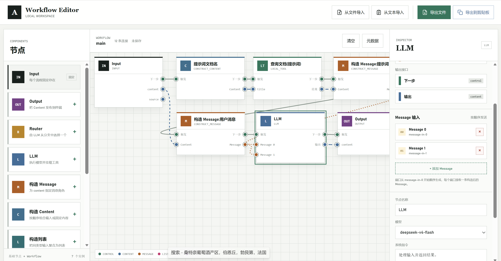
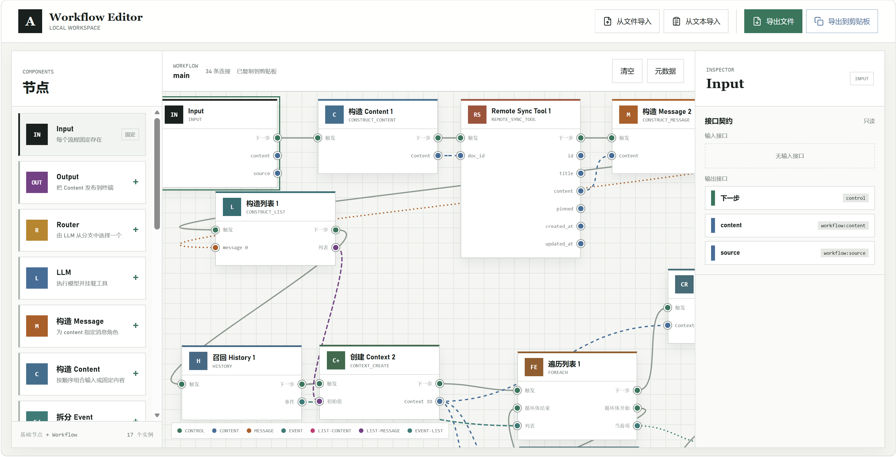
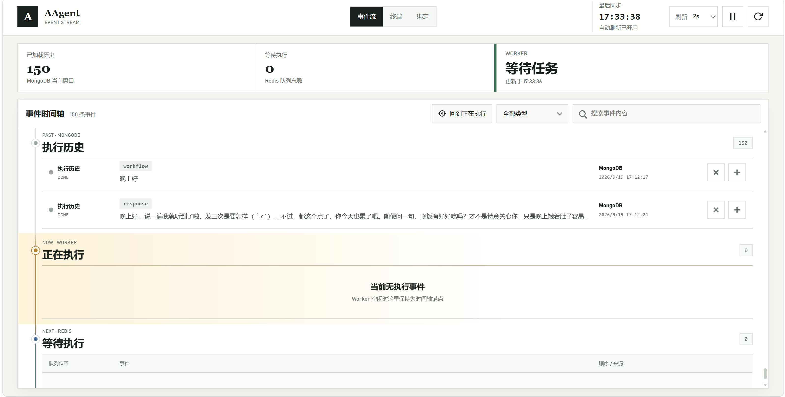
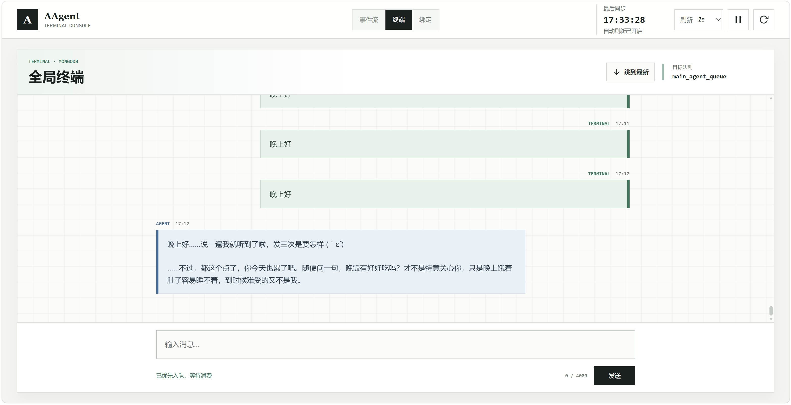
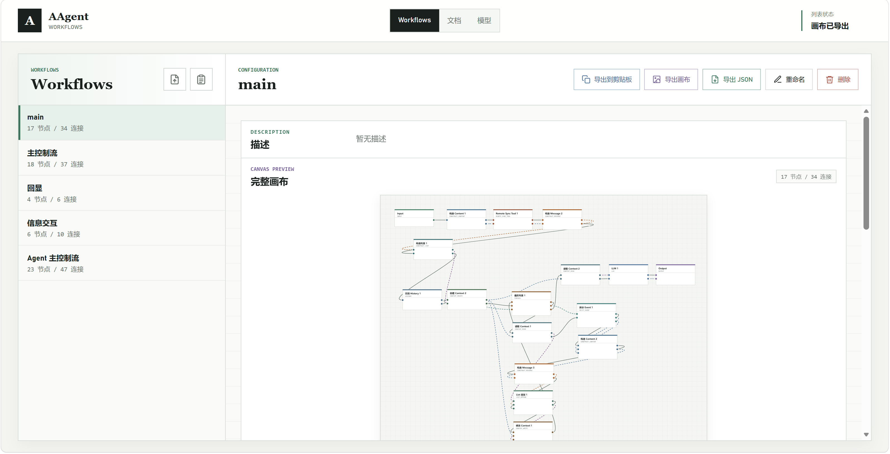
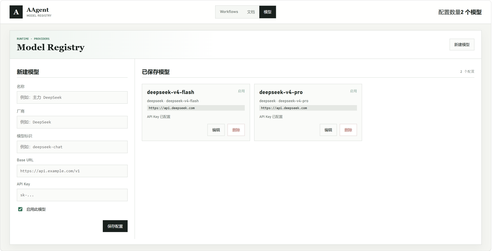
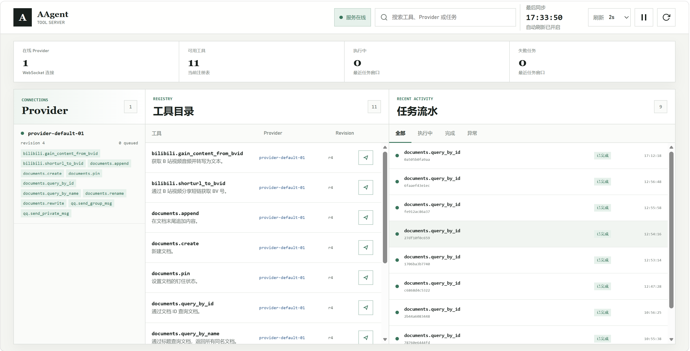
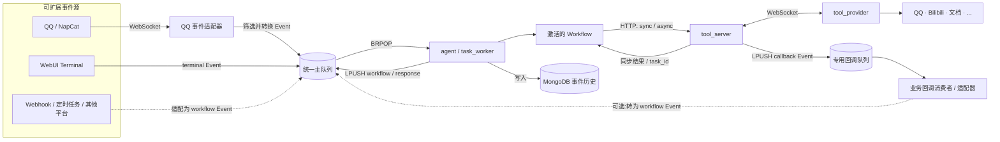

# AAgent

以 **事件驱动与 Workflow 画布**为中心的个人 Agent 平台。不同事件源通过适配器写入统一主队列,Agent 将事件交给可视化编排的 Workflow 处理,再通过分布式 Tool Server 调用本地或远程工具。

QQ 和 WebUI Terminal 都只是当前已经实现的事件源,并不是系统入口的固定边界。新的聊天平台、Webhook、定时任务或业务系统可以在适配器中直接生成标准 `workflow` Event 并写入主队列,无需修改 Workflow 执行器。

设计上强调:

- **可扩展** — 事件源、Workflow 节点与 Tool Provider 分别沿输入、编排和能力三个方向独立扩展;QQ 与 Terminal 只是两个现有适配器。
- **弹性** — 队列、Agent、Tool Server、Provider、WebUI 都是独立进程与容器,可以单独重启、水平扩展或替换实现。
- **灵活编排** — Workflow 不是固定的线性流水线:路由、循环、可变 Context、工具调用和子 Workflow 可以组合成复杂控制流,包括 ReAct 风格的“思考 → 行动 → 观察 → 再思考”。
- **可自定义** — 业务能力由画布编排,节点、端口和状态都显式可见;多数流程变化不需要修改执行器代码。
- **易于调试** — 事件与每个节点的出入参全量落库,WebUI 里可以直接看历史、看正在执行的事件、看队列里还在等什么。

> 项目仍在过渡期,架构持续调整中。设计与实现冲突时以源码为准;`docs/废弃旧文档/` 里的方案已不代表当前行为。

## 界面一览

### Workflow 编辑器

画布即契约:节点端口是强类型的,类型不匹配的连接在编辑器里就画不出来。左边是 LLM 节点拼出的最小流程,右边是带 Context、Remote Sync Tool 和 foreach 的复杂编排。

| 基础流程 | Context + 远程工具 + 循环 |
| --- | --- |
|  |  |

### 为什么是 Workflow

这里的 Workflow 不只是把几个 API 串起来,而是 Agent 的控制流语言。Router 可以按运行结果选择路径,foreach 可以展开任务,Context 可以跨节点积累状态,控制流可以成环,子 Workflow 可以把一段能力封装后再次组合。节点之间的连接同时表达执行顺序和数据依赖,因此复杂行为仍然可以被追踪、替换和复用。

这些能力可以组合出不少巧妙的模式:

- **ReAct** — workflow 单次完成 LLM、工具和 Context, 连续发布事件调用自身实现循环 ; 通过 history召回 让每轮 observation 回到下一轮 reasoning,退出条件由 Router 显式控制。
- **动态计划** — 根据中间结果选择、跳过或重复步骤,而不是在代码里写死一条执行路径。
- **能力组合** — 把不同工具和子 Workflow 作为独立能力单元,按任务动态选择和编排。
- **Multi-Agent** — 未来可以把不同角色建模为可复用的 Agent Workflow,通过事件、共享 Context 和子 Workflow 调用完成委派、协作、复核与交叉验证。比如与用户对接和长任务的分工。

更重要的是,事件源和 Workflow 解耦后,一次长任务不必表现为“发出请求,等待最终答案”。未来可以把计划变化、阶段结果、工具进度、Agent 间交接和需要用户决策的节点持续转化为事件,让 Terminal、聊天平台或其他客户端呈现可追踪、可介入、可继续的交互过程。这是 AAgent 希望探索的体验:复杂执行发生在后台,但用户始终看得见进度,并能在恰当的时机参与。

### 运行与调试

终端页把输入直接投进主队列,配合事件流可以逐个节点核对输入输出。

| 事件流 | 终端 |
| --- | --- |
|  |  |

### 管理

管理 WebUI 负责 Workflow 的落地(编辑器只导出 JSON)、契约快照、依赖关系和 LLM 模型注册表。

| Workflow 管理 | 模型注册表 |
| --- | --- |
|  |  |

### Tool Server

Provider 在线状态、工具目录和任务流水都在这里看。



## 架构



- **事件源适配器** 负责接入外部输入并写入 `main_agent_queue`;新增来源优先直接生成 `event_type: "workflow"` 的标准 Event,其 payload 字段与画布 Input 端口同名即可进入现有执行链路。
- **QQ** 是其中一个实现:`qqbot` 搬运 OneBot 事件到 `qq:events`(`LPUSH` / `BLPOP`,所以是 LIFO),`qqbot_consumer` 负责存档、筛选目标用户私聊并转发到主队列。
- **WebUI Terminal** 是另一个实现:它直接构造 `terminal` Event 并以 `RPUSH` 写入主队列,因此当前任务结束后会优先被 `BRPOP` 取走。
- **agent** 只依赖 Event 协议和主队列。当前内置 handler 会把 `qq` / `terminal` 转换成 `workflow` Event;新事件源直接产出 `workflow` Event 时,无需让 worker 了解其界面或传输协议。
- **tool_server** 不只是被动返回结果:远程异步工具会先把 `task_id` 交还 Workflow,任务到达终态后还可以通过 outbox 向节点指定的 Redis 队列 `LPUSH` callback Event。回调类型由 `TOOL_CALLBACK_EVENT_TYPES` 限制,默认是 `async_result`。
- **回调也是事件源**:专用消费者可以保存进度、通知客户端,也可以把回调适配成新的 `workflow` Event 再次进入编排,从而承接长任务续跑、阶段反馈和 Agent 间异步协作。当前主 worker 没有 `async_result` handler,所以原始回调不能直接写入 `main_agent_queue`,必须使用专用队列和对应消费者。

## 服务与端口

| 服务 | 端口 | 说明 |
| --- | --- | --- |
| `webui_py` | 8081 | Agent WebUI:事件流、终端、绑定、运行状态 |
| `workflow_editor` | 8082 | Workflow 可视化编辑器(独立服务,只导出 JSON) |
| `tool_server` | 8083 | 工具注册、调用、任务状态与控制台 |
| `manager_webui` | 8084 | 管理 WebUI:Workflow、文档、模型 |
| `agent` | — | 工作流执行器,主队列消费者 |
| `qqbot` / `qqbot_consumer` | — | 可选的 QQ 事件源:OneBot 接入与 Event 适配 |
| `tool_provider` | — | 工具实际执行方,通过 WebSocket 注册到 Tool Server |
| `redis` / `mongodb` | — | 队列与存储,仅在 dev 配置下暴露到宿主机 |

## 快速启动

1. 安装 Docker Desktop 与 Docker Compose;
2. 复制环境变量模板并填写当前启用服务所需的配置;
3. 构建并启动服务。

QQ 不是必需入口。仅在启用 QQ 事件源时,才需要部署 NapNeko/NapCatQQ 并填写 `.env` 中的 `QQ_*` 配置;不启用时可以直接使用 WebUI Terminal 产生事件。

```powershell
Copy-Item .env.example .env
# 编辑 .env
docker compose up --build -d
docker compose logs -f agent qqbot
```

启动后 Agent WebUI 在 `http://localhost:8081`,管理 WebUI 在 `http://localhost:8084`。

### 环境变量

`.env.example` 已按用途分组:

| 分组 | 变量 |
| --- | --- |
| LLM | `DEEPSEEK_*`、`KIMI_*`、`ZAI_API_KEY`、`TAVILY_API_KEYS`、`BOCHA_*` |
| QQ | `QQ_API_BASE_URL`、`QQ_API_TOKEN`、`QQ_WS_URI`、`QQ_WS_TOKEN`、`QQ_TARGET_USER_ID`、`QQ_BOT_ID` |
| 队列 | `REDIS_*`、`QQ_QUEUE_NAME`、`MAIN_AGENT_QUEUE_NAME`、`AGENT_TOOLS_KEY`、`AGENT_WORKER_STATUS_KEY` |
| Tool | `TOOL_SERVER_URL`、`TOOL_MAX_WAIT_MS`、`TOOL_CLIENT_*`、`TOOL_PROVIDER_*`、`TOOL_MODULES` |
| 存储 | `MONGO_*` 及各集合名 |

## 开发调试

`docker-compose.dev.yml` 挂载宿主机源码,并让 `agent` / `qqbot` / `qqbot_consumer` 以 `sleep infinity` 启动,改完代码不用重建镜像,手动跑入口即可:

```powershell
docker compose -f docker-compose.yml -f docker-compose.dev.yml up -d --build
docker compose exec agent python task_worker.py
```

发布时不要叠加这个文件。

注意:生产配置 `docker-compose.yml` 里只有 `redis` / `mongodb` 有 volumes,`webui_py` / `manager_webui` / `workflow_editor` / `tool_server` 的代码都在镜像内,改完要 `docker compose up -d --build <服务>`;dev 配置下这四个服务已挂载源码目录,但静态资源引用形式是 `?v=N`,改动后仍需递增版本号才会绕过浏览器缓存。

## 目录结构

```
agent/              Agent 运行时:Workflow 校验、解析、执行与节点实现
qqbot/              可选 QQ 事件源:监听 OneBot WebSocket
qqbot_consumer/     QQ Event 适配器:存档 + 筛选转发到主队列
tool_server/        工具注册与调用中心,任务状态、回调投递
tool_provider/      实际执行工具的 Provider(QQ / Bilibili / 文档)
webui_py/           Agent WebUI(8081)
manager_webui/      管理 WebUI(8084)
workflow_editor/    Workflow 编辑器(8082)
docs/               设计文档、审查日志与 README 图片
data/               Redis / MongoDB 持久化数据(不提交)
```

## 文档

入口见 [`docs/README.md`](docs/README.md)。

| 文档 | 内容 |
| --- | --- |
| [17-Tool Server 设计](docs/17-Tool%20Server设计.md) | 工具注册、调用与回调协议 |
| [18-Tool Server 内核实现](docs/18-Tool%20Server内核实现.md) | Provider 并发、Redis 等待、状态原子性与回调投递 |
| [19-Workflow 本地与远程 Tool 节点拆分](docs/19-Workflow本地与远程Tool节点拆分.md) | local / remote_sync / remote_async 三类工具节点 |
| [20-Event 协议与流转](docs/20-Event协议与流转.md) | Event 类型、队列方向与完整运行路径 |
| [21-Workflow Context 节点设计](docs/21-Workflow%20Context节点设计.md) | 可变 Context、Redis 生命周期与 foreach 累积 |

## TODO

- MCTS reward通过workflow实现
- 交叉验证
- reAct multiAgent编排 (穿插引导:上下文代表任务状态+todo) *长任务核心

## 安全

不要提交 `.env`、API Key、访问 Token 或 `data/`。曾出现在源码或 Git 历史中的凭据必须先吊销,再从服务商处生成新凭据。