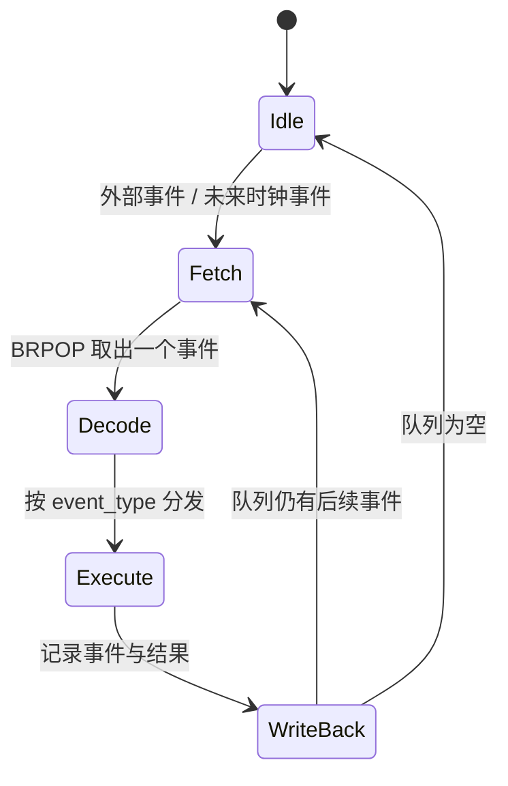
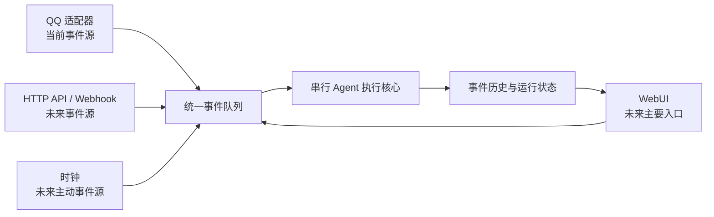

# 00 设计哲学

## 1. 项目定位

AAgent 是一个受 CPU 取指、执行与写回循环启发的**事件脉冲驱动 Agent 运行时**。

系统将消息、模型响应、工具调用和工具结果统一表示为事件。单个 worker 每次只处理一个事件,执行结果写入历史并产生后续事件,从而以确定的顺序持续推进 Agent 状态。

> 事件是指令,队列是控制流,Agent 按脉冲执行。

AAgent 借用的是 CPU 的执行思想,并不是硬件模拟器。它不模拟指令集、寄存器、流水线或真实硬件时钟。

## 2. 为什么选择串行执行

当前系统采用单执行器串行调度,同一时刻只执行一个事件。这不是为了追求吞吐量,而是为了优先获得:

- **确定性**:模型响应、工具调用和结果回写具有明确顺序;
- **连续性**:同一轮工具调用链不会被后来到达的外部消息打断;
- **可观察性**:每一步都能在队列、worker 状态和事件历史中被检查;
- **可复现性**:故障可以沿事件序列定位,减少并发竞态;
- **简单性**:先建立可靠的单执行核心,再扩展多会话并行能力。

串行执行的代价是整体吞吐量有限。未来更合适的扩展方式不是让同一会话内部无序并发,而是实现**会话之间并行、会话内部串行**。每个会话可以拥有独立的逻辑执行上下文。

## 3. CPU 概念映射

| CPU 概念 | AAgent 中的实现 |
|----------|-----------------|
| 指令缓冲区 | Redis 事件队列 |
| 取指 | worker 使用 `BRPOP` 获取下一个事件 |
| 译码 | `handle_task()` 根据 `event_type` 分发 |
| 执行 | 调用 LLM、工具或外部接口 |
| 写回 | 将事件和结果写入 MongoDB |
| 子程序调用 | `tool` 事件 |
| 子程序返回 | `tool_return` 事件 |
| 程序计数器 | Redis 队列中的事件顺序 |
| 执行上下文 | MongoDB 中持久化的事件历史 |
| 外部中断 | QQ、WebUI 或未来其他事件源提交的事件 |
| 执行脉冲 | 当前由事件到达产生;未来可由空闲时钟事件产生 |

## 4. 事件脉冲与未来时钟

当前 AAgent 并非严格的时钟驱动系统,而是采用**事件脉冲驱动**:

1. 外部事件进入队列;
2. worker 取出一个事件并执行;
3. 执行结果产生后续事件时,系统立即推进下一步;
4. 队列为空时,worker 进入阻塞等待。

未来计划增加空闲时钟事件:当没有外部任务时,时钟可以周期性唤醒 Agent,触发检查、计划、提醒和后台任务。届时系统将形成两类脉冲:

- **事件脉冲**:用户操作或上一步执行结果触发,立即推进;
- **时钟脉冲**:系统空闲时按计划触发,支持主动行为。

## 5. 入口与运行时分离

AAgent 的核心是事件运行时,不是 QQ 机器人。事件源只是运行时的输入适配器。

### 当前阶段

- `qqbot` 是目前唯一的外部事件源;
- QQ 消息被转换为 `qq` 事件后进入统一队列;
- `webui` 当前主要用于观察队列、worker 状态和事件历史。

### 目标阶段

- **WebUI 将成为主要交互界面和主要事件入口**;
- WebUI 不只展示状态,还将负责提交任务、管理会话、查看执行过程、配置工具与触发主动任务;
- QQ 将从“系统本体”退回为一个可选的消息渠道适配器;
- 后续可以继续接入 HTTP API、定时器、Webhook 或其他消息平台,而不改变核心执行模型。

## 6. 设计原则

1. **统一事件模型**:入口不同,进入运行时后都转换为事件。
2. **核心与渠道解耦**:Agent 执行逻辑不依赖 QQ 或 WebUI 的具体协议。
3. **会话内部有序**:工具链和状态写回应保持确定顺序。
4. **过程优先可见**:执行过程应能被 WebUI 观察、解释和追踪。
5. **空闲也可工作**:未来通过时钟事件让 Agent 从被动响应扩展到主动执行。
6. **先保证正确,再扩展并行**:并行能力应建立在会话隔离和幂等机制之上。
