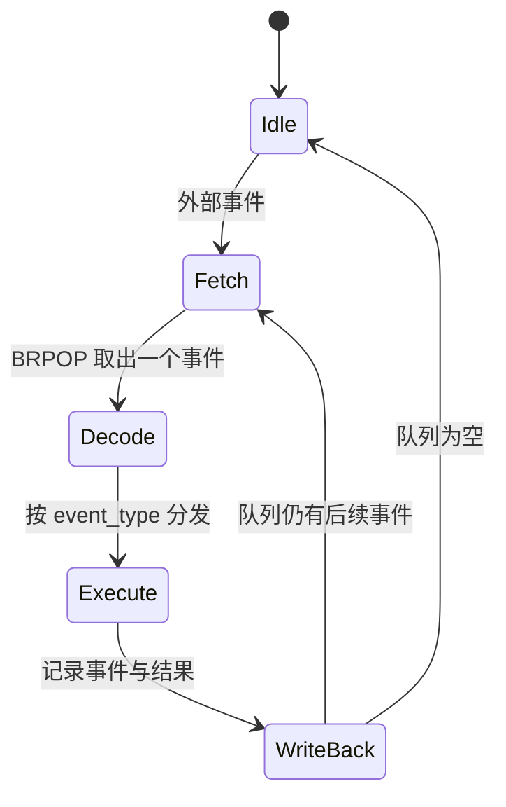
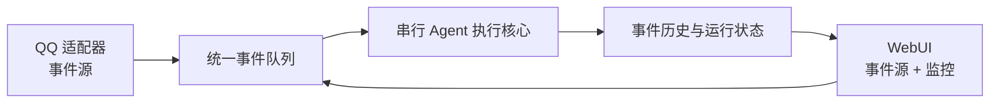

# 00 设计哲学

> 本文只记录当前系统必须遵守的核心原则和不变量。尚未实现的能力、创新方向与具体待办统一记录在[路线图与创新](05-路线图与创新.md)。

## 核心不变量

1. 系统只有一个决策中心和一份权威上下文;
2. LLM 调用及工具结果必须线性写回;
3. 外部入口只能提交事件,不能直接推进 Agent 状态;
4. 来源标识用于路由、权限和检索,不用于切割认知;
5. Redis 决定执行顺序,MongoDB 保存已提交历史。

## 1. 第一原则:一个决策中心

AAgent 的首要目标不是承载多个彼此隔离的聊天会话,而是构建**一个持续存在、统一认知并统一决策的中心**。WebUI、QQ、API、时钟和未来其他入口只是向这个决策中心提供信息与任务的渠道,不是各自拥有独立记忆和人格的 Agent 实例。

因此,AAgent 明确反对“全局历史隔离”或“会话间隔离”成为系统边界。按 `user_id`、`group_id`、页面标签或所谓 `session_id` 切断历史,会把一个决策中心拆成多个互不知情的局部聊天机器人。这种设计主要服务于多会话并发与吞吐扩展,可以用于会话型产品,却背离了 AAgent 的目标。

来源标识仍然可以保留,用于权限控制、消息路由、审计和检索;但来源标识不是认知边界。不同来源产生的信息最终必须汇入同一个全局认知,并由同一个决策中心判断、计划和行动。

> 一个决策中心,一个全局认知,一条连续时间线。

## 2. 唯一上下文与线性执行

为了让“一个决策中心”在工程上成立,系统只保留一个权威 LLM 上下文。每次模型调用都读取已提交的最新状态;模型响应、工具调用和工具结果写回后,下一次推理才能开始。

### 为什么必须串行

设权威上下文为 $C_0$。如果两个 LLM 调用异步启动,它们都可能读取 $C_0$:

$$
L_1(C_0) \rightarrow R_1, \qquad L_2(C_0) \rightarrow R_2
$$

$L_1$ 不知道 $R_2$,$L_2$ 也不知道 $R_1$。它们可能给出互相矛盾的判断或动作,而网络耗时又可能让 $R_2$ 先于 $R_1$ 返回。此时无论按完成顺序还是调用顺序写回,系统都无法证明哪个结果代表 Agent 在最新状态下的决定。一个 Agent 被分裂成了两条互不知情的时间线,即**上下文脑裂**。

AAgent 要求执行历史满足线性关系:

$$
C_0 \xrightarrow{L_1 / R_1} C_1 \xrightarrow{L_2 / R_2} C_2
$$

$L_2$ 必须读取已经包含 $R_1$ 及相关工具结果的 $C_1$。因此 AAgent 要求:

1. 同一时刻最多存在一个 LLM 调用;
2. 当前调用结束前不得启动下一次调用;
3. 模型响应和工具结果必须先写入权威历史;
4. 写回完成后才能处理下一个 `active` 事件;
5. 外部新任务只能排队,不能抢占或分叉当前推理。

AAgent 因而不采用并发 LLM 调用、异步上下文写回或多个 worker 共同推进同一上下文。这里限制的是**权威推理和状态推进**,不是所有 I/O:QQ WebSocket 可以异步接收消息,WebUI 也可以并发处理 HTTP 请求,但它们只能提交事件或读取快照。

这也不意味着系统拒绝一切异步任务。对于耗时较长、收益不足以阻塞主 Agent、且结果格式和回传路径可以预先约定的外部任务,未来可以提供**异步兼容**。但这只是路线图中的待实现能力:异步只能发生在外部任务执行边界,不能产生第二条推理时间线。具体协议和实现规划见[路线图与创新](05-路线图与创新.md#25-异步任务兼容)。

这套设计借鉴了 CPU 对单一状态和顺序提交的思路,仅用于帮助理解一致性约束。AAgent 不是硬件模拟器,无需逐项对应指令、寄存器、程序计数器或时钟。

AAgent 明确拒绝以下实现:

- 异步或并发调用同一 Agent 的 LLM;
- 使用线程池、协程任务或 fire-and-forget 处理 `active` 事件;
- 启动多个 worker 共同消费和修改同一权威上下文;
- 在当前工具链尚未写回时启动下一次模型调用;
- 让 WebUI、QQ 或其他入口绕过队列直接修改 Agent 状态。

## 3. 历史记录:一鱼多吃

`record_history()` 是所有事件共用的历史记录入口。事件只要进入 worker,就先经过这条记录管线,再按 `event_type` 执行后续逻辑。因此,历史记录不只用于保存审计轨迹,还同时服务于 LLM 上下文、WebUI 监控、工具调用追踪和未来的 document 召回。

`response` 和 `tool_return` 并没有另建一套历史机制,而是分别作为模型响应事件和工具返回事件加入统一事件流,直接复用 `record_history()`。这就是 history_record 的“一鱼多吃”:新增事件类型即可自然获得持久化、可观察和可召回的能力。

## 4. Redis 队列:一鱼两吃

“一鱼两吃”是 AAgent 的刻意设计取向:同一个组件尽可能同时解决两个相互兼容的问题。Redis List 在这里同时承担**任务顺序编排**与**吞吐缓冲**。外部任务、模型响应、工具调用、工具返回和未来时钟事件都通过队列确定先后关系;队列顺序就是决策中心接下来处理什么的可执行计划。同时,入口突发流量可以在 List 中等待,由 worker 按能力逐步消费,从而获得排队、缓冲和削峰效果。

普通事件排队,当前推理产生的连续性事件插队,从而保证一个工具链完整写回后再处理下一项外部任务。Redis 因而同时承载等待任务、优先级、控制流和流量缓冲,服务于一条连续决策时间线,也服务于系统整体吞吐;它不是只能在一致性与性能之间二选一的组件。

## 5. 事件脉冲

当前 AAgent 并非严格的时钟驱动系统,而是采用**事件脉冲驱动**:

1. 外部事件进入队列;
2. worker 取出一个事件并执行;
3. 执行结果提交后,后续事件成为单 worker 的下一候选事件;
4. 队列为空时,worker 进入阻塞等待。

当前只有事件脉冲:用户操作或上一步执行结果产生新的排队事件。空闲时钟事件属于未来规划,不属于当前运行模型,详见[路线图与创新](05-路线图与创新.md#23-空闲时钟事件)。

## 6. 入口与运行时分离

AAgent 的核心是事件运行时,不是 QQ 机器人。事件源只是运行时的输入适配器。

### 当前阶段

- `qqbot` 和 `webui` 均为外部事件源,各自产生 `qq` / `webui` 事件进入统一队列;
- QQ 消息用于命令处理(`/dsB`、`/kmB`、`/search`)和授权用户触发 LLM;WebUI 用于监控事件流和提交消息;
- 所有入口必须提交事件到统一队列,不能绕过执行核心。

新增入口只需定义事件类型和 payload 格式,然后在 LLM 的消息投影规则中加一行映射即可——不需要改动 `active` 分支或调用签名。详见 [07-事件双重身份与信息回调](07-事件双重身份与信息回调.md)。

