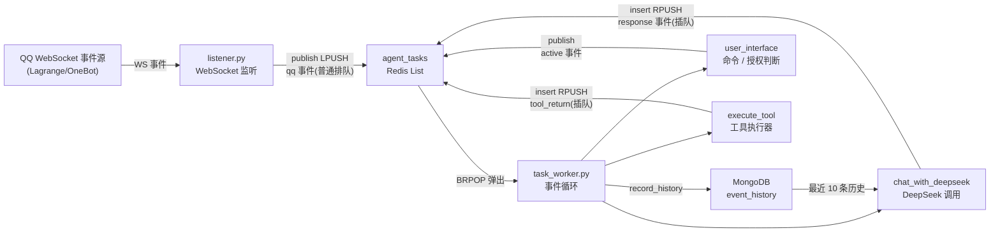

# 01 系统架构

## 1. 架构总览

**事件驱动架构(EDA)+ Redis 任务队列**:

- `qqbot` 监听 QQ WebSocket 事件,封装为 `qq` 事件投递到 Redis 队列;
- `agent` 作为中央 worker 用 `BRPOP` 消费事件,调用 DeepSeek 大模型与工具(余额查询 / Tavily 搜索);
- LLM 工具调用通过**事件回环**(`response → tool → tool_return → active`)在同一轮对话内循环推进,直到生成最终回复;
- 所有事件持久化到 MongoDB 形成历史上下文,供 LLM 回忆。

## 2. 服务拓扑

| 服务 | 职责 | 关键文件 |
|------|------|----------|
| `qqbot` | 连接 QQ WebSocket,接收事件并发布任务 | `listener.py`, `queue_client.py` |
| `agent` | 消费 Redis 任务,调用 LLM/工具,回复 QQ 消息 | `task_worker.py`, `llm.py`, `tool.py`, `qqapi.py` |
| `webui` | 队列 / worker 状态 / 历史记录监控面板 | `main.go`, `static/` |
| `redis` | 任务队列与事件缓冲(List + 状态 Key) | — |
| `mongodb` | 事件历史持久化 | — |

所有服务接入自定义桥接网络 `rainbow_net`,通过服务名互相访问。

## 3. 架构图

## 4. 设计要点:"同步调度"

系统参考 CPU 取指-执行循环设计,事件即时钟,按确定性顺序逐步推进一轮对话:

| CPU 概念 | 本系统实现 |
|----------|------------|
| 指令缓冲 | Redis 队列 `agent_tasks` |
| 取指-执行循环 | `BRPOP` + `handle_task()` 主循环 |
| 子程序调用(call) | `tool` 事件 |
| 子程序返回(return) | `tool_return` 事件 |
| 时钟脉冲 | 队列中的事件——事件到达即触发下一步 |
| 程序计数器(PC) | 队列顺序(由入队方向决定) |
| 中断(interrupt) | 新 QQ 消息(排队软化解,不打断工具链) |

术语对照:总体为 **EDA**;调度为**队列驱动状态机**;工具链推进即 **Agentic Loop / ReAct 循环**;未来若加重试与持久化,演进方向为 **Durable Execution**。

## 5. 数据存储

### Redis

| Key | 类型 | 说明 |
|-----|------|------|
| `agent_tasks` | List | 任务队列,`publish`(LPUSH)/`insert`(RPUSH)双端写入,`BRPOP` 消费 |
| `aagent:worker:status` | String | worker 运行状态(state / event / started_at / updated_at),供 webui 展示 |

### MongoDB

集合 `agent.event_history`(默认),每条事件附加 `created_at`(UTC)。

| 索引 | 键 | 说明 |
|------|-----|------|
| `created_at_desc` | `created_at` 倒序 | 历史查询主排序 |
| `event_type_created_at` | `(event_type, created_at)` 倒序 | 按类型过滤历史 |
| `tool_call_id_payload` | `payload.id`(稀疏) | 工具调用 ID 检索 |
