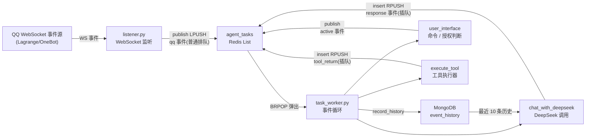

# 01 系统架构

## 本页结论

- **一个执行核心**:`agent` 是唯一推进 Agent 状态的 worker;
- **两类存储**:Redis 决定接下来做什么,MongoDB 保存已经发生什么;
- **一条时间线**:外部入口可以并发接收事件,LLM 与工具链只能串行执行。

> 架构公式:**外部事件驱动 + 单 worker 同步执行 + Redis 顺序编排 + MongoDB 权威历史**。

## 1. 请求如何流动

- `qqbot` 监听 QQ WebSocket 事件,封装为 `qq` 事件投递到 Redis 队列;
- `agent` 作为唯一执行核心,用 `BRPOP` 串行消费事件,同步调用 DeepSeek 大模型与工具;
- LLM 工具调用通过**事件回环**(`response → tool → tool_return → active`)在同一轮对话内循环推进,直到生成最终回复;
- 所有事件按执行顺序持久化到 MongoDB,形成当前唯一权威事件历史;其中 `qq`、`response` 和 `tool_return` 会按类型转换为 LLM 上下文消息。

事件驱动只描述任务如何进入系统,不表示 LLM 可以异步执行。队列细节见[事件与队列](02-事件与队列.md)。

## 2. 服务拓扑

| 服务 | 职责 | 关键文件 |
|------|------|----------|
| `qqbot` | 连接 QQ WebSocket,接收事件并发布任务 | `listener.py`, `queue_client.py` |
| `agent` | 消费 Redis 任务,调用 LLM/工具,回复 QQ 消息 | `task_worker.py`, `llm.py`, `tool.py`, `qqapi.py` |
| `webui` | 当前提供队列、worker 状态与历史监控;未来作为主要事件入口 | `main.go`, `static/` |
| `redis` | 任务顺序编排、吞吐缓冲与事件缓冲(List + 状态 Key) | — |
| `mongodb` | 全局事件历史与未来 document 信息空间 | — |

所有服务接入自定义桥接网络 `rainbow_net`,通过服务名互相访问。

## 3. 架构图

## 4. 不可突破的一致性边界

1. MongoDB 中已提交的事件历史是唯一 Agent 状态来源;
2. 下一次 LLM 调用必须看到前一次响应及其工具结果;
3. `agent` 必须保持单实例;
4. `active` 不得由线程、协程或后台任务并发处理;
5. QQ、WebUI 等入口不得绕过队列直接修改 Agent 状态。

这些约束的论证见[设计哲学](00-设计哲学.md),部署检查见[配置与部署](04-配置与部署.md)。

## 5. 数据存储

### Redis

| Key | 类型 | 说明 |
|-----|------|------|
| `agent_tasks` | List | 任务顺序编排队列,`publish`(LPUSH)/`insert`(RPUSH)双端写入,`BRPOP` 消费 |
| `aagent:worker:status` | String | worker 运行状态(state / event / started_at / updated_at),供 webui 展示 |

### MongoDB

集合 `agent.event_history`(默认),每条事件附加 `created_at`(UTC)。所有事件复用同一记录入口,`response` 与 `tool_return` 也通过新增事件进入这条管线,同时服务历史审计、LLM 上下文、WebUI 监控和工具追踪。

| 索引 | 键 | 说明 |
|------|-----|------|
| `created_at_desc` | `created_at` 倒序 | 历史查询主排序 |
| `event_type_created_at` | `(event_type, created_at)` 倒序 | 按类型过滤历史 |
| `tool_call_id_payload` | `payload.id`(稀疏) | 工具调用 ID 检索 |
