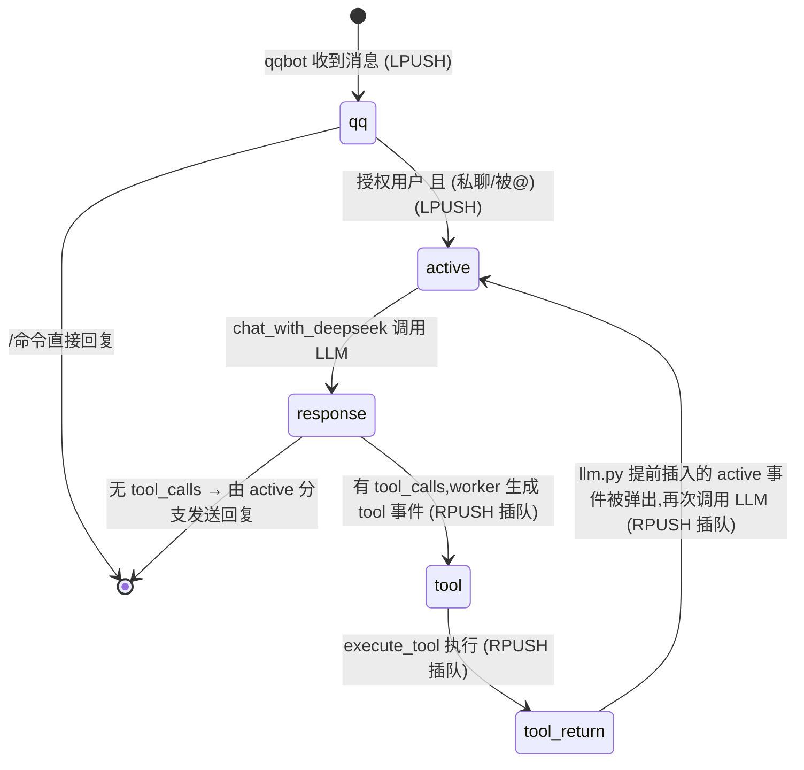

# 02 事件与队列

## 1. 事件类型

| 事件 | 产生方 | 入队方式 | 消费行为 |
|------|--------|----------|----------|
| `qq` | qqbot listener | `publish`(LPUSH) | 记录历史 → `user_interface()` 判断命令/授权 |
| `active` | `user_interface()` / `llm.py`(有 tool_calls 时) | 前者 `publish`,后者 `insert` | 记录历史 → `chat_with_deepseek()` → 发送回复 |
| `response` | `chat_with_deepseek()` | `insert`(RPUSH) | 记录历史;worker 的 response 分支有 `tool_calls` 时逐个生成 `tool` 事件插队 |
| `tool` | worker 的 response 分支 | `insert` | 记录历史 → `execute_tool()` → 生成 `tool_return` 插队 |
| `tool_return` | `task_worker.py` | `insert` | 仅记录历史(供 LLM 上下文) |

> 注意:
> - `response`、`tool_return` 本身不直接触发回复;`active` 是真正触发 LLM 调用并发送 QQ 回复的入口;
> - 工具链的"再次调用 LLM"由 `llm.py` 在插入 `response` 时**先插一个 `active` 事件**承担(见 2 节)。

## 2. 状态机



整条工具链(`response → tool → tool_return → active`)通过插队保证不被新消息打断,循环直到 LLM 不再请求工具。

## 3. 队列机制(两种入队方式)

Redis 队列基于 List 实现,消费端固定 `BRPOP`(从队尾阻塞弹出),**入队方向决定事件优先级**:

| 方法 | 底层命令 | 行为 | 用途 |
|------|----------|------|------|
| `publish_to_queue()` | `LPUSH` | 从队头压入,排在队尾(FIFO 普通排队) | 外部 QQ 消息、`active` 触发等常规任务 |
| `insert_to_queue()` | `RPUSH` | 从队尾压入,紧贴消费端,**立即被弹出(最高优先级插队)** | 工具链 / LLM 内部连续性事件 |

设计意图:外部消息**排队**,工具链**插队**——保证一轮工具调用链优先于后续新到的 QQ 消息被执行,同时避免普通任务饿死。

## 4. 典型流转(授权用户 @ 机器人)

```
[QQ 消息] → qqbot 解析 → LPUSH agent_tasks
              ↓
agent BRPOP 弹出 qq 事件 → user_interface 判断授权 → LPUSH active 事件
              ↓
agent BRPOP 弹出 active 事件 → chat_with_deepseek 调用 DeepSeek
              ↓
有 tool_calls → llm.py 插入 [active(带 user_id/group_id), response] (RPUSH,response 先被弹出)
              ↓
依次弹出:response(生成 tool1/tool2 事件) → tool1(执行) → tool_return1(记录)
        → tool2(执行) → tool_return2(记录) → active(再次调用 LLM,历史已含工具结果)
              ↓
第二次 LLM 调用获得最终回复 → 发送 QQ 消息
```
