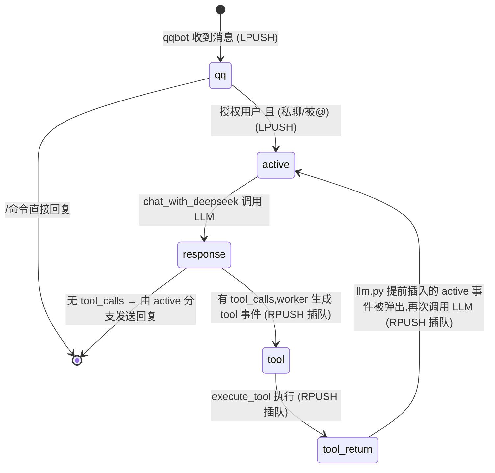

# 02 事件与队列

## 本页结论

- 外部事件使用 `LPUSH` 普通排队;
- 当前工具链产生的事件使用 `RPUSH` 优先衔接;
- worker 固定使用 `BRPOP`,因此队尾事件先执行;
- 所有事件先写入历史,再按类型分发。

## 1. 当前事件

| 事件 | 产生方 | 入队方式 | 消费行为 |
|------|--------|----------|----------|
| `qq` | qqbot listener | `publish`(LPUSH) | 记录历史 → `user_interface()` 判断命令/授权 |
| `active` | `user_interface()` / `llm.py`(有 tool_calls 时) | 前者 `publish`,后者 `insert` | 记录历史 → `chat_with_deepseek()` → 发送回复 |
| `response` | `chat_with_deepseek()` | `insert`(RPUSH) | 记录历史;worker 的 response 分支有 `tool_calls` 时逐个生成 `tool` 事件插队 |
| `tool` | worker 的 response 分支 | `insert` | 记录历史 → `execute_tool()` → 生成 `tool_return` 插队 |
| `tool_return` | `task_worker.py` | `insert` | 仅记录历史(供 LLM 上下文) |

> `response`、`tool_return` 本身不直接触发回复。`active` 才是调用 LLM 并发送 QQ 回复的入口;有工具调用时,`llm.py` 会预先插入后续 `active`。

## 2. 执行不变量

Redis List 同时承担任务顺序编排与入口流量缓冲。队列处理必须满足:

1. 所有来源共同服务一个决策中心,不得按会话建立隔离队列或隔离上下文;
2. MongoDB 已提交历史是当前唯一权威 LLM 上下文;
3. 任意时刻最多处理一个 `active`,最多存在一次 LLM 调用;
4. 当前模型响应及其全部工具结果写回前,下一个 `active` 不得执行;
5. 新 QQ/WebUI 事件只能排队,不能抢占当前调用;
6. 禁止为 `active` 增加线程池、协程任务、fire-and-forget 或额外消费者。

这些不变量的设计依据及上下文脑裂模型见[设计哲学](00-设计哲学.md#为什么必须串行)。

所有事件在 worker 中先通过 `record_history()` 持久化,再执行分发逻辑。统一记录不等于所有事件都会直接变成 LLM 消息:当前 `llm.py` 将 `qq`、`response` 和 `tool_return` 映射到 prompt,而 `active`、`tool` 主要承担调度、执行与追踪职责。`response` 与 `tool_return` 因而既是工具链控制流中的事件,也是 LLM 上下文、WebUI 监控和未来 document 召回的记录材料。

## 3. 状态机



整条工具链(`response → tool → tool_return → active`)通过插队保证不被新消息打断,循环直到 LLM 不再请求工具。

## 4. 队列机制(两种入队方式)

队列基于 Redis List 实现,消费端固定使用 `BRPOP`(从队尾阻塞弹出)。**入队方向决定事件优先级和下一步控制流**:

| 方法 | 底层命令 | 行为 | 用途 |
|------|----------|------|------|
| `publish_to_queue()` | `LPUSH` | 从队头压入,排在队尾(FIFO 普通排队) | 外部 QQ 消息、`active` 触发等常规任务 |
| `insert_to_queue()` | `RPUSH` | 从队尾压入,成为当前事件处理结束后单 worker 的下一个候选事件 | 工具链 / LLM 内部连续性事件 |

设计意图:外部消息**排队**,工具链**插队**,保证一轮工具调用链优先于后续新到的 QQ 消息执行。List 同时吸收入口突发流量。

## 5. 典型流转(授权用户 @ 机器人)

```
[QQ 消息] → qqbot 解析 → LPUSH agent_tasks
              ↓
agent BRPOP 弹出 qq 事件 → user_interface 判断授权 → LPUSH active 事件
              ↓
agent BRPOP 弹出 active 事件 → chat_with_deepseek 调用 DeepSeek
              ↓
有 tool_calls → llm.py 插入 [active(带 user_id/group_id), response] (RPUSH,response 先被弹出)
              ↓
依次弹出:response(生成 tool1/tool2 事件) → tool1(执行) → tool_return1(记录)
        → tool2(执行) → tool_return2(记录) → active(再次调用 LLM,历史已含工具结果)
              ↓
第二次 LLM 调用获得最终回复 → 发送 QQ 消息
```

## 6. 规划事件(尚未实现)

| 事件 | 计划用途 |
|------|----------|
| `async_request` | 发布外部异步任务,登记任务 ID、参数和预期结果格式 |
| `async_result` | 回写真实结果,由单 worker 记录后按协议触发后续 `active` |

两类事件仍须复用统一历史管线,且不能直接修改 MongoDB 或绕过 Redis 唤醒 LLM。完整协议见[路线图与创新](06-路线图与创新.md#25-异步任务兼容)。
