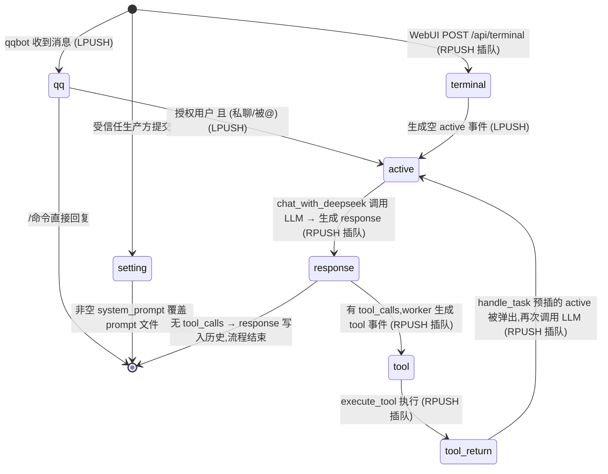

# 02 事件与队列

## 本页结论

- 普通外部事件使用 `LPUSH` 排队，最高权限终端的 `terminal` 事件使用 `RPUSH` 插队;
- 当前工具链产生的事件使用 `RPUSH` 优先衔接;
- worker 固定使用 `BRPOP`,因此队尾事件先执行;
- 所有事件先写入历史,再按类型分发。

## 1. 当前事件

| 事件 | 产生方 | 入队方式 | 消费行为 |
|------|--------|----------|----------|
| `qq` | qqbot listener | `publish`(LPUSH) | 记录历史 → `user_interface()` 判断命令/授权 |
| `terminal` | WebUI `POST /api/terminal` | `RPUSH` | 记录历史 → 生成空 `active` 事件 `publish` 触发 LLM |
| `setting` | 当前无公开入口,由受信任事件生产方提交 | 由生产方决定 | 记录历史 → `payload.system_prompt` 非空时原子写入 Redis 设置(`aagent:settings` 的 `system_prompt` 字段) |
| `active` | `user_interface()` / `handle_task` 的 terminal 分支 / `handle_task` 的 active 分支(有 tool_calls 时) | 前者 `publish`,后两者 `insert` | 记录历史 → `chat_with_deepseek()` → 生成 `response` 事件 |
| `response` | `handle_task` 的 active 分支 | `insert`(RPUSH) | 记录历史;有 `tool_calls` 时逐个生成 `tool` 事件插队 |
| `tool` | worker 的 response 分支 | `insert` | 记录历史 → `execute_tool()` → 生成 `tool_return` 插队 |
| `tool_return` | `task_worker.py` | `insert` | 仅记录历史(供 LLM 上下文 callback) |

> `response`、`tool_return` 本身不直接触发回复。`active` 是调用 LLM 的入口,LLM 结果写为 `response` 事件回到事件流;有工具调用时,`handle_task` 的 active 分支预先插入下一个空 `active`,等工具链完成后再次触发 LLM。

`setting` 是控制面事件,不直接触发 LLM,也不投影为上下文消息。当前代码没有为它提供 QQ 或 WebUI 入口;只有能够向 Agent 队列写入事件的受信任组件才能使用。新 prompt 从下一次 `active` 读取时生效。

## 2. 执行不变量

Redis List 同时承担任务顺序编排与入口流量缓冲。队列处理必须满足:

1. 所有来源共同服务一个决策中心,不得按会话建立隔离队列或隔离上下文;
2. MongoDB 已提交历史是当前唯一权威 LLM 上下文;
3. 任意时刻最多处理一个 `active`,最多存在一次 LLM 调用;
4. 当前模型响应及其全部工具结果写回前,下一个 `active` 不得执行;
5. 新事件不能抢占正在执行的调用；QQ 普通排队，最高权限终端提交的 terminal 事件可影响当前事件完成后的下一次出队顺序;
6. 禁止为 `active` 增加线程池、协程任务、fire-and-forget 或额外消费者。

这些不变量的设计依据及上下文脑裂模型见[设计哲学](00-设计哲学.md#为什么必须串行)。

所有事件在 worker 中先通过 `record_history()` 持久化,再执行分发逻辑。统一记录不等于所有事件都会直接变成 LLM 消息:当前 `llm.py` 将 `qq`、`terminal`、`response` 和 `tool_return` 映射到 prompt,而 `active`、`tool` 主要承担调度、执行与追踪职责。`response` 与 `tool_return` 因而既是工具链控制流中的事件,也是 LLM 上下文、WebUI 监控和未来 document 召回的记录材料。

## 3. 状态机



整条工具链(`response → tool → tool_return → active`)通过插队保证不被新消息打断,循环直到 LLM 不再请求工具。

## 4. 队列机制(两种入队方式)

队列基于 Redis List 实现,消费端固定使用 `BRPOP`(从队尾阻塞弹出)。**入队方向决定事件优先级和下一步控制流**:

| 方法 | 底层命令 | 行为 | 用途 |
|------|----------|------|------|
| `publish_to_queue()` | `LPUSH` | 从队头压入,排在队尾(FIFO 普通排队) | 外部 QQ 消息、`active` 触发等常规任务 |
| `insert_to_queue()` / WebUI `RPush` | `RPUSH` | 从队尾压入,成为当前事件处理结束后单 worker 的下一个候选事件 | 工具链 / LLM 内部连续性事件、最高权限终端命令 |

设计意图:普通外部消息**排队**,内部连续性事件和最高权限终端命令**插队**。终端仍提交普通 `terminal` 事件并经过完整 Worker 管线，只是拥有插队资格；详见 [08-终端设计](08-终端设计.md)。List 同时吸收入口突发流量。

## 5. 典型流转

### 5.1 QQ 授权用户触发

```
[QQ 消息] → qqbot 解析 → LPUSH main_agent_queue
              ↓
agent BRPOP 弹出 qq 事件 → user_interface 判断授权 → LPUSH active {}
              ↓
agent BRPOP 弹出 active 事件 → chat_with_deepseek → callback 历史(含 qq 消息)
              ↓
有 tool_calls → handle_task 插入 [active {}, response] (RPUSH,response 先被弹出)
              ↓
依次弹出:response(生成 tool) → tool(执行) → tool_return(记录)
        → active(再次调用 LLM,历史已含工具结果)
              ↓
最终 response 写入历史(无 tool_calls),流程结束
```

### 5.2 WebUI 用户触发

```
[POST /api/terminal] → WebUI 封装 → RPUSH terminal {message: "..."}
              ↓
agent BRPOP 弹出 terminal → record_history → LPUSH active {}
              ↓
agent BRPOP 弹出 active → chat_with_deepseek → callback 历史(含 terminal 消息)
              ↓
（后续工具链与 QQ 入口完全相同）
```

> 注意:WebUI 的 `active` 事件不携带 `user_id`/`group_id`/`message`。消息内容在上一步 `terminal` 事件中已写入历史,LLM 通过 `get_recent_history()` 自行 callback。详见 [07-事件双重身份与信息回调](07-事件双重身份与信息回调.md)。

## 6. 规划事件(尚未实现)

| 事件 | 计划用途 |
|------|----------|
| `async_request` | 发布外部异步任务,登记任务 ID、参数和预期结果格式 |
| `async_result` | 回写真实结果,由单 worker 记录后按协议触发后续 `active` |

两类事件仍须复用统一历史管线,且不能直接修改 MongoDB 或绕过 Redis 唤醒 LLM。完整协议见[路线图与创新](05-路线图与创新.md#25-异步任务兼容)。
