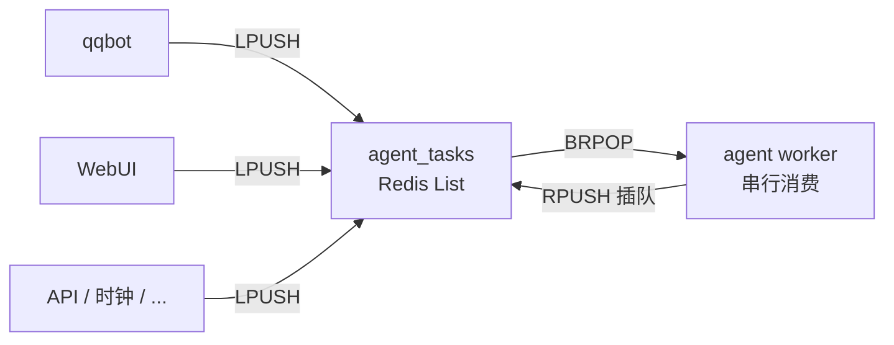

# 07 事件的双重身份与信息回调

> 本文回答一个问题：**同一个事件对象，为什么既是调度触发器，又是信息载体？这两层是如何解耦的？**
>
> 形象比喻——**"fallback"**：信息不在调用链中逐层传递，而是由 callback 经过业务规则召回、筛选与编排，再组装为 LLM 所需的处理上下文。它不是把事件池中的内容一股脑塞进 prompt；瀑布只是描述信息被逐级取用的形象说法。

## 骨架：Redis List 作为调度中心的分布式 EDA

AAgent 的物理调度层是确定的——Redis List 是唯一的分布式调度中心：

- 所有入口（qqbot、WebUI、未来 API / 时钟）只做一件事：把事件 **LPUSH** 进 `agent_tasks`；
- 唯一的 `agent` worker 用 **BRPOP** 串行消费；
- 工具链内部连续性事件用 **RPUSH** 插队，保证当前推理闭环不被新消息打断；
- 双端入队 + 单端出队，天然实现"外部排队、内部优先"。

这是最朴素的分布式事件驱动架构（EDA）。只有队列、入队方向和消费循环，不涉及任何"信息怎么传给 LLM"的问题。



## 血肉：MongoDB 作为信息池，callback 作为信息流动方式

在调度骨架之上，AAgent 长出了一层信息层——**所有事件在消费时先写入 MongoDB `event_history`**。

这层不做调度决策，只做一件事：**让每个事件都成为可被后续检索的信息片段**。

但事情到这里还没有结束。信息写入池子只是第一步，真正的设计选择在于——**信息如何从池子到达 LLM**。

AAgent 的答案是 **callback**——不传参、不穿越调用链、不把消息塞进下一个事件的 payload。LLM 需要上下文时，callback 从 MongoDB 这个全局事件池中召回信息，再按当前的事件类型映射与历史顺序进行筛选、投影和上下文编排。未来还可以加入相关性、任务状态、token 预算等更复杂的业务规则。只有经过这套机制处理后的结果，才会进入 LLM 的 prompt；形象地说，信息像瀑布一样从池子中逐级取用，这就是 **"fallback"** 的比喻。

```
事件 → record_history() → MongoDB event_history（信息池）
                                ↓
                                ↓  callback：召回、筛选、编排（"fallback"）
                                ↓
                      [投影规则]  ← 筛选层：只映射 qq / webui / response / tool_return
                                ↓
                      [排序规则]  ← 筛选层：按时间/相关性排序
                                ↓
                      [截断规则]  ← 筛选层：取前 N 条
                                ↓
                      chat_with_deepseek() → LLM 上下文
```

同一个事件对象因此承担了两种截然不同的身份：

| 身份 | 发生在 | 作用 | 是否可剥离 |
|------|--------|------|-----------|
| **调度触发器** | Redis List 中被弹出 | 决定 worker 下一步执行什么分支 | 否——没有事件就没有执行 |
| **信息载体** | MongoDB 中被存储，经 callback 召回后落入 LLM 上下文 | 为 LLM 提供决策所需的信息 | 可——触发事件可以几乎不携带信息 |

## 解耦的核心：触发不必等于传递

这是 AAgent 当前架构最重要的设计转折。

旧模型要求事件携带完整上下文穿越调用链：

```
webui 事件 → active 事件 {user_id, group_id, message} → llm(user_id, group_id) → response {target, content} → 发送回复
```

新模型只要求事件触发正确的分支，信息由 LLM 从历史池中 callback 召回（"fallback"）：

```
webui 事件 {message}  →  [入历史池]
空 active 事件 {}      →  [入历史池]
                          ↓
                    chat_with_deepseek()
                          ↓
                    callback：召回、筛选、编排（"fallback"）
                          ↓
         ┌────────────────┼────────────────┐
         ↓                ↓                ↓
   投影规则筛选      排序规则筛选      截断规则筛选
   (qq/webui/        (时间/相关性)    (取前 N 条)
    response/
    tool_return)
         └────────────────┼────────────────┘
                          ↓
                    LLM 处理上下文
```

关键变化：

- **`active` 事件不再携带 `user_id`、`group_id`、`raw_message`。** 它只是一个"请 LLM 推理"的脉冲。消息内容已经在上一步的 `webui`（或 `qq`）事件里写入了历史池。
- **LLM 不再接收调用参数。** `chat_with_deepseek()` 通过 callback 从历史池中召回并组装上下文，不需要调用方告诉它"是谁、在哪、说了什么"。
- **`response` 事件不再绑定回复目标。** 响应只记录 LLM 说了什么，不记录"应该发给谁"——回复路由是另一个独立问题。

这种解耦意味着：**新增一个入口，只需要定义它的事件类型和 payload 格式，然后在 `llm.py` 的消息投影规则（callback 的第一层筛选）中加一行映射。** 不需要改动 `active` 分支、不需要改动调用签名、不需要让触发器学会传递新入口的参数。

### 一个具体例子：WebUI 入队到 LLM 看到消息

```
1. POST /api/chat      → LPUSH webui {message: "查余额"}
2. worker BRPOP webui  → record_history()               ← 信息写入池子
                       → publish active {}               ← 仅触发
3. worker BRPOP active → record_history()
                       → chat_with_deepseek()
                            ↓
                         callback 开始：按业务规则召回并编排（"fallback"）
                            ↓
                         投影筛选：webui 事件 → "<UserMsg>查余额</UserMsg>"
                                  qq 事件 → 跳过（本窗口无）
                                  tool_return → 跳过（本窗口无）
                                  response → 跳过（本窗口无）
                            ↓
                         排序筛选：按 created_at 取最近事件，再按时间正序组装
                            ↓
                         截断筛选：取前 10 条
                            ↓
                         messages.append({"role":"user",
                           "content":"<UserMsg>查余额</UserMsg>"})
                            ↓
                         callback 结束：上下文组装完成
                            ↓
                         LLM 推理 → 可能调用工具 → ...
```

第 2 步和第 3 步之间，消息的流动路径是：

```
webui 事件 ──→ MongoDB（池子）──→ callback 召回/编排（"fallback"）──→ LLM 上下文
```

必要时，LLM 也可以通过工具主动搜索外部或全局信息。主动搜索不是 callback 的替代品，而是自动召回与上下文编排之后的补充通道：**callback 自动召回**负责按系统业务规则准备基础上下文，**主动搜索工具**负责在推理过程中处理自动召回未覆盖、需要追问或需要实时查询的信息。

而不是：

```
webui 事件 ──→ active.payload.message ──→ chat_with_deepseek(message)
              （穿越调用链，已废弃）
```

## 把时间展开为空间

传统 agent 很容易把历史理解成一条时间线：当前状态不断向前推进，较早的事件只能通过更长的上下文窗口、RAG / KAG 等检索机制，或 LLM 在推理过程中调用 ReAct 工具搜索来补充。它们当然能够缓解遗忘，但信息与当前推理距离越远，通常越容易在窗口、排序或检索条件中被稀释。

AAgent 试图换一个方向：**不把历史仅仅看作一条必须逐步走过的时间线，而是把时间展开为一个可检索、可组织、可重新编排的信息空间。** 事件仍然拥有发生时间，但时间不再是信息可达性的唯一坐标；来源、主题、实体、任务状态、因果关系和相关性，也都可以成为这个空间中的索引维度。这样，较早的事件不必依赖"还留在上下文里"才能发挥作用，而可以在需要时由 callback 重新召回。

在这个意义上，我会把 AAgent 的 **"fallback"** 架构与 RAG / KAG 等变种作如下比喻：

> **它更像 attention 之于 LSTM。**
>
> LSTM 依靠隐藏状态沿时间线携带信息，距离越远，信息越可能随着传播逐渐衰减；attention 则允许模型直接从更大的信息空间中，对当前真正相关的部分建立连接。类似地，时间线式 agent 主要依靠历史状态持续传递，再以 RAG / KAG 或 ReAct 工具搜索作补充；AAgent 则把事件沉淀为全局信息空间，由 callback 通过复杂的业务机制进行召回、筛选、排序、投影与上下文编排，再把真正相关的结果交给 LLM。

这个类比表达的是**信息组织方式的变化**，并不声称 AAgent 的 callback 在算法上等同于神经网络中的 attention。自动 callback 是主要路径，负责准备和编排基础上下文；LLM 主动调用搜索工具仍然存在，但它是推理期针对缺口的次要补充，而不是替代全局信息空间的主要机制。

## callback 的现在与未来

### 当前：粗筛

当前的 callback 实现是过渡性的——`get_recent_history(limit=10)`，主要是固定窗口和事件类型映射；更复杂的相关性、任务状态与 token 预算策略属于后续演进：

- **投影筛选**：`if event_type == 'webui'` / `'qq'` / `'tool_return'` / `'response'` → 映射为 LLM 消息
- **排序筛选**：按历史记录顺序倒序
- **截断筛选**：固定 10 条

这是过渡方案。它能让信息经过 callback 进入上下文，但没有轻重缓急——系统通知、用户指令、工具结果、闲聊碎语，全都一视同仁地争夺这 10 个位置。第 11 条事件直接蒸发，不管它有多重要。对于自动召回未覆盖的信息，LLM 还可以在推理过程中调用搜索工具主动补充；但这条路径属于次要补充，不取代 callback 的基础信息编排职责。

### 未来：精筛 callback

规划中的 callback 将不再是固定窗口，而是从全局事件池中**按相关性召回**：

- 事件被组织为带有元数据的 **document**（来源、时间、主题、实体、任务 ID 等）；
- LLM 推理时，根据当前任务的特征，从全局池中逐层筛选：
  - **第一层：类型投影**——哪些事件类型映射为 LLM 消息（与当前一致）；
  - **第二层：语义召回**——根据任务特征匹配最相关的 document，而不是"最近 N 条"；
  - **第三层：窗口裁剪**——根据 token 预算和优先级截断。
- 筛选策略是系统设计责任——不保证"全部召全"，但保证筛选逻辑是可控、可观察、可调优的。
- 在 callback 自动召回之后，LLM 仍可按需调用搜索工具，主动获取自动召回未覆盖的实时或特定信息；这属于补充路径，而不是主要上下文来源。

这种演进不会改变本文的核心论断——事件的调度身份和信息身份仍然是解耦的。升级的只是 callback 这个"fallback"比喻中"筛子"的精细程度，不影响"事件怎样触发执行"。

> 拟人化地说——"fallback" 从"倒一桶水看浮上来什么"升级为"用一个不断改良的滤网系统从大池子里提取最相关的信息"。池子还是那个池子（MongoDB），筛法变了。

## 文档定位

本文描述的是 AAgent 在 Redis List EDA 调度骨架上长出的信息层血肉，以及两层之间"触发 ≠ 传递"的解耦设计。**callback** 是信息从池子到 LLM 的业务召回与上下文编排机制——不传参，不穿越调用链，也不把历史事件直接倾倒进 prompt。信息必须经过规则筛选、排序、投影、相关性判断与窗口裁剪，才会组装为 LLM 的处理上下文；这就是 **"fallback"** 这个比喻的含义。LLM 还可以通过主动搜索工具补充信息，但那是次要的推理期补充路径。

- 骨架层（调度）：见 [02-事件与队列](02-事件与队列.md)
- 信息层（存储与 callback）：本文
- 工具消息在 LLM 上下文中的格式（callback 第一层筛子）：见 [06-工具消息格式](06-工具消息格式.md)
- future callback 的规划：见 [05-路线图与创新](05-路线图与创新.md#21-全局信息的-document-callback)
