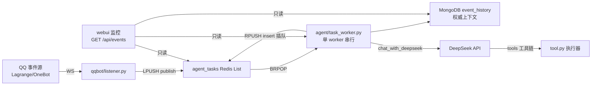
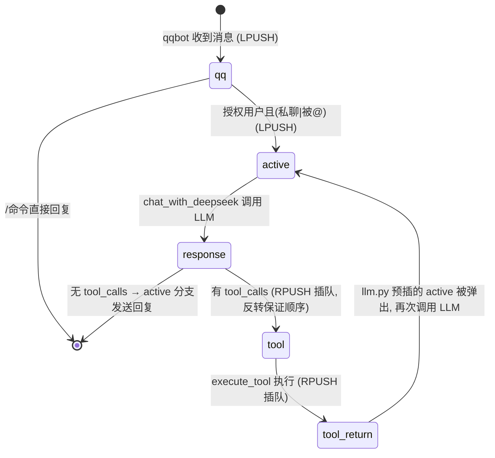

# 08 全项目审查与优化报告

> 审查日期:2026-08-01。审查范围:全部源码(`agent/`、`qqbot/`、`webui/`)、`docker-compose.yml`、Dockerfile、`docs/` 与根目录配置文件。
> 本文回答三个问题:**系统现在的业务逻辑是什么?哪些地方可以精简?哪些地方可以用更巧妙的设计简化?**

---

## 1. 业务逻辑梳理(现状全景)

### 1.1 五个服务,两条时间线



- **决策时间线**:`qqbot` 只负责把 QQ 事件封装成 `qq` 事件 `LPUSH` 入队;`agent` 单 worker 用 `BRPOP` 串行消费,所有事件**先 `record_history()` 写入 MongoDB,再按类型分发**;
- **监控时间线**:`webui` 只读聚合 Worker 状态 + Redis 队列 + MongoDB 历史,不修改任何状态;
- 两者的共同前提是设计哲学的四条不变量(单决策中心、线性执行、入口只能提交事件、Redis 定序 MongoDB 存史)。

### 1.2 事件状态机



关键机制(现状里**设计得巧妙、应当保留**的部分):

1. **插队链不打断**:`llm.py` 在有 `tool_calls` 时 `insert_to_queue(e2, e)`(即 `[active, response]`),BRPOP 从队尾弹,`response` 先被弹出生成 `tool` 事件,`active` 留在队尾,天然保证整条工具链(`response→tool→tool_return→…`)完成后才再次调用 LLM——**一次 RPUSH 就实现了"工具链优先"的调度语义**;
2. **多 tool_calls 反转入队**:`insert_to_queue(events[::-1])` 抵消 RPUSH 多参压入的方向性,使工具按 LLM 声明的顺序执行(此处易踩坑,建议在 `insert_to_queue` 文档注释中固化说明);
3. **一鱼多吃的历史管线**:所有事件共用 `record_history()`,同一份记录同时服务 LLM 上下文、WebUI 监控、工具追踪;
4. **事件脉冲**:worker 空闲即阻塞在 BRPOP,无空闲轮询,无额外定时器。

### 1.3 当前代码规模

| 模块 | 文件 | 行数 | 职责 |
|------|------|------|------|
| agent 主循环 | `task_worker.py` | 174 | 事件分发、命令处理、QQ 回复 |
| LLM 调用 | `llm.py` | 75 | 组装上下文、调用 DeepSeek、插队 |
| 工具 | `tool.py` | 124 | 工具 schema 与执行器 |
| 历史仓库 | `history_repository.py` | 64 | MongoDB 读写与索引 |
| QQ API | `qqapi.py` | 74 | QQ 消息/群 API 封装 |
| 队列客户端 | `agent/queue_client.py` | 41 | Redis List 与 worker 状态 |
| 队列客户端 | `qqbot/queue_client.py` | 20 | Redis List(与 agent 版重复) |
| QQ 监听 | `qqbot/listener.py` | 56 | WS 接收 → 入队 |
| WebUI | `webui/*.go` | 317 | 聚合 API 与 HTTP 服务 |
| WebUI 前端 | `webui/static/*` | 299 | 轮询渲染、筛选、状态卡 |

**结论先行:整体架构是清晰且自洽的,主要问题集中在"实现层的糙点"和"三处正确性风险",而非架构本身。** 下面按优先级给出诊断与优化方案。

---

## 2. 问题诊断总览

| 编号 | 优先级 | 问题 | 影响 | 章节 |
|------|--------|------|------|------|
| C1 | **P0** | LLM 上下文截断可能拆散 `assistant(tool_calls)`/`tool` 消息对 | DeepSeek API 400,回复中断 | 3.1 |
| C2 | **P0** | `created_at` 毫秒精度,同批事件排序不稳定 | 上下文顺序错乱 | 3.2 |
| C3 | **P0** | `tool` 事件 `json.loads(arguments)` 无容错 | 非法 JSON 使工具链静默断裂 | 3.3 |
| R1 | P1 | LLM 调用/QQ 发送失败不重试,事件已出队 | 消息永久丢失 | 4.1 |
| R2 | P1 | `processing` 状态不写 `updated_at` | 卡死检测只能靠 10 分钟兜底 | 4.2 |
| R3 | P1 | 外部 HTTP 无统一异常处理(裸 `response.json()[...]`) | KeyError/连接异常直接崩 | 4.3 |
| R4 | P1 | Redis 连接每次新建,无复用 | 高频场景下连接开销 | 4.4 |
| S1 | P2 | `from tool import *` 污染命名空间 | 隐式依赖、易踩坑 | 5.1 |
| S2 | P2 | `qqapi.py` 6 函数重复模式,4 个未使用 | 冗余代码 | 5.2 |
| S3 | P2 | `task_worker.py` tool 分支 try/except 重复 | 冗余代码 | 5.3 |
| S4 | P2 | `requirements.txt` 含未使用的 `typer`/`rich`/`motor` | 镜像体积与安装时间 | 5.4 |
| S5 | P2 | `qqbot/queue_client.py` 未用 `pop_from_queue`,与 agent 版重复 | 冗余代码 | 5.5 |
| D1 | P3 | 工具 schema 与执行器 if-elif 两处维护 | 新增工具易漏改 | 6.1 |
| D2 | P3 | `handle_task` 大 if-elif 链 | 新事件类型扩展成本高 | 6.2 |
| D3 | P3 | `user_interface` 命令 if-elif 链 | 命令扩展成本高 | 6.3 |
| D4 | P3 | 历史→OpenAI 消息映射内嵌在 `chat_with_deepseek` | 不可独立测试 | 6.4 |
| D5 | P3 | 事件无唯一 ID,去重靠内容指纹 | 幂等/重试无基础 | 6.6 |
| O1 | P4 | `agent`/`qqbot` 容器 `command: sleep infinity` 不跑服务 | README 与事实不符,compose up 不等于启动 | 7.1 |
| O2 | P4 | `mongodb` 无健康检查,`webui` 依赖 `service_started` | 启动竞态 | 7.2 |
| O3 | P4 | 未用的 `ZAI_API_KEY`/`BOCHA_*` 在导入时强制读取 | 缺 Key 直接启动失败 | 7.3 |
| O4 | P4 | 安全项(Redis 无密码、Mongo root) | 公网风险 | 7.4 |

---

## 3. 正确性风险(P0,先修)

### 3.1 C1:上下文截断会拆散消息对

`llm.py` 固定取最近 10 条历史组装 OpenAI 消息。OpenAI 兼容 API 要求:**`assistant` 消息带 `tool_calls` 时,其对应的 `tool` 消息必须紧随其后;孤悬的 `tool` 消息(无前置 `tool_calls`)同样非法**。

若最近 10 条的边界恰好落在一条工具链中间,例如:

```
... response(带 tool_calls) | tool_return(tool) ...   ← 边界在这里
```

则组装出的消息里 `assistant` 有 `tool_calls` 却没有对应 `tool` 消息 → DeepSeek 返回 400,整个 `active` 分支异常,**该轮对话直接失败且不会重试**(叠加 R1)。

**方案 A(曾设计,已放弃)**:按"消息对完整性"截取,而不是按固定条数——从最旧端扫描,遇到孤悬的 `tool` 消息或未闭合的 `assistant(tool_calls)` 时丢弃,窗口内工具链未闭合时再从后向前回退。逻辑繁琐、边界情况多,最终未采用。

**方案 B(已采用,2026-08-01)**:干脆不用 `tool` 角色——详见 [09-工具消息格式](09-工具消息格式.md),代码在 `llm.py::chat_with_deepseek()`:

- `tool_return` → `user` 消息,内容为 `Tool {tool} args({json.dumps(args)}) result: {result}`;
- `response` → `assistant` 消息,**不再携带 `tool_calls`**。

消息序列里不存在任何"配对约束",截断天然免疫,也无需成对校验逻辑。信息量并不减少:工具名 + 参数 + 结果以完整文本进入上下文,MongoDB 仍保留结构化存档,构成完整追溯证据链。代价仅是丢失 `tool_call_id` 的结构化关联,对当前文本型工具无影响。

### 3.2 C2:同毫秒排序不稳定

`get_recent_history()` 按 `created_at`(Python `datetime`,**毫秒精度**)倒序。一条工具链内 `response→tool→tool_return→active` 连续插入,极可能落在同一毫秒,此时 `sort("created_at", -1)` 的次序不确定 → LLM 上下文消息顺序错乱,轻则答非所问,重则 API 400。

**方案**:改用 `_id`(ObjectId)排序。ObjectId 内嵌秒级时间戳且**单调递增**,同一毫秒内也严格保持插入顺序,天然就是"提交顺序"的可靠代理:

```python
def get_recent_history(limit: int = 10, event_type: str | None = None) -> list[dict]:
    query = {} if event_type is None else {"event_type": event_type}
    return list(
        get_history_collection()
        .find(query, {"_id": 0})
        .sort("_id", DESCENDING)   # 排序可用被投影的字段
        .limit(limit)
    )
```

> 排序在投影之前执行,`{"_id": 0}` 不影响按 `_id` 排序。顺带保留 `created_at` 索引仅服务 WebUI 展示查询。

### 3.3 C3:`tool` 事件解析无容错

`task_worker.py` 的 `response` 分支中 `json.loads(i["function"]["arguments"])` 无 try/except。LLM 偶尔会返回非法 JSON(截断、多余逗号),此时异常被 `main()` 吞掉:

- 该 `tool` 事件**不会产生 `tool_return`**,后续 LLM 调用(预插的 `active`)读到的是"缺了 tool 结果的上下文",可能再触发一次同样的错误工具调用;
- 历史里留下一个悬空的 `response(tool_calls)`,永久破坏上下文(WebUI 也会显示一条永远无法闭合的工具链)。

**方案**:解析失败时生成携带错误信息的 `tool_return`(`success=False`),把失败本身写回上下文,让 LLM 自行修正:

```python
try:
    args = json.loads(i["function"]["arguments"])
except (json.JSONDecodeError, TypeError):
    args = {}
    # 生成 success=False 的 tool_return,内容为 "Error: arguments 解析失败: <原文>"
```

---

## 4. 健壮性缺陷(P1)

### 4.1 R1:失败不重试,消息丢失

当前所有事件**先出队再处理**,处理失败(LLM 网络抖动、QQ API 500)后事件不会回到队列,也不会重试:

- `active` 分支:LLM 调用抛异常 → 该轮对话直接消失,用户等不到回复;
- 发送 QQ 消息失败(`send_group_msg` 抛异常)→ 历史里有 `response`,但用户永远收不到。

**方案**(与 D5 配套):

1. 给事件增加唯一 `id`(UUID),写历史时带上;
2. `main()` 捕获业务异常后,按事件类型决定处置:`active`/`tool` 等可重试事件带 `retry_count+1` 重新入队(普通排队,避免死循环插队),超过上限(如 3 次)则放弃并记录;
3. 发送消息单独 try/except:失败重试 2 次仍失败则写一条 `error` 事件到历史,保证"发失败"这件事本身可见。

### 4.2 R2:processing 状态缺 `updated_at`

`main()` 只在进入时写 `started_at`,退出时写 `updated_at`。若进程被硬杀/OOM,状态永远停在 `processing`,前端只能靠"单任务运行超 10 分钟"的粗粒度兜底。

**方案**:进入 `processing` 时同时写 `started_at` 和 `updated_at`;长时间工具调用(如 `tavily_search` 30s 超时)可在工具执行前后刷新 `updated_at`。前端据此可用更短、更准的判定(如 3 分钟),且能区分"慢任务"与"真卡死"。

### 4.3 R3:外部 HTTP 无统一异常处理

`tool.py` 中 `deepseekBalance()` / `kimiBalance()` 直接 `response.json()['balance_infos'][0]`,网络异常或响应结构变化时抛 `KeyError`/`ConnectionError`;`bocha_search` 无 return、无超时。这些都发生在工具链内,一旦抛错就是 C3 的同类后果(工具链断裂)。

**方案**:两个余额函数改为 `try/except` 返回 `None`(语义已存在:`execute_tool` 把 `None` 转成"执行失败,未获取到数据");统一抽一个带超时和错误日志的请求辅助函数。`bocha_search` 要么注册为工具,要么删除(见 6.1 工具注册表方案)。

### 4.4 R4:Redis 连接每次新建

`queue_client.py` 的 `get_connection()` 每次调用都新建 `redis.Redis` 客户端。一个 `active` 事件的完整链路里,`BRPOP`+`set_worker_status`×2+`record_history`(Mongo)+`insert_to_queue`+`LPUSH`,每个方法都新建连接。虽然 redis-py 是懒连接,但客户端对象反复创建、TCP 建连反复发生,高频时会明显增加延迟。

**方案**:模块级单例(worker 是单实例单线程,无并发问题):

```python
_client = None
def get_connection():
    global _client
    if _client is None:
        _client = redis.Redis(...)
    return _client
```

Mongo 端已经是单例(`history_repository.py`),保持一致。

---

## 5. 代码精简(P2)

### 5.1 S1:消灭 `from tool import *`

`task_worker.py` 与 `llm.py` 都 `from tool import *`,实际只用到少数符号,却把 `tool.py` 里 `json`、`os`、`requests`、`cycle`、各 URL/Key 常量全部导入,造成隐式依赖(甚至历史上有过"task_worker 依赖 tool 间接提供 json"的问题,说明坑已踩过)。

**方案**:显式导入,顺带把命名理顺(注意 `tool.py` 里 `deepseekBalance`/`kimiBalance` 是非 PEP8 命名,重构时一并改):

```python
from tool import execute_tool, tools, deepseekBalance, kimiBalance, tavily_search
```

### 5.2 S2:`qqapi.py` 去重

6 个函数都是同一模式(`requests.post(baseurl + endpoint, headers=headers, json=payload, timeout=15)` + `raise_for_status` + `res.json()['data']`),其中 `send_private_img`、`get_group_list`、`get_group_member_info`、`get_group_msg_history` **在整个代码库中从未被调用**。

**方案**:抽一个私有辅助,保留具名函数做语义封装:

```python
def _post(endpoint: str, payload: dict | None = None, timeout: int = 15):
    res = requests.post(baseurl + endpoint, headers=headers, json=payload, timeout=timeout)
    res.raise_for_status()
    return res.json()["data"]

def send_group_msg(group_id, message):
    return _post("/send_group_msg", {"group_id": group_id, "message": message})

def send_private_msg(user_id, message):
    return _post("/send_private_msg", {"user_id": user_id, "message": message})
```

未使用的 4 个函数:建议删除(若未来要用,从 git 历史取回即可),QQ API 封装保留 `send_group_msg`/`send_private_msg` 两个就够当前业务。若担心删多,至少用 `_post` 统一,删除 `send_private_img`(发送图片可以用 CQ 码文本 `[CQ:image,file=base64://...]` 直接走 `send_private_msg`,少一个函数)。

### 5.3 S3:`task_worker.py` tool 分支去重

try/except 两个分支构造几乎相同的 `tool_return` 字典,仅 `result`/`success` 不同。抽一个小构造器:

```python
def _tool_return(tool_id, tool_name, tool_args, result, success):
    return {"event_type": "tool_return", "payload": {...}}
```

### 5.4 S4:清理依赖

`agent/requirements.txt` 与 `qqbot/requirements.txt` 中的 `typer`、`rich`、`motor` **在整个代码库中零引用**(已 grep 验证)。`motor` 是异步 Mongo 驱动(代码用 `pymongo`),`typer`/`rich` 是 CLI 展示库。删掉后:

- `agent` 实际只需要:`pymongo`、`requests`、`redis`;
- `qqbot` 实际只需要:`redis`、`websockets`。

两个 `requirements.txt` 内容高度重叠,可保留两份但都做最小化;若追求统一,也可以合并为一个 `requirements-common.txt` 供两个镜像 COPY。

### 5.5 S5:精简 `qqbot/queue_client.py`

`pop_from_queue` 在 qqbot 中从未使用(它只用 `publish_to_queue`)。删除未使用函数,并补上 agent 版已有的 `REDIS_SOCKET_TIMEOUT` 与 `decode_responses`(现在缺 `decode_responses=True`,列表里存的是 JSON 字符串,当前只 publish 不消费所以没暴露问题,但一旦误用就会解出 bytes)。

---

## 6. 更巧妙的设计(P3,核心章节)

### 6.1 D1:工具注册表——"schema 与实现同处,一处定义"

现状:新增一个工具要改**两处**(`tools` 列表手写 schema + `execute_tool` 里加一个 if-elif 分支),schema 与实现分居两处,极易漏改。用装饰器把两者绑定:

```python
# tool.py
_TOOL_REGISTRY: dict[str, dict] = {}

def tool_schema(name, description, parameters):
    def decorator(func):
        _TOOL_REGISTRY[name] = {
            "func": func,
            "schema": {
                "type": "function",
                "function": {"name": name, "description": description, "parameters": parameters},
            },
        }
        return func
    return decorator

@tool_schema(
    "tavily_search",
    "使用 Tavily 搜索引擎进行网络搜索,适合获取实时或最新信息",
    {"type": "object", "properties": {"keyword": {"type": "string", "description": "搜索关键词"}}, "required": ["keyword"]},
)
def tavily_search(keyword: str):
    ...

tools = [entry["schema"] for entry in _TOOL_REGISTRY.values()]   # 供 llm.py 使用

def execute_tool(tool: str, args: dict) -> str:
    entry = _TOOL_REGISTRY.get(tool)
    if entry is None:
        return f"未知工具: {tool}"
    return _stringify(entry["func"](**args))
```

收益:**新增工具 = 写一个函数 + 一个装饰器**;schema 永不与实现漂移;`execute_tool` 自动分发、天然覆盖"未知工具"分支;`bocha_search` 是否保留只需决定加不加装饰器。

### 6.2 D2:事件分发表——"新事件类型 = 注册一个 handler"

`handle_task` 的大 if-elif 链,可以替换为 dict 分发。这不仅更短,而且与路线图中 `async_request`/`async_result` 的扩展路径对齐:

```python
def handle_qq(e):      user_interface(e["payload"])
def handle_active(e):  ...   # 现 active 分支
def handle_response(e): ...  # 现 response 分支
def handle_tool(e):    ...   # 现 tool 分支

HANDLERS = {
    "qq": handle_qq,
    "active": handle_active,
    "response": handle_response,
    "tool": handle_tool,
    "tool_return": lambda e: None,   # 仅记录,显式表达"无副作用"
}

def handle_task(e: dict):
    record_history(e)
    handler = HANDLERS.get(e["event_type"])
    if handler is None:
        print(f"未知事件类型: {e['event_type']}")   # 未知类型不再静默
        return
    handler(e)
```

附带收益:未知事件类型从"静默忽略"变成"可观测的告警"。

### 6.3 D3:命令路由表——"新命令 = 加一行"

`user_interface` 的命令 if-elif 链,可以替换为路由表。`search` 需要参数,统一成 `handler(args_str) -> str|None` 签名即可:

```python
def _cmd_ds_b(_):    return f"{deepseekBalance()}rmb" if ... else "DeepSeek 余额查询失败"
def _cmd_km_b(_):    ...
def _cmd_balance(_): ...
def _cmd_search(query): ...

COMMANDS = {
    "dsB": _cmd_ds_b,
    "kmB": _cmd_km_b,
    "B": _cmd_balance,
    "search": _cmd_search,
}

# user_interface 中:
handler = COMMANDS.get(cmd)
if handler is None:
    print("未知命令:", cmd)
    return
res = handler(command_parts[1] if len(command_parts) > 1 else "")
```

### 6.4 D4:消息组装独立成函数

把 `chat_with_deepseek` 里的"历史 → OpenAI 消息"映射抽成 `build_messages(history)`(3.1 的成对截断逻辑也放这里),`chat_with_deepseek` 退化为:取历史 → 组装 → 调用 → 插队。`build_messages` 变成纯函数,可脱离网络单测——这是"工具链正确性"最容易出 bug 的地方,值得独立可测。

### 6.5 D5:事件唯一 ID——幂等与重试的地基

当前事件无 ID,WebUI 去重 running 事件要靠"内容指纹"取巧,重试也无法区分"同一条消息的第二次投递"。给事件加 `id` 的成本极低、收益贯穿多个功能:

- `record_history` 时若事件无 `id`,自动补 UUID 并**去重插入**(用唯一索引 `{id: 1}` + `insert_one` 捕获 DuplicateKeyError);
- 队列消费可幂等:重复投递的同一事件不会重复记录、重复回复;
- 重试语义清晰:重试是"同 id 重新入队",历史里只留一条;
- WebUI 的 running 去重可以直接用事件 `id` 匹配,删掉指纹 hack(指纹逻辑可保留为展示 ID)。

### 6.6 顺带:Dockerfile 与 compose 的小巧思

`webui/Dockerfile` 的层缓存方案(go.mod 单独 COPY)已经是正确做法,保留。`agent`/`qqbot` 的 Dockerfile 可同样优化:`COPY requirements.txt .` + `RUN pip install` 已经是缓存友好的,无需改。真正的改动在 7.1 的启动方式。

---

## 7. 部署与运维(P4)

### 7.1 O1:容器只 `sleep infinity`,不跑服务

`docker-compose.yml` 里 `agent` 与 `qqbot` 的 `command: ["sleep", "infinity"]` 意味着 **compose up 之后这两个容器什么都不干**——README 中 `docker compose up --build -d` 即启动的说法与事实不符,当前实际运行方式是宿主机手动执行 `python agent/task_worker.py`(或进容器手动跑)。这是"半成品容器化"。

**方案 A(推荐,生产可用)**:Dockerfile 补 CMD,compose 去掉 `command` 覆盖:

```dockerfile
# agent/Dockerfile
COPY task_worker.py .
CMD ["python", "task_worker.py"]
```

```dockerfile
# qqbot/Dockerfile
COPY listener.py .
CMD ["python", "listener.py"]
```

并各加 healthcheck(agent 可心跳写 Redis;qqbot 可检查 WS 连接状态),`depends_on` 升级为 `service_healthy`。

**方案 B(开发模式)**:保留挂载卷与 sleep,但在 README 明示"业务进程在宿主机运行,容器仅提供 Python 环境与依赖",并给出宿主机启动命令。**当前的问题是文档与行为二选一都未明确**。

> 推荐 A:B 模式下 `.env` 的密钥暴露在宿主机、依赖版本漂移、日志无统一管理,长期不可维护。

### 7.2 O2:mongodb 无健康检查

`webui` 的 `depends_on` 对 mongodb 是 `condition: service_started`(容器起来了,不代表 Mongo 可接受连接)。补 healthcheck:

```yaml
mongodb:
  healthcheck:
    test: ["CMD", "mongosh", "--quiet", "--eval", "db.adminCommand('ping').ok"]
    interval: 10s
    timeout: 3s
    retries: 10
```

`webui` 相应改为 `condition: service_healthy`。

### 7.3 O3:未用 Key 阻塞启动

`tool.py` 顶部 `os.environ["ZAI_API_KEY"]`、`os.environ["BOCHA_*"]` 在**导入时**强制读取。用户不需要智谱/博查功能时,缺 Key 也会启动失败。改为 `os.getenv` 延迟读取(用到才取),文档中的"必须全部填写"约束随之解除:

```python
ZAI_API_KEY = os.getenv("ZAI_API_KEY")          # 可选,未用
BOCHA_BASE_URL = os.getenv("BOCHA_BASE_URL", "")
BOCHA_API_KEY = os.getenv("BOCHA_API_KEY")
```

### 7.4 O4:安全加固(延续 05 文档)

- Redis 增加 `requirepass`,`webui`/`agent`/`qqbot` 都改读 `REDIS_PASSWORD`(`webui/main.go` 已支持);
- MongoDB 创建最小权限应用账号,替代 root;
- `TAVILY_API_KEYS` 为空时改为启动告警而非 `RuntimeError`(或保留,取决于是否接受"必须配置搜索");

---

## 8. 分阶段实施建议

| 阶段 | 内容 | 收益 | 风险 |
|------|------|------|------|
| **第一阶段:止血(正确性)** | C1 工具结果改 `user` 文本、去 `tool` 角色(已实施,见 [09](09-工具消息格式.md))、C2 `_id` 排序、C3 arguments 容错 | 消灭 API 400 与工具链断裂,LLM 稳定性立竿见影 | 低,纯局部改动 |
| **第二阶段:健壮性** | R1 重试与事件 ID(D5)、R2 `updated_at`、R3 HTTP 统一异常、R4 Redis 单例 | 消息不再丢失,卡死可早发现 | 低-中,涉及事件模型(加 id 字段需与 WebUI 指纹逻辑协调) |
| **第三阶段:精简** | S1 显式导入、S2/S3 去重、S4 依赖清理、S5 qqbot 队列客户端 | 减少约 150 行重复代码,镜像变小 | 低 |
| **第四阶段:架构重构** | D1 工具注册表、D2 事件分发表、D3 命令路由表、D4 消息组装 | 扩展成本从"改多处"降为"注册一处",为 async/WebUI 入口铺路 | 中,建议在测试覆盖后再做 |
| **第五阶段:部署收尾** | O1 容器补 CMD、O2 健康检查、O3 延迟读取、O4 安全加固 | compose up 即用,公网可部署 | 中,涉及部署方式变更 |

> 顺序原则:**先修正确性,再谈架构;先减负,再重构**。D1–D4 的重构纯行为等价,建议配合最小单元测试(尤其 `build_messages`)后批量落地。

---

## 9. 总结

1. **架构值得保留**:单决策中心 + Redis 定序 + MongoDB 存史 + 插队工具链的设计是自洽的,07 文档记录的前端优化思路(聚合接口、指纹去重、DOM 脏检查)也是成熟做法,无需推翻;
2. **三处正确性风险必须先修**(C1/C2/C3):都集中在"LLM 上下文组装"这一条链路上,是当前最容易实际触发的故障;
3. **精简空间明确**:约 150 行重复/死代码 + 3 个未使用依赖 + 命名空间污染,都是低风险清理;
4. **更巧妙的设计**集中在四个"注册化"重构(工具/事件/命令/消息),让新增能力从"改多处"变成"注册一处";
5. **部署是最大的隐性债**:`sleep infinity` 的容器让 README 与事实不符,建议在第三阶段之后一次性收口。
