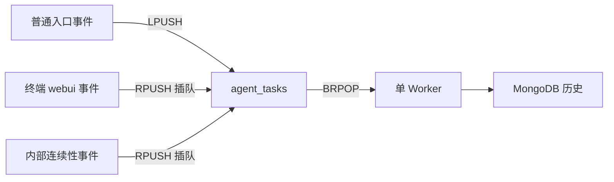

# 08 终端设计

## 本页结论

- 终端是 AAgent 的**最高权限人工入口**，不是独立 Agent，也不是新的会话边界；
- 终端提交的仍是普通 `webui` 事件，不绕过 Redis、Worker、MongoDB 或事件分发；
- 最高权限在信息层表现为 `system` 角色的 `AdminMsg`，在调度层表现为允许使用 `RPUSH` 插队；
- Chat 页是全局终端的历史投影，只展示 MongoDB 中已经消费的 `webui` 和 `response`；
- 终端按时间追加事件，不推断某条 `response` 属于哪条 `webui` 命令。

## 1. 设计起点：最高权限人工入口

AAgent 只有一个决策中心、一份全局认知和一条连续时间线。终端不是面向普通用户的聊天会话，而是可信操作者向这个决策中心直接提交管理意图的人工控制面。

这里的“最高权限”首先是**信息语义上的权限**。`llm.py` 将 `webui` 事件投影为：

```python
{"role": "system", "content": "<AdminMsg>...</AdminMsg>"}
```

因此终端输入不是普通用户消息，而是进入 LLM 上下文的管理员级指令。这个权限定义是后续工程选择的原因：

1. 终端命令必须进入同一个全局认知，不能建立隔离会话；
2. 可信操作者需要在必要时越过普通入口积压，因此终端获得插队资格；
3. 终端必须看到全局 Agent 输出，而不是只看“自己的回复”；
4. 显示内容必须来自已经提交的权威历史，不能把仅仅入队当成已经执行；
5. 终端不能绕过事件运行时直接调用 LLM 或修改 Agent 状态，否则会破坏单一时间线。

最高权限不等于特殊事件模型。终端提交的 `webui` 与其他事件一样，仍然遵守：

```text
HTTP 提交 → Redis List → 单 Worker 消费 → record_history() → 按 event_type 分发
```

它是**有插队资格的普通事件**，不是队列外命令、同步 RPC 或第二个执行核心。

## 2. 权限、优先级与执行边界

三个概念必须分开：

| 概念 | 终端中的含义 | 当前实现 |
|------|--------------|----------|
| 信息权限 | LLM 如何理解终端输入 | `webui` 映射为 `system` 角色的 `<AdminMsg>` |
| 调度优先级 | 事件在 Redis List 中何时被消费 | `POST /api/chat` 使用 `RPUSH`，靠近 `BRPOP` 消费端 |
| 执行权限 | 谁能推进 Agent 状态 | 仍只有单 Worker；WebUI 只能提交事件 |

所以“终端具有最高权限”的准确含义是：可信人工指令拥有最高的信息权重，并被允许优先进入统一事件运行时。它不意味着 WebUI 可以直接调用 `chat_with_deepseek()`、直接写 MongoDB 历史、直接执行工具或创建并行时间线。

## 3. 为什么使用 RPUSH

Redis List 的消费者固定使用 `BRPOP`：

- `LPUSH` 把事件放在远离消费端的一侧，用于普通 FIFO 排队；
- `RPUSH` 把事件放在靠近消费端的一侧，使其成为下一批候选事件。

终端命令使用 `RPUSH`，是最高权限语义在调度层的实现：当普通 QQ 事件或其他入口已经积压时，操作者仍能优先向 Agent 提交管理命令。



`RPUSH` 不会改变事件的类型或处理管线。Worker 弹出 `webui` 后仍先调用 `record_history()`，再生成空 `active` 事件触发后续推理。

### 3.1 当前优先级的边界

Redis List 只有两端，没有真正的多级优先级。终端 `webui` 与内部 `active`、`response`、`tool`、`tool_return` 都可能使用 `RPUSH`，所以它们共享同一个高优先级端。

这意味着终端命令不仅能越过普通 `LPUSH` 积压，也可能进入尚未完全消费的内部工具链之间。当前设计接受这个结果，因为终端代表最高权限人工干预。但它仍然不会抢占正在执行的函数或 LLM HTTP 请求，只会影响单 Worker 完成当前事件后的下一次 `BRPOP`。

如果未来需要同时满足“终端最高优先级”和“工具链原子连续”，单一 Redis List 的双端语义将不够，需要显式优先级队列、独立控制队列或可证明的调度规则。不能通过绕过 Worker 来解决。

## 4. 为什么是全局终端而不是对话页

终端服务的是唯一决策中心，不服务某个隔离会话。因此页面展示全局的 `webui` 和 `response` 历史：

- `webui` 表示管理员从终端提交的命令；
- `response` 表示 Agent 写回的全局响应，可能由终端、QQ 或未来其他入口触发；
- 页面不按用户、标签页或浏览器会话切割历史；
- 页面不宣称相邻的命令与响应存在一问一答关系。

当前事件没有 `conversation_id`、`correlation_id` 或 `causation_id`，而 `response` 已经刻意解除回复目标绑定。按时间邻接、内容相似或“上一条命令”推断归属都不可靠，也会把全局认知错误包装成局部聊天。

因此 Chat 的正确视觉模型是追加式终端：

```text
TERMINAL  管理员命令
AGENT     全局响应
TERMINAL  下一条管理员命令
AGENT     可能由任意入口触发的全局响应
```

它展示事件发生顺序，不表达未被事件协议证明的因果关系。

## 5. 读写架构

### 5.1 写路径

```text
浏览器
  → POST /api/chat
  → 校验 JSON、非空、4000 字符上限、暂不接受附件
  → 封装 webui {message, files: []}
  → RPUSH agent_tasks
  → 返回 201 与入队事件
```

接口返回 `201` 只表示事件已进入 Redis，不表示 Worker 已经消费，也不表示 LLM 已经执行。前端因此显示“已优先入队，等待消费”，但不会立即把该命令画进历史。

### 5.2 执行路径

```text
Worker BRPOP webui
  → record_history(webui)
  → 发布空 active
  → active 调用 LLM
  → response 进入事件流
  → Worker 消费 response
  → record_history(response)
```

终端输入通过 MongoDB 历史进入 callback，再以 `AdminMsg` 投影到 LLM 上下文。消息不是通过 `active.payload` 穿越调用链。

### 5.3 读路径

```text
浏览器轮询 GET /api/chat/history?limit=150
  → MongoDB event_history
  → event_type in [webui, response]
  → 按 _id 倒序取最近窗口
  → 服务端反转为正序
  → 浏览器按 _id 去重并追加
```

终端不读取 Redis pending，也不读取 Worker running。Redis 是调度事实，MongoDB 是已提交历史；终端只显示后者，从而避免同一事件同时存在于 Redis、Worker 和 MongoDB 时的跨存储去重与状态迁移问题。

## 6. 历史接口契约

`GET /api/chat/history` 接受 `limit`，默认 `150`，范围为 `1..300`。

```json
{
  "fetched_at": "2026-08-02T11:04:01Z",
  "items": [
    {
      "id": "688e...",
      "created_at": "2026-08-02T11:03:58Z",
      "event": {
        "event_type": "webui",
        "payload": { "message": "检查当前任务", "files": [] }
      }
    },
    {
      "id": "688f...",
      "created_at": "2026-08-02T11:04:00Z",
      "event": {
        "event_type": "response",
        "payload": { "content": "...", "reasoning": "", "tool_calls": [] }
      }
    }
  ]
}
```

`id` 来自 MongoDB ObjectID，是前端追加去重的稳定身份。`created_at` 是 Worker 调用 `record_history()` 的时间，不是浏览器提交时间。事件中的 `time` 可保留入口创建时间，但当前终端排序以已提交历史为准。

## 7. 前端刷新与追加规则

Chat 与事件页共用同一种导航栏控制：刷新间隔、暂停、立即刷新、最后同步时间和自动刷新状态。

终端刷新遵守以下规则：

1. 同一时刻最多一个历史请求；
2. 成功后更新时间，并按响应顺序处理 `items`；
3. 已存在于 `seen` 集合的 ObjectID 不重复渲染；
4. 新 `webui` 渲染为右侧 `TERMINAL` 命令；
5. 新 `response` 渲染为左侧 `AGENT` 输出；
6. 只有追加新事件时才滚动到底部；
7. 同步失败或超时直接显示在“最后同步”的时间位置；
8. 暂停自动刷新后，手动刷新仍然可用。

当前实现是固定窗口轮询，不是游标增量查询。如果页面持续运行且某次新增事件超过窗口上限，窗口外事件不会被补回；以当前单 Worker 和终端用途，这一限制暂时可接受。需要严格无遗漏时，应把接口升级为基于 ObjectID 的 `after` 游标。

## 8. 安全边界

因为 `webui` 会以 `system` 级 `AdminMsg` 进入 LLM 上下文，终端接口必须被视为高权限控制面，而不是公开聊天接口。

当前 Go 路由本身没有认证、授权或 CSRF 防护，Compose 还可能把端口直接发布到宿主机。因此部署必须至少保证：

- WebUI 仅暴露在可信网络或本机；
- 对外部署时由反向代理提供强认证和访问控制；
- 不允许不可信用户调用 `POST /api/chat`；
- 操作者理解终端输入会影响全局 Agent，而非私人会话；
- 日志和 MongoDB 历史按管理员指令数据进行保护。

最高权限是设计能力，也是安全责任。没有访问控制的最高权限终端不应暴露到公网。

## 9. 不变量与非目标

### 9.1 必须保持

1. 终端输入始终是普通事件，必须经过 Redis 和单 Worker；
2. 所有事件先写历史，再执行类型分发；
3. 终端不得直接调用 LLM、工具或 MongoDB 写历史；
4. Chat 只展示已提交历史，不把“已入队”伪装成“已执行”；
5. 页面不创建会话隔离，不推断未经协议证明的事件关联；
6. 终端的管理员语义必须与访问控制强度匹配。

### 9.2 当前非目标

- 把 `webui` 与 `response` 配成问答对；
- 展示 Redis pending 或 Worker running；
- 展示 `active`、`tool`、`tool_return` 的完整执行轨迹；
- 支持多个隔离终端会话；
- 支持附件上传；
- 保证工具链不被最高权限终端插队；
- 用 WebSocket 或 Server-Sent Events 替代轮询。

## 10. 与其他文档的关系

- 单一决策中心和线性执行：[00-设计哲学](00-设计哲学.md)
- Redis 双端队列与事件状态机：[02-事件与队列](02-事件与队列.md)
- WebUI 与 Agent 模块职责：[03-模块详解](03-模块详解.md)
- 事件的信息身份与 `AdminMsg` callback：[07-事件双重身份与信息回调](07-事件双重身份与信息回调.md)
- 事件流页面设计：[webUI/前端事件流设计](webUI/前端事件流设计.md)
- 轮询与 DOM 稳定性记录：[webUI/前端优化记录](webUI/前端优化记录.md)