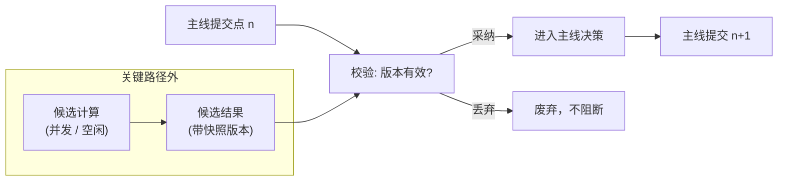

# 09 同步架构下的加速设计

> 本文讨论一个问题：在不改变“单 worker 串行提交 + 全局历史按需召回”架构的前提下，如何降低 Agent 的端到端延迟并提高吞吐。
>
> 本文描述的是设计方向，不代表相关能力已经实现。实现状态以[路线图与创新](05-路线图与创新.md)和源码为准。

## 1. 问题定义

AAgent 的约束不是“所有计算只能占一个线程”，而是：

1. 同一时刻只有一个推进权威上下文的决策点；
2. 下一次 LLM 决策必须基于已提交的最新主线状态；
3. 外部事件、工具结果和模型响应统一经过队列与 `record_history()` 管线；
4. 历史按需召回，经过筛选、排序、投影和裁剪后进入 prompt；
5. 缓存、索引和预计算结果不是事实来源，MongoDB 中已提交的历史才是。

因此，加速目标是把一部分计算移出关键路径，而不是让主线并发推进。端到端延迟可分解为：

$$
T_{total} = T_{queue} + T_{callback} + T_{prompt} + T_{llm} + T_{tool} + T_{commit}
$$

- $T_{queue}$：事件在队列中等待 worker 的时间；
- $T_{callback}$：检索、去重、重排和上下文组装时间；
- $T_{prompt}$：prompt 传输与输入预填充时间；
- $T_{llm}$：模型生成时间；
- $T_{tool}$：同步工具执行与网络等待时间；
- $T_{commit}$：事件记录、版本校验和后续事件入队时间。

加速就是压缩这些分项：能提前算的在关键路径外算好，主线只做校验和提交。

## 2. 不可突破的不变量

任何加速方案都必须通过以下检查：

| 不变量 | 判断问题 |
|--------|----------|
| 单一决策中心 | 是否出现两个同时推进主线的决策点？ |
| 主线顺序提交 | 是否可能基于旧版本覆盖新版本结果？ |
| 统一事件入口 | 是否绕过 Redis 和 `record_history()` 直接修改 Agent 状态？ |
| 候选不等于事实 | 预取、摘要、缓存或小模型输出是否未经验证就进入主线？ |
| 副作用唯一 | 候选计算是否可能重复发消息、写文件或调用不可逆 API？ |
| callback 可降级 | 索引、缓存或预计算失败时，是否仍能从权威历史恢复并继续？ |

违反其中任何一项，该方案引入的就不再是优化，而是另一套一致性模型。

## 3. 候选计算与主线提交

### 3.1 基本模式：推测执行，校验后提交

加速的基本模式是常规工程做法：**候选计算在关键路径外推测执行，主线在提交点基于最新版本校验后决定采纳或丢弃。**

- **候选计算**：主线之外的任何辅助计算——检索预取、摘要、小模型草稿、分支探索。它只产出数据，不产出结论；
- **提交点**：主 worker 下一次基于最新已提交状态进行决策和写回的时刻。只有在这里，候选内容才会被校验，通过后才进入主线；
- **采纳**：候选内容通过版本与相关性校验，被主线引用为输入材料。采纳不等于免验证——主线的 LLM 决策仍然基于完整上下文独立作出。

```text
权威历史快照 ──只读副本──→ 候选计算 ──→ 候选结果
                                          │
主线 ──────────────→ 提交点：版本校验 ←────┘
                          │
                     采纳 / 丢弃 → 主线继续
```

### 3.2 兼容性判据：可插拔性

判断一个加速手段是否兼容现有架构，标准是可插拔性：**移除它，系统语义不变，只是更慢或更贵。**

设主线状态转移为 $S_{n+1} = F(S_n, E_n)$，加入候选计算后：

$$
D_n = G(S_k, E, \text{budget}), \quad k \le n
$$

$$
S_{n+1} = F(S_n, E_n, \operatorname{validate}(D_n, S_n))
$$

$D_n$ 只是候选。只要候选计算只读快照、结果可丢弃、失败不阻断主线、采纳时按当前版本重新校验、副作用仍由主线串行提交，那么关闭候选层后系统退化为原架构——这就是兼容。Draft-Review、思考分支、潜意识搜索（见[路线图与创新](05-路线图与创新.md)）都应按此标准设计。

### 3.3 权限边界与副作用隔离

候选计算的权限管理是具体的安全问题，必须显式定义：

- **只读**：候选计算只能读取被授予的上下文快照，不得调用有副作用的工具（发消息、写文件、不可逆 API）；
- **无副作用**：候选计算的任何外部可见影响都视为**副作用泄漏**，属于权限配置缺陷，必须修复而不是追认；
- **隔离实现**：通过工具白名单、只读快照、独立执行环境落实，而不是依赖候选计算“自觉”；
- **泄漏判定**：候选计算触发了任何写操作或外部请求，即构成泄漏，无论结果是否被主线采纳。

### 3.4 两种时序：并发与空闲预计算

候选计算可以放在两个时间点：

1. **并发候选计算**：主线等待 LLM 响应或工具结果期间，并行执行检索预取、小模型草稿等。产物供当前或下一次提交点校验；
2. **空闲预计算**：队列排空、worker 阻塞等待时，预处理索引、摘要或常见查询，供未来提交点使用。

两种时序的产物都受同一约束：**必须在提交点通过版本校验才有效**。候选生成时的快照版本落后于主线当前版本，或目标、上下文已变化，则直接丢弃。



## 4. 工程约束

候选计算要落地，还需要以下具体设计，原稿（见审查日志快照）未覆盖：

- **快照与版本**：候选结果必须携带其基于的主线版本号；提交点比对当前版本，落后即丢弃；
- **预算**：并发候选的数量上限、token 预算、结果 TTL，避免候选计算本身消耗超过其节省的资源；
- **降级**：候选计算层可整体关闭，系统行为不变——这是可插拔性的运行态验证手段；
- **观测**：候选命中率（采纳数 / 生成数）、平均节省延迟、无效计算率。没有这三个指标，无法判断候选计算是否值得保留。

## 5. 结论

同步架构的加速空间在于：**把能提前做的计算移出关键路径，主线只做校验和提交。** 约束不是“不能并发”，而是“候选不能自行生效”。候选计算只读、无副作用、可丢弃、按版本校验后采纳——满足这四条，并发与加速都不破坏单一决策中心和串行提交。权限边界（只读快照 + 工具白名单 + 泄漏判定）是这一模式成立的前提。

## 关联文档

- 核心不变量：[00-设计哲学](00-设计哲学.md)
- 当前执行拓扑：[01-系统架构](01-系统架构.md)
- 队列与线性推进：[02-事件与队列](02-事件与队列.md)
- 规划能力与实现状态：[05-路线图与创新](05-路线图与创新.md)
- 事件和上下文格式：[06-格式规范](06-格式规范.md)
- callback 信息模型：[07-事件双重身份与信息回调](07-事件双重身份与信息回调.md)
