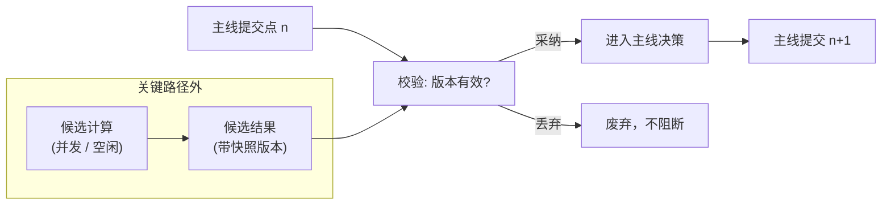

# 09 同步架构下的加速设计

> 本文目标只有四个字：**加速降费**。
>
> 本文描述的是设计方向，不代表相关能力已经实现。实现状态以[路线图与创新](05-路线图与创新.md)和源码为准。

## 1. 加速边界

AAgent 的约束不是“所有计算只能占一个线程”，而是：**同一时刻只能有一个推进权威上下文的决策点。** 主线之外可以并发执行只读、可丢弃的候选计算，最终仍由主 worker 校验和提交。

### 1.1 兼容性判据：可插拔性

判断一个加速手段是否兼容现有架构，标准是可插拔性：**移除它，系统语义不变，只是更慢或更贵。**

设主线状态转移为 $S_{n+1} = F(S_n, E_n)$，加入候选计算后（$E$ 为候选计算触发时可用的上下文与事件）：

$$
D_n = G(S_k, E, \text{budget}), \quad k \le n
$$

$$
\operatorname{adopt}(D_n, S_n) =
\begin{cases}
D_n, & \text{if } S_k \text{ 与 } S_n \text{ 相容} \\
\varnothing, & \text{otherwise}
\end{cases}
$$

$$
S_{n+1} = F(S_n, E_n, \operatorname{adopt}(D_n, S_n))
$$

$D_n$ 只是候选。"相容"表示候选所依赖的版本、目标和上下文在当前主线中仍然有效；不相容则丢弃。只要候选计算只读快照、结果可丢弃、失败不阻断主线、采纳时按当前状态重新校验、副作用仍由主线串行提交，那么关闭候选层后系统退化为原架构——这就是兼容。降费来自用本地模型承担检索、整理和初筛，减少付费主模型从空白开始推理的 token 与调用。Draft-Review、思考分支、潜意识搜索（见[路线图与创新](05-路线图与创新.md)）都应按此标准设计。

### 1.2 权限、信息边界与副作用隔离

候选计算的权限和可见信息都必须显式定义：

- **只读**：候选计算只能读取被授予的上下文快照，不得调用有副作用的工具（发消息、写文件、不可逆 API）；
- **无副作用**：候选计算的任何外部可见影响都视为**副作用泄漏**，属于权限配置缺陷，必须修复而不是追认；
- **上下文隔离**：候选计算不能默认读取全部历史，只能访问任务所需的历史切片；可以按来源、时间范围、事件类型、主题和召回数量限制其 callback 范围。

以上通过工具白名单、受限只读快照、独立执行环境和独立上下文组装落实。隔离不仅用于权限安全，也用于减少无关 token 开支、稳定辅助计算的输入边界并提高缓存命中率。

## 2. 不可突破的不变量

任何加速方案都必须通过以下检查：

| 不变量 | 判断问题 |
|--------|----------|
| 单一决策中心 | 是否出现两个同时推进主线的决策点？ |
| 主线顺序提交 | 是否可能基于旧版本覆盖新版本结果？ |
| 统一事件入口 | 是否绕过 Redis 和 `record_history()` 直接修改 Agent 状态？ |
| 候选不等于事实 | 预取、摘要、缓存或小模型输出是否未经验证就进入主线？ |
| 副作用唯一 | 候选计算是否可能重复发消息、写文件或调用不可逆 API？ |
| callback 可降级 | 索引、缓存或预计算失败时，是否仍能从权威历史恢复并继续？ |

违反其中任何一项，该方案引入的就不再是优化，而是另一套一致性模型。

## 3. 候选计算与主线提交

### 3.1 基本模式：推测执行，校验后提交

加速的基本模式是常规工程做法：**候选计算在关键路径外推测执行，主线在提交点基于最新版本校验后决定采纳或丢弃。**

- **候选计算**：主线之外的任何辅助计算——检索预取、摘要、小模型草稿、分支探索。它只产出数据，不产出结论；
- **提交点**：主 worker 下一次基于最新已提交状态进行决策和写回的时刻。只有在这里，候选内容才会被校验，通过后才进入主线；
- **采纳**：候选内容通过版本与相关性校验，被主线引用为输入材料。这里有两道关：采纳只确认材料在当前状态下仍然新鲜且相关，不保证其结论正确；事实判断和最终决策仍由主线 LLM 基于当前权威工作集独立完成。

```text
权威历史快照 ──只读副本──→ 候选计算 ──→ 候选结果
                                          │
主线 ──────────────→ 提交点：版本校验 ←────┘
                          │
                     采纳 / 丢弃 → 主线继续
```

### 3.2 两种时序：并发与空闲预计算

候选计算可以放在两个时间点：

1. **并发候选计算**：主线等待 LLM 响应或工具结果期间，并行执行检索预取、小模型草稿等。产物供当前或下一次提交点校验；
2. **空闲预计算**：队列排空、worker 阻塞等待时，预处理索引、摘要或常见查询，供未来提交点使用。受当前同步执行方式限制，空闲任务一旦开始，不能保证在新事件到达时立即被抢占；如果它与主 worker 共用执行路径，就可能延迟下一事件的处理。这个调度边界目前保留为待解决问题，不能把“立即让出”当作现有能力。

两种时序的产物都受同一约束：**必须在提交点通过版本校验才有效**。候选生成时的快照版本与当前主线状态不相容，或目标、上下文已变化，则丢弃。



## 4. 当前基线:待度量项

> 本节只列**待测项与度量方法**,不含结论。来源:[2026-09-14 全项目问题报告](审查日志/2026-09-14-全项目-问题报告.md)。在测出数字之前,下列内容不构成优化依据;每条括号内的编号指向该报告。

### O-01 工作流定义的读取成本

- **现状**:每次事件都调用 `read_active_workflow_id()` 与 `_read_workflow()`,二者各自 `with MongoClient(...)` 新建连接并全量读文档;`workflow_workflow` 节点还会为每个子 Workflow 再读一次。N 节点工作流 ⇒ ≥2N 次建连 + N 次全量读。对比 `history_repository.py` 已使用模块级单例。(报告 `M-01`)
- **度量**:在 `workflow()` 入口计数单次事件的 `MongoClient` 构造次数与 `find_one` 次数;跑一条 20 节点链,记录(建连次数, 读文档次数, 事件端到端耗时)。
- **判据**:若建连耗时占端到端比例超过一成,或次数随节点数线性增长,则值得引入进程内 client 复用与定义缓存。

### O-02 事件入库体积

- **现状**:`record_history(e)` 对所有事件无条件执行,`{**e, "created_at": ...}` 全量写入;队列写入与入库路径均无体积上限(WebUI 侧对事件**编辑**有 256 KB 限制,入库无等量限制)。(报告 `M-02`)
- **度量**:`event_history` 集合的日均写入条数、平均与最大文档字节数、总量与增长速率,并定位最大来源事件类型。
- **判据**:若出现单文档超过 256 KB,或增长速率要求定期清理,则引入摘要化或截断。

### O-03 文档检索与注入成本

- **现状**:`system_documents_prompt()` 每次调用执行 `documents_collection.find()` 全表扫描(无投影),再把每个 pinned 文档的**完整内容**拼进提示词;该函数目前只被已死的 `active()` 调用。另有 `list_documents()` 无投影返回全量 `content`,调用方却只用 `title`/`pinned`。(报告 `M-09`)
- **度量**:documents 集合文档数 × 平均 content 长度;pinned 注入后 system prompt 的字符数与 token 估算;若该能力迁移到 LLM 节点,单次执行的 token 增量。
- **判据**:注入 token 占比与检索耗时决定是否改为索引式注入 + 按需拉取。

### O-04 失败率当前不可度量

- **现状**:执行期异常只 `print` + `traceback` + `sleep(2)`,不产生任何失败事件,因此没有可聚合的失败信号。(报告 `F-02`)
- **度量**:需先有失败事件才能度量。在此之前无法计算失败率,也无法定位高频失败节点。
- **判据**:这是 O-01~O-03 的**前置项**——没有失败事件,任何"优化收益"都无法验证。

### O-05 单次执行的模型调用次数与 token

- **现状**:每个 LLM 节点每次执行调用一次 `chat_with_deepseek`;节点虽携带 `model` 参数,运行时实际只使用 `DEEPSEEK_MODEL` 环境变量,即所有 LLM 节点共用同一模型与同一 `base_url`;`messages` 由节点 `prompt` 与 `message-in-*` 端口拼装。(报告 `F-01`、`F-04`)
- **度量**:对含 K 个 LLM 节点的工作流,记录(调用次数, 输入 token, 输出 token, 计费),并区分"模型只回 tool_calls"与"回文本"两条路径的占比。
- **判据**:用于判断节点粒度的成本结构与缓存机会,不作为合并节点的依据。

## 5. 结论

同步架构的加速空间在于：**把能提前做的计算移出关键路径，主线只做校验和提交。** 约束不是“不能并发”，而是“候选不能自行生效”。候选计算只读、无副作用、可丢弃、按版本校验后采纳——满足这四条，并发与加速都不破坏单一决策中心和串行提交。权限与信息边界（只读快照 + 工具白名单 + 上下文隔离 + 独立执行）是这一模式成立的前提。

## 关联文档

- 核心不变量：[00-设计哲学](00-设计哲学.md)
- 当前执行拓扑：[01-系统架构](01-系统架构.md)
- 队列与线性推进：[02-事件与队列](02-事件与队列.md)
- 规划能力与实现状态：[05-路线图与创新](05-路线图与创新.md)
- 事件和上下文格式：[06-格式规范](06-格式规范.md)
- callback 信息模型：[07-事件双重身份与信息回调](07-事件双重身份与信息回调.md)
- 架构决策清单：[架构问题汇总](审查日志/架构问题汇总.md)
