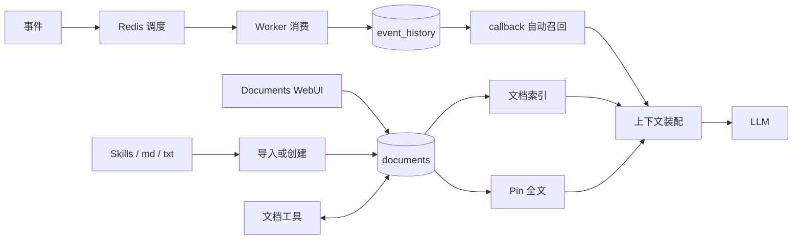

# 10 文档中心的信息处理

> 本文描述 AAgent 的一个信息处理原则：文档是信息进入召回、编排与上下文装配过程时的共同形态。这里的“文档”首先是 MongoDB document，不等同于磁盘上的 Markdown 文件。

## 核心判断

AAgent 可以把自己的信息处理方式概括为：

> **万物皆文档，通过文档召回上下文。**

这句话不是说所有数据都必须保存成 `.md`，也不是要用文件系统替代 MongoDB。它表达的是：只要一段信息需要被 Agent 保存、检索、筛选、重新组织或放入上下文，它就应当具有可独立寻址、携带元数据并可被召回的文档形态。

事件、长期说明、技能、用户主动保留的信息因此可以来自不同入口，但最终都进入以 document 为基本单位的信息空间。LLM 不需要知道信息最初来自队列、WebUI 还是文件导入，只需要面对经过业务规则选出的上下文。

## 来自 MongoDB 的启发

这个思路直接受到 MongoDB `document` 模型的启发。MongoDB 不把一条数据限制为关系表中的一行，而是以 BSON document 作为基本数据记录，以 collection 组织同类 document。每个 document 可以独立存在，拥有自己的 ID、字段和嵌套结构，也可以通过索引被查询和组合。

AAgent 将这种数据组织方式延伸到信息处理层：

- 每份信息首先是一个独立 document，而不是长对话中只能依靠位置识别的 message；
- 不同 document 平行存在于 collection 中，没有哪一份必须依附上一条信息才能被找到；
- document 通过 ID、来源、时间、类型、主题和任务等字段表达身份与关系；
- collection 保存全局信息，索引与召回规则从中选择当前任务需要的短工作集；
- document 的正文和元数据可以一起演进，不必把所有语义压缩进单一 message 字符串。

因此，“万物皆文档”既是 AAgent 的信息处理理念，也是在 Agent 场景中对 MongoDB document 思想的一次延伸。不过这不是说 MongoDB 内部的所有机制在字面上都是 document，也不是要照搬数据库 API；AAgent 借用的是它以独立文档组织数据的基本模型。

## 为什么不是“万物皆 message”

一种常见的 Agent 设计是把所有信息都视为 message：用户消息、工具结果、系统事件、历史记录和长期知识都不断追加到同一条对话中。这种方式开始简单，但会把信息组织和信息召回的责任逐渐转移给 LLM：

- 上下文会随着时间增长，近期内容和关键旧内容竞争同一个窗口；
- 信息的可见性主要由它在对话中的位置、截断规则和模型注意力决定；
- 当历史过长时，LLM 可能无法稳定找到真正相关的内容，即使内容仍然存在；
- 哪些信息被遗漏、为什么遗漏，难以由系统直接观察和调整；
- 不同来源被压扁成相同的 message 序列，文档边界和元数据容易丢失。

问题不在于 message 不重要。message 适合表达 LLM 当前这一轮需要处理的工作材料；问题在于不能把整个信息系统都退化成一条需要 LLM 自己维护的长对话。

## 短上下文与可控召回

AAgent 的方向是把 LLM 的上下文窗口控制在一个较短、但足以发挥当前模型能力的工作范围内。历史信息不因为“曾经进入过上下文”就永久留在上下文中，而是在需要时从文档信息空间重新召回。

```text
全局文档空间
    ↓  系统控制的发现、筛选、排序、裁剪
当前任务的短工作集
    ↓
LLM 推理与工具调用
```

这种设计把两件事分开：

- **LLM 负责理解和推理**：在短工作集中完成当前任务；
- **系统负责信息可达性**：决定有哪些文档候选、采用什么召回规则、如何排序、需要多少内容以及为什么进入上下文。

系统可控不代表召回天然完整。召回机制同样可能设计不周或漏掉信息，但它至少具有明确的输入、规则、结果和预算，可以测试、记录、调优和替换。相比让 LLM 在一条不断增长的 message 序列中自行寻找一切，这是一种更可观察的责任划分。

当前 callback 的固定历史窗口是这条路线的过渡实现；未来的 document callback 才会进一步利用文档元数据和任务相关性进行精细召回。设计目标是短而相关的工作集，不是把全部历史换一种格式重新塞进 prompt。

## 文档的独立性

文档应当是独立、平行、统一格式的信息单元，而不是长对话中的隐含片段：

- **独立**：可以单独创建、读取、引用、更新和删除；
- **平行**：不同来源的文档都处在同一个可检索信息空间，不必沿原始调用链逐层传递；
- **统一格式**：至少具备 ID、正文、来源、时间和可扩展元数据，召回器不需要为每个来源发明完全不同的上下文协议；
- **可组合**：多个文档可以按任务、优先级和 token 预算组成一次短工作集。

这里的“统一”指文档接口和召回语义统一，不要求 `event_history` 与 `documents` 使用完全相同的业务字段或生命周期。

## 两个信息集合

当前信息主要保存在 MongoDB 的两个 collection 中，它们承担不同职责。

### `event_history`

`event_history` 是运行过程中自然形成的动态信息池。

- 事件先通过 Redis List 完成调度；
- worker 消费事件时将其写入 `event_history`；
- callback 从历史事件中召回、筛选、排序和投影信息；
- 经过编排的结果才进入 LLM 上下文。

这里的事件同时具有调度触发器和信息文档两种身份。Redis 决定下一步执行什么，MongoDB 让事件成为之后仍可访问的信息。两者不能混为同一层，具体边界见 [07-事件双重身份与信息回调](07-事件双重身份与信息回调.md)。

### `documents`

`documents` 是显式维护的长期文档库。

- 用户和 Agent 可以创建、读取、重写、追加、重命名和删除文档；
- Documents WebUI 提供可视化的编辑、预览、导入和导出入口；
- Agent 通过文档工具按标题或 ID 主动查询；
- 文档列表进入 system prompt，提供可发现的文档索引；
- 被 Pin 的文档全文直接进入 system prompt，形成稳定的显式上下文。

因此，Pin 不是另一套存储机制，而是 `documents` 上的一种召回策略：它把“可能按需读取”提升为“每轮固定装配”。

## 两条召回路径

当前实现中，两类文档服务于同一个目标，但还没有经过完全统一的召回器。



- `event_history` 目前走 callback，以最近事件、类型投影和顺序规则自动准备对话上下文；
- `documents` 目前走 system prompt 索引、Pin 全文和推理期工具查询；
- 两条路径都属于“通过文档召回上下文”，但它们的触发条件、优先级和装配位置不同。

未来可以让二者共享更完整的召回、相关性排序和 token 预算机制，但不应为了形式统一而抹去它们的语义差别。运行事件具有时间性和因果顺序，长期文档则强调稳定内容与显式维护。

## Skills 的位置

根目录 `skills/` 中的文件是便于人直接编辑、交换和版本管理的技能载体。Documents WebUI 当前可以把 `.md` 和 `.txt` 文件导入 `documents`，导入后形成独立的 MongoDB 文档。

因此应区分：

- 文件是技能内容的一种来源、交换格式和备份形式；
- `documents` 是 Documents WebUI 与 Agent 文档工具共同操作的运行时文档库；
- Skills 是否被 Agent 使用，取决于它是否进入可发现、可查询或被 Pin 的上下文路径，而不只取决于磁盘上是否存在文件。

目前不应声称文件与 MongoDB 文档自动双向同步。若以后增加同步机制，还需要明确冲突处理、版本关系和哪一侧是事实来源。

## 格式偏好

AAgent 偏好 Markdown、XML 和 YAML，但三者解决的问题不同。

| 格式 | 适合的职责 | 当前体现 |
|------|------------|----------|
| Markdown | 长篇内容、技能、说明和人类编辑 | `documents.content` 的主要内容形式，WebUI 支持预览及 `.md` 导入导出 |
| XML | 上下文中的语义边界和模型可见结构 | system prompt、文档包装、命令及工具消息等上下文格式 |
| YAML | 元数据、配置和便于人工维护的结构化字段 | 设计偏好，尚未成为 `documents` 的固定 schema 或 WebUI 导入约定 |

格式不应反过来决定存储架构。MongoDB 保存结构化字段，正文可以使用 Markdown；装配进 prompt 时，再按用途包装为 XML。YAML 只有在确实需要可移植元数据时才应加入，不能把尚未实现的格式约定写成现状。

## Unix 风格的准确含义

这里所说的 Unix 风格是一种接口取向，而不是“所有内容都必须放在文件系统中”。它主要表现为：

- 信息尽量可读、可检查，并能以纯文本导入导出；
- 文档工具各自完成创建、查询、追加、重写、Pin 等单一操作；
- 不同来源通过共同的文档形态进入召回和上下文装配；
- Markdown、XML、YAML 等开放文本格式可以被人和程序共同处理；
- 存储、召回和展示彼此解耦，WebUI 不是文档数据的唯一入口。

MongoDB 并不违背这种风格。它负责持久化、索引和查询；只要系统仍保留清晰的数据边界、可组合的小工具和可导入导出的文本表达，底层就没有必要伪装成文件系统。

## 设计边界

“万物皆文档”应作为信息层原则，而不是无限扩张的口号。

它不表示：

- Redis 队列应该被 MongoDB 取代；
- 每个临时变量或中间计算都要持久化；
- `event_history` 与 `documents` 应立即合并成一个 collection；
- 所有文档都必须自动进入 prompt；
- Markdown 文件是唯一事实来源。

它真正要求的是：

1. 需要长期可达的信息应具有明确的 document 表示；
2. LLM 的当前上下文应是有预算的短工作集，而不是无限增长的历史容器；
3. 信息进入上下文前必须经过可解释的召回与编排规则；
4. 自动 callback、主动工具查询和 Pin 应被视为不同强度的召回方式；
5. 存储中的文档与最终 prompt 之间必须保留筛选层，不能把信息池直接倾倒给模型；
6. 新的信息来源应尽量接入现有文档与召回路径，而不是再造一套专用上下文传递链。

## 一句话总结

AAgent 不是“把一切保存成 Markdown”的系统，也不是“把一切追加成 message”的系统，而是一个**以 MongoDB document 组织信息、以系统可控的召回和编排生成短工作上下文、以开放文本格式连接人和 Agent** 的系统。