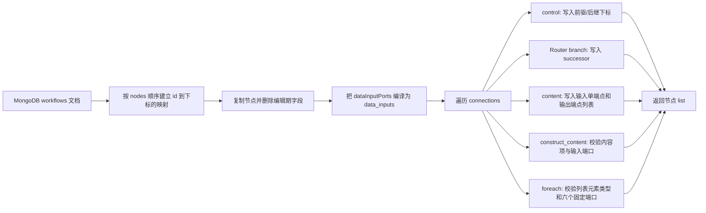

# Workflow 解析器

本文声明 `agent/workflow_parser.py` 的输入、解析结果和运行时数据约定。解析结果格式是 Worker 与其他 Workflow 执行器共同依赖的接口契约。

解析器的职责是把 WebUI 保存的 Workflow 图结构转换成运行时更容易遍历的节点列表。它不负责执行 LLM、调度任务或修改 MongoDB 数据。

## 1. 输入来源

解析器从 MongoDB 的 Workflow 集合读取一条文档：

```text
数据库:     MONGO_DATABASE，默认 agent
集合:       MONGO_WORKFLOW_COLLECTION，默认 workflows
查询条件:   {"key": workflow_key}
```

连接配置：

- `MONGO_HOST`，默认 `mongodb`
- `MONGO_PORT`，默认 `27017`
- `MONGO_USER`，可选
- `MONGO_PASS`，可选

命令行参数是 Workflow 的 `key`。示例：

```powershell
python agent/workflow_parser.py main
```

查询只读取 `nodes` 和 `connections`。MongoDB 文档不会被修改；文档的 `_id` 也不会进入解析结果。

## 2. 原始 Workflow 图

WebUI 保存的核心结构如下：

```json
{
  "version": 1,
  "nodes": [
    {"id": "input", "type": "input", "name": "Input", "x": 52, "y": 238},
    {
      "id": "router-1",
      "type": "router",
      "name": "任务路由",
      "branches": [
        {"id": "branch-1", "name": "分支 1"},
        {"id": "branch-2", "name": "分支 2"}
      ],
      "x": 310,
      "y": 238
    }
  ],
  "connections": [
    {
      "fromId": "input",
      "fromPortId": "control-out",
      "toId": "router-1",
      "toPortId": "control-in",
      "type": "control"
    }
  ]
}
```

这是编辑器图模型。节点通过稳定的字符串 `id` 连接，`x`、`y` 只服务于画布布局。

## 3. 解析结果

解析结果是一个 `list`，列表下标就是节点的运行时索引：

```text
result[0] -> input
result[1] -> router-1
result[2] -> llm-1
```

每个列表元素是一个节点字典。原节点的业务字段会保留，但编辑期字段 `x`、`y` 和 `dataInputPorts` 不会进入解析结果。`dataInputPorts` 会被编译成运行时的 `data_inputs`。

解析器为每个节点增加 `control_predecessors`、`control_successors`、`data_inputs` 和 `data_outputs`。Router 的每个 `branches` 元素还会增加 `successor`：

```json
{
  "id": "router-1",
  "type": "router",
  "name": "任务路由",
  "branches": [
    {"id": "branch-1", "name": "分支 1", "successor": 2},
    {"id": "branch-2", "name": "分支 2", "successor": null}
  ],
  "control_predecessors": [0],
  "control_successors": [2],
  "data_inputs": {
    "content-in": [0, "content-out"]
  },
  "data_outputs": {}
}
```

## 4. 控制流规则

控制流只表示执行顺序，不携带文本或模型结果。

### 普通节点

节点的控制关系使用节点下标：

```json
{
  "control_predecessors": [0],
  "control_successors": [2]
}
```

- `control_predecessors`：哪些节点可以把控制权交给当前节点。
- `control_successors`：当前节点完成后可以前往哪些节点。
- 当前字段是列表，即使某类节点通常只有一个前驱或后继，也统一使用下标列表。

### Router 节点

Router 的分支拥有自己的后继：

```json
"branches": [
  {"id": "branch-1", "name": "成功", "successor": 2},
  {"id": "branch-2", "name": "失败", "successor": 3}
]
```

`successor` 是目标节点在结果列表中的下标。它通过控制连接的 `fromPortId` 与 branch 的 `id` 匹配。

Router 一次运行只选择一个分支，不表示并行执行。未连接分支的 `successor` 为 `null`。同一 branch 连接多个后继会报错，避免静默覆盖。

### foreach 节点

`foreach` 是一个带数据状态的控制流节点，固定控制端口如下：

| 方向 | 端口 | 作用 |
| --- | --- | --- |
| 输入 | `control-in`（触发） | 普通进入 foreach |
| 输入 | `loop-in`（循环体结束） | 循环体完成后的再次进入 |
| 输出 | `control-out`（下一步） | 列表为空时离开循环 |
| 输出 | `loop-out`（循环体开始） | 列表仍有元素时进入循环体 |

解析器会保留端口名称，并将控制连接编译为统一的端点结构：

```json
{
  "type": "foreach",
  "control_inputs": {
    "control-in": [[1, "control-out"]],
    "loop-in": [[3, "control-out"]]
  },
  "control_outputs": {
    "control-out": [4, "control-in"],
    "loop-out": [2, "control-in"]
  },
  "data_inputs": {
    "list-in": [0, "list-out"]
  },
  "data_outputs": {
    "item-out": [[5, "content-in"]]
  }
}
```

这里有一个刻意保持的解耦约定：`control-in` 和 `loop-in` 是两个可读的 UI 端口，但不是两套不同的执行算法。运行时不需要判断本次事件从哪个输入端口进入；两者都执行同一段逻辑。因此，循环体结束边既可以连接到 `loop-in`，也可以连接到 `control-in`，两种接法的行为完全等价。解析器和保存层都必须允许这两种指向 foreach 的控制边，不能把“回边”绑定到某个特定输入端口。

`list-in` 接收 `list-content` 或 `list-message`，其元素类型由节点的 `item_type` 决定；`item-out` 输出对应的单个元素。执行器直接在运行时列表上执行 `pop(0)`：

1. 列表非空时取出一个元素，从 `item-out` 输出，并沿 `loop-out` 进入循环体。
2. 循环体完成后沿任一 foreach 输入端口再次触发同一节点。
3. 列表为空时不再输出当前项，而沿 `control-out` 进入下一步。

该设计不需要 `entry_port`、循环栈、循环帧或额外的 `render` 状态。列表本身就是循环进度，解析结果只负责提供稳定的端口和连接契约；执行状态由 Worker 在可变的 `data_inputs["list-in"]` 端点中维护。

## 5. 数据流格式契约

数据端点统一使用二元素列表：

```text
[节点下标, 端口 ID]
```

### 5.1 输入端口声明

节点通过 `dataInputPorts` 声明动态数据输入端口：

```json
{
  "id": "llm-1",
  "type": "llm",
  "dataInputPorts": ["content-in-0", "content-in-1"]
}
```

Parser 将该字段编译为 `data_inputs`，然后从解析结果中删除 `dataInputPorts`：

```json
"data_inputs": {
  "content-in-0": null,
  "content-in-1": null
}
```

`data_inputs` 必须保留所有已声明端口，包括未连线端口。`null` 表示“端口存在，但没有来源”，不能解释为端口不存在。

固定输入端口也进入同一个 `data_inputs` 字典。固定端口和 `dataInputPorts` 重名时合并为一个键：

| 节点类型 | 固定或动态 `data_inputs` | `data_outputs` |
| --- | --- | --- |
| `input` | 通常为空 | `content-out` |
| `router` | 固定 `content-in`，加通用声明端口 | 无 |
| `llm` | 由 `dataInputPorts` 声明 | 固定 `output`；按配置增加 `reasoning`、`tool_calls`（`list-content`） |
| `construct_message` | 固定 `content-in`，加通用声明端口 | `message-out` |
| `construct_content` | 由 `append_items` 中 `type: "port"` 的项目生成 | `content-out` |
| `construct_list` | 由 `item_type` 和 `initial_value_count` 生成 | `list-out` |
| `tool` | Tool 的 `parameters`，加通用声明端口 | `output` |

### 5.2 输入端口状态

一个输入端口最多有一个来源。Parser 输出及 Worker 运行期间，输入端口存在三种结构状态：

```text
未连接:           null
已连接，尚无值:   [source_node_index, source_port_id]
已收到运行时值:   [source_node_index, source_port_id, runtime_value]
```

例如：

```json
"data_inputs": {
  "content-in-0": [0, "content-out"],
  "content-in-1": null
}
```

表示 `content-in-0` 来自节点 `0` 的 `content-out`，而 `content-in-1` 已声明但未连线。同一个输入端口存在多个来源时，Parser 报错：

```text
data input has multiple sources
```

Worker 沿 `data_outputs` 传播数据时，把运行时值追加到目标输入端点列表。读取方使用最后一个元素作为最新值，但必须先检查结构：

```python
values = node["data_inputs"].get(port_id)
if isinstance(values, list) and len(values) > 2:
    value = values[-1]
```

不能使用 `if value` 判断数据是否到达，因为 `0`、`false`、空字符串和运行时 `null` 都是有效值。未连接端口为 `null`；已收到运行时 `null` 的端口是三元素列表，最后一个元素为 `null`，两者结构不同。

### 5.3 输出端口扇出

一个输出端口可以连接多个下游输入端口，因此 `data_outputs` 的值是端点列表：

```json
"data_outputs": {
  "content-out": [
    [1, "content-in"],
    [2, "content-in-0"]
  ]
}
```

外层列表表示一个输出的多个目标，内层列表表示单个目标端点。它不表示输入端口可以有多个来源。

### 5.4 LLM 动态上下文

LLM 上下文输入从 `0` 开始连续编号：

```text
content-in-0
content-in-1
content-in-2
...
```

前端决定端口数量，并把完整列表写入 `dataInputPorts`。Parser 只执行通用端口编译和连线解析，不根据 LLM 类型或 `content-in-*` 前缀临时创建端口。content 连接的目标端口必须已经存在于 `data_inputs`。

Worker 只读取符合 `content-in-<数字>` 格式的端口，并按数字后缀升序处理。只有一个上下文到达时保持原值；多个上下文到达时按端口顺序合并。LLM 不接受无数字后缀的 `content-in` 端口。

### 5.5 LLM 工具调用输出

Workflow 不再提供独立的 `tool_calls` 节点。LLM 仍可通过 `tool_calls` 布尔开关启用同名 `list-content` 输出端口；该端口表示模型返回的 OpenAI 格式工具调用数组，具体的工具编排由新的实现负责。关闭开关时该输出不会进入解析结果。

## 6. 转换流程



## 7. 构造列表节点

`construct_list` 不改变控制流，只把 `initial_value_count` 个同类型数据输入按端口顺序聚合为一个列表。节点配置示例：

```json
{
  "type": "construct_list",
  "item_type": "message",
  "initial_value_count": 2,
  "dataInputPorts": ["message-in-0", "message-in-1"]
}
```

`item_type` 只能是 `content` 或 `message`，数量允许为 `0` 到 `20`。输入连接使用元素类型 `content` 或 `message`；输出端口固定为 `list-out`，连接类型分别为 `list-content` 或 `list-message`。运行时输出始终是列表，未连接的初始值端口会使节点等待；数量为 `0` 时输出空列表。

节点下标来自 MongoDB 文档中 `nodes` 的原始顺序，解析器不会按照节点 ID 或坐标重新排序。因此连接关系转换后不依赖字符串 ID。

## 8. 构造 Content 节点

`construct_content` 在控制流触发后，按照 `append_items` 的数组顺序组合内容，并从 `content-out` 输出一个新的 `content` 值。内容项可以来自数据端口，也可以是节点参数中的固定字符串。一个节点至少需要一个内容项，内容项数量没有额外的固定上限。

节点配置示例：

```json
{
  "id": "append-1",
  "type": "construct_content",
  "name": "补充上下文",
  "append_items": [
    {"type": "port", "port_id": "append-in-0"},
    {"type": "fixed", "value": "\n\n请继续处理："},
    {"type": "port", "port_id": "append-in-1"}
  ],
  "dataInputPorts": ["append-in-0", "append-in-1"]
}
```

字段规则：

- `append_items` 必须是非空列表。
- `type: "port"` 表示通过数据连接接收 `content`。该项目必须提供非空字符串 `port_id`。
- `type: "fixed"` 表示追加参数中的固定内容。`value` 默认为空字符串，并且必须是字符串。
- `dataInputPorts` 必须恰好包含所有 `port` 项的 `port_id`，不能包含固定项对应的端口，也不能重复。
- 内容项的顺序由 `append_items` 决定，不由端口 ID 或节点坐标决定。
- `construct_content` 的输入连接类型必须是 `content`，目标端口必须是 `dataInputPorts` 中声明的端口。
- 输出端口固定为 `content-out`，输出连接类型为 `content`。

解析后的节点示例：

```json
{
  "id": "append-1",
  "type": "construct_content",
  "name": "补充上下文",
  "append_items": [
    {"type": "port", "port_id": "append-in-0"},
    {"type": "fixed", "value": "\n\n请继续处理："},
    {"type": "port", "port_id": "append-in-1"}
  ],
  "control_predecessors": [1],
  "control_successors": [3],
  "data_inputs": {
    "append-in-0": [0, "content-out"],
    "append-in-1": null
  },
  "data_outputs": {
    "content-out": []
  }
}
```

解析器只负责把 Port 项编译为 `data_inputs`，不执行字符串拼接。运行时节点被触发时，执行器按 `append_items` 遍历：固定项直接加入结果；Port 项有运行时值时加入结果；没有值的 Port 项跳过。最终结果使用字符串拼接后通过 `content-out` 传播，再沿 `control_successors` 继续执行。

## 9. 当前校验

当前实现会检查：

- `nodes` 和 `connections` 必须是列表。
- 节点必须有非空字符串 `id`，且不能重复。
- Router 必须有 `branches` 列表。
- `dataInputPorts` 必须是非空字符串组成的列表，端口 ID 不能重复。
- 连接两端的节点必须存在。
 - 连接类型支持 `control`、`content`、`message`、`list-content` 和 `list-message`。
 - `construct_list` 的元素类型、数量和动态输入端口必须一致。
 - `construct_list` 的输入连接必须使用元素类型，输出连接必须使用对应的 `list-*` 类型。
- `construct_content` 必须包含至少一个合法内容项；Port 项的 `port_id` 必须唯一，固定项的 `value` 必须是字符串。
- `construct_content` 的 `dataInputPorts` 必须恰好匹配所有 Port 项的端口 ID。
- 连接端点 ID 必须是非空字符串。
- Router 分支必须存在，且一个分支不能有多个控制后继。
- content 连接的来源端口必须存在于来源节点的 `data_outputs`。
- content 连接的目标端口必须存在于目标节点的 `data_inputs`。
- 一个数据输入端口不能有多个来源。

当前还没有完整的端口方向和端口类型校验。也就是说，解析器暂时相信 WebUI 已经保证 `fromPortId` 是输出端口、`toPortId` 是输入端口。后续增加节点类型时，应把端口定义集中化后再补充这部分校验。

## 10. 当前边界

这是解析 demo，不是 Workflow 运行器：

- 不执行节点。
- 不选择 Router 分支。
- 不负责判断控制流是否可执行；控制流环由运行时节点语义决定，`foreach` 的合法循环由列表消费条件终止。
- 不判断必需数据是否已经准备好；未连线输入保留为 `null`。
- 不把 `selectedId`、连接拖拽状态或视口状态带入结果。
- 不修改 MongoDB。

运行时执行器应把本解析结果作为可变运行图，沿 `control_successors` 或 Router 的 `branches[].successor` 调度节点，通过 `data_outputs` 定位目标，并把运行时值追加到目标 `data_inputs` 端点列表。

## 11. 完整解析结果示例

下面的结果包含 Input、Router 和双输入 LLM，展示控制流、数据流、未连接端口以及动态端口编译后的统一格式：

```json
[
  {
    "id": "input",
    "type": "input",
    "name": "Input",
    "control_predecessors": [],
    "control_successors": [1],
    "data_inputs": {},
    "data_outputs": {
      "content-out": [
        [1, "content-in"],
        [2, "content-in-0"]
      ]
    }
  },
  {
    "id": "router-1",
    "type": "router",
    "name": "任务路由",
    "branches": [
      {"id": "branch-1", "name": "执行", "successor": 2},
      {"id": "branch-2", "name": "结束", "successor": null}
    ],
    "control_predecessors": [0],
    "control_successors": [2],
    "data_inputs": {
      "content-in": [0, "content-out"]
    },
    "data_outputs": {}
  },
  {
    "id": "llm-1",
    "type": "llm",
    "name": "主 LLM",
    "prompt": "完成用户请求",
    "think": false,
    "tool_calls": false,
    "control_predecessors": [1],
    "control_successors": [],
    "data_inputs": {
      "content-in-0": [0, "content-out"],
      "content-in-1": null
    },
    "data_outputs": {
      "output": []
    }
  }
]
```

该示例中的 `content-in-1` 虽未连线仍然存在。这是格式保证，不允许执行器通过删除未连线键来压缩解析结果。