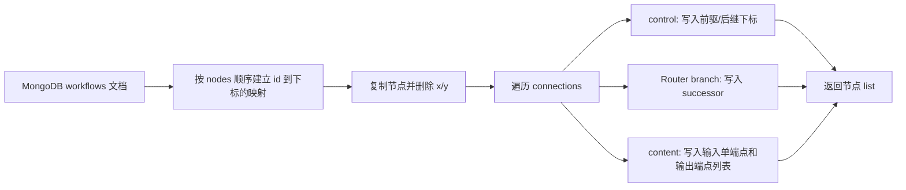

# Workflow 解析器

本文描述 `agent/workflow_parser.py` 当前 demo 的实际行为。

解析器的职责是把 WebUI 保存的 Workflow 图结构转换成运行时更容易遍历的节点列表。它不负责执行 LLM、调度任务或修改 MongoDB 数据。

## 1. 输入来源

解析器从 MongoDB 的 Workflow 集合读取一条文档：

```text
数据库:     MONGO_DATABASE，默认 agent
集合:       MONGO_WORKFLOW_COLLECTION，默认 workflows
查询条件:   {"key": workflow_key}
```

连接配置：

- `MONGO_HOST`，默认 `mongodb`
- `MONGO_PORT`，默认 `27017`
- `MONGO_USER`，可选
- `MONGO_PASS`，可选

命令行参数是 Workflow 的 `key`。示例：

```powershell
python agent/workflow_parser.py main
```

查询只读取 `nodes` 和 `connections`。MongoDB 文档不会被修改；文档的 `_id` 也不会进入解析结果。

## 2. 原始 Workflow 图

WebUI 保存的核心结构如下：

```json
{
  "version": 1,
  "nodes": [
    {"id": "input", "type": "input", "name": "Input", "x": 52, "y": 238},
    {
      "id": "router-1",
      "type": "router",
      "name": "任务路由",
      "branches": [
        {"id": "branch-1", "name": "分支 1"},
        {"id": "branch-2", "name": "分支 2"}
      ],
      "x": 310,
      "y": 238
    }
  ],
  "connections": [
    {
      "fromId": "input",
      "fromPortId": "control-out",
      "toId": "router-1",
      "toPortId": "control-in",
      "type": "control"
    }
  ]
}
```

这是编辑器图模型。节点通过稳定的字符串 `id` 连接，`x`、`y` 只服务于画布布局。

## 3. 解析结果

解析结果是一个 `list`，列表下标就是节点的运行时索引：

```text
result[0] -> input
result[1] -> router-1
result[2] -> llm-1
```

每个列表元素是一个节点字典。原节点的业务字段会保留，但 `x` 和 `y` 会被移除，并增加链路字段：

```json
{
  "id": "router-1",
  "type": "router",
  "name": "任务路由",
  "branches": [
    {"id": "branch-1", "name": "分支 1", "successor": 2},
    {"id": "branch-2", "name": "分支 2", "successor": null}
  ],
  "control_predecessors": [0],
  "control_successors": [2],
  "data_inputs": {
    "content-in": [0, "content-out"]
  },
  "data_outputs": {}
}
```

## 4. 控制流规则

控制流只表示执行顺序，不携带文本或模型结果。

### 普通节点

节点的控制关系使用节点下标：

```json
{
  "control_predecessors": [0],
  "control_successors": [2]
}
```

- `control_predecessors`：哪些节点可以把控制权交给当前节点。
- `control_successors`：当前节点完成后可以前往哪些节点。
- 当前字段是列表，即使某类节点通常只有一个前驱或后继，也统一使用下标列表。

### Router 节点

Router 的分支拥有自己的后继：

```json
"branches": [
  {"id": "branch-1", "name": "成功", "successor": 2},
  {"id": "branch-2", "name": "失败", "successor": 3}
]
```

`successor` 是目标节点在结果列表中的下标。它通过控制连接的 `fromPortId` 与 branch 的 `id` 匹配。

Router 一次运行只选择一个分支，不表示并行执行。未连接分支的 `successor` 为 `null`。同一 branch 连接多个后继会报错，避免静默覆盖。

## 5. 数据流规则

数据流表示节点之间传递的内容。端点统一使用：

```text
[节点下标, 端点 ID]
```

### 数据输入：单来源

一个输入端口只有一个来源，因此 `data_inputs` 的值就是一个端点，不再额外包一层列表：

```json
"data_inputs": {
  "content-in": [0, "content-out"]
}
```

含义是当前节点的 `content-in` 来自第 `0` 个节点的 `content-out`。

同一个输入端口存在多个数据来源时，解析器报错：

```text
data input has multiple sources
```

### 数据输出：允许扇出

一个输出端口可以连接多个下游输入端口，因此 `data_outputs` 的值是端点列表：

```json
"data_outputs": {
  "content-out": [
    [1, "content-in"],
    [2, "content-in"]
  ]
}
```

这里的两层列表是有意义的：外层表示一个输出的多个目标，内层表示单个目标端点。它不代表输入端口可以有多个来源。

## 6. 转换流程



节点下标来自 MongoDB 文档中 `nodes` 的原始顺序，解析器不会按照节点 ID 或坐标重新排序。因此连接关系转换后不依赖字符串 ID。

## 7. 当前校验

当前实现会检查：

- `nodes` 和 `connections` 必须是列表。
- 节点必须有非空字符串 `id`，且不能重复。
- Router 必须有 `branches` 列表。
- 连接两端的节点必须存在。
- 连接类型只能是 `control` 或 `content`。
- 连接端点 ID 必须是非空字符串。
- Router 分支必须存在，且一个分支不能有多个控制后继。
- 一个数据输入端口不能有多个来源。

当前还没有完整的端口方向和端口类型校验。也就是说，解析器暂时相信 WebUI 已经保证 `fromPortId` 是输出端口、`toPortId` 是输入端口。后续增加节点类型时，应把端口定义集中化后再补充这部分校验。

## 8. 当前边界

这是解析 demo，不是 Workflow 运行器：

- 不执行节点。
- 不选择 Router 分支。
- 不检查控制流是否存在环。
- 不判断必需数据是否已经准备好。
- 不把 `selectedId`、连接拖拽状态或视口状态带入结果。
- 不修改 MongoDB。

运行时执行器应把本解析结果作为输入，沿 `control_successors` 或 Router 的 `branches[].successor` 调度节点，再通过 `data_inputs` 读取上游输出。