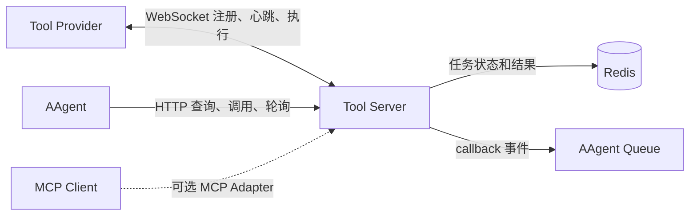

# 17 Tool Server 设计

## 1. 目标

引入独立的 `tool_server`，统一管理分布式工具的注册、发现、调用和任务状态。

- 工具提供方通过 WebSocket 长连接注册工具并接收调用；
- AAgent 通过非流式 HTTP API 查询和调用工具；
- 调用既可阻塞等待，也可立即返回任务 ID；
- 异步任务完成后可由调用方轮询，也可向 Redis Queue 发布回调事件；
- MCP 不是核心协议，未来需要兼容标准 MCP Client 时再增加适配层。

## 2. 功能与定位总览

`tool_server` 是 AAgent 与分布式 Tool Provider 之间的**工具调度基础设施**。它位于 LLM / Workflow 执行层之外，向上为 AAgent 提供统一工具目录和调用 API，向下管理 Provider 的连接、路由与任务状态。实际执行发生在 Tool Provider 内部，Tool Server 不承载工具执行 Worker，也不能直接推进 AAgent 的状态。

Tool Server 按**单实例调度内核**设计：系统中始终只有一个 Tool Server 实例持有 Provider 连接、工具注册表和任务调度权，不通过增加 Tool Server 实例分发任务。工具执行吞吐由 Provider 数量及其 Consumer 并发扩展；Tool Server 多实例会额外引入连接归属、跨实例转发和重复调度问题，与本系统的职责划分不符。

| 维度 | 功能与定位 | AAgent 中的使用方式 |
|------|------------|---------------------|
| 工具接入 | Provider 通过 WebSocket 动态注册 Tool Schema、维持心跳并接收调用 | AAgent 不再直接导入所有工具实现，只读取统一工具目录 |
| 同步阻塞 | HTTP 调用等待工具完成，并在同一响应中返回结果 | 适合短耗时工具；Workflow 节点可像调用本地函数一样等待结果 |
| 异步轮询 | HTTP 调用立即返回 `task_id`，调用方随后查询任务状态和结果 | 适合长耗时任务，以及调用方需要自行控制等待节奏的场景 |
| 异步回调 | HTTP 调用立即返回 `task_id`，任务完成后向 AAgent Queue 发布结果事件 | 适合不阻塞单 Agent worker 的长任务；结果仍由统一事件队列进入 Agent 时间线 |
| 消费与并发 | Provider 自行控制工具执行并发，Tool Server 只负责派发与状态管理 | 每个 Provider 按自身资源和线程安全条件独立配置吞吐 |
| 任务管理 | Tool Server 统一保存 `pending`、`working` 和终态，并为每个 Task 分配独立通知队列；Provider 管理内部执行队列 | 三种使用方式共享同一个任务记录和按 Task 隔离的等待通道，不形成多套状态来源 |
| 系统边界 | 只执行工具和投递结果，不负责 LLM 推理、Workflow 编排或历史写入 | AAgent 仍是唯一决策中心，Redis Queue 仍是推进 Agent 状态的唯一入口 |
| 标准兼容 | Tool Schema 尽量兼容 MCP，未来可增加独立 MCP Adapter | MCP Client 与 AAgent REST 调用复用同一注册表和执行内核 |

三种使用方式的选择原则：**短任务同步阻塞，长任务异步轮询，需要自动唤醒 AAgent 的长任务使用异步回调。**异步轮询和异步回调不是两套任务机制，区别只在于任务完成后是否主动发布 callback。

## 3. 服务边界



`tool_server` 负责：

1. 校验和保存工具 Schema；
2. 维护 Tool Provider 在线状态；
3. 将调用路由到对应 Provider，并接收任务确认与结果；
4. 记录任务状态、结果和过期时间；
5. 提供 HTTP 查询接口并按需发布回调事件。

`tool_server` 不负责：

- LLM 推理和 Workflow 编排；
- 运行工具执行 Worker 或管理 Provider 内部 Consumer；
- 修改 AAgent 的 MongoDB 历史；
- 绕过 `main_agent_queue` 推进 Agent 状态；
- 把 Provider 的 WebSocket 连接状态当作任务状态。

部署层可以通过进程守护和故障后重启恢复单实例，但不能同时启动多个拥有调度权的 Tool Server。高可用不改变单实例、单调度权约束。

## 4. Tool Schema

工具使用 JSON Schema 2020-12 描述输入和输出。注册格式可直接兼容 MCP Tool 的主要字段：

```json
{
  "name": "web.search",
  "description": "搜索公开网页",
  "inputSchema": {
    "type": "object",
    "properties": {
      "keyword": { "type": "string" }
    },
    "required": ["keyword"],
    "additionalProperties": false
  },
  "outputSchema": {
    "type": "array",
    "items": { "type": "object" }
  },
  "annotations": {
    "readOnlyHint": true
  }
}
```

工具名在服务内必须唯一。建议使用 `<domain>.<action>`，例如 `web.search`、`qq.send_message`。同一工具的 Schema 发生变化时，Provider 必须提交递增的 `revision`。

## 5. Provider WebSocket 协议

连接地址：`WS /ws/providers`

Provider 建立连接后先认证，再注册一组工具：

```json
{
  "type": "register",
  "provider_id": "provider-web-01",
  "revision": 3,
  "tools": []
}
```

Tool Server 派发调用：

```json
{
  "type": "invoke",
  "task_id": "01J...",
  "tool": "web.search",
  "arguments": { "keyword": "MCP" },
  "deadline": "2026-09-14T12:00:30Z"
}
```

Provider 成功将任务放入内部队列后返回接收确认：

```json
{
  "type": "accepted",
  "task_id": "01J..."
}
```

任务执行期间，Provider 可以定时或在进度变化时上报状态：

```json
{
  "type": "status",
  "task_id": "01J...",
  "status": "working",
  "progress": 0.6,
  "message": "已处理 60%"
}
```

Provider 返回结果：

```json
{
  "type": "result",
  "task_id": "01J...",
  "success": true,
  "output": [{ "title": "Model Context Protocol" }]
}
```

双方定期发送 `ping` / `pong`。连接断开后，该 Provider 的工具立即标记为不可调度。Tool Server 与 Provider 的连接管理、消费并发和重连处理见 [18-Tool Server内核实现](18-Tool Server内核实现.md)。

## 6. HTTP API

```text
GET  /api/tools
GET  /api/tools/{tool_name}
POST /api/tools/{tool_name}/calls
GET  /api/tasks/{task_id}
POST /api/tasks/{task_id}/cancel
```

统一调用请求：

```json
{
  "arguments": { "keyword": "MCP" },
  "mode": "wait",
  "timeout_ms": 30000,
  "idempotency_key": "optional-client-generated-key",
  "callback": {
    "type": "redis",
    "queue": "main_agent_queue",
    "event_type": "async_result"
  }
}
```

### 6.1 阻塞等待

`mode: "wait"` 时，HTTP 请求等待任务完成：

- 在 `timeout_ms` 内完成：返回 `200` 和最终任务；
- 等待超时但任务仍在执行：返回 `202` 和 `task_id`，任务不会取消；
- `timeout_ms` 必须设置上限，避免长期占用 HTTP 连接。

阻塞等待只依赖统一任务状态，不直接等待某一条 WebSocket 消息。Provider 的状态和结果上报会推进任务状态并唤醒请求；具体等待与唤醒机制见 [18-Tool Server内核实现](18-Tool Server内核实现.md)。

### 6.2 只发布任务

`mode: "async"` 时，任务持久化并成功派发后立即返回 `202`。调用方使用 `GET /api/tasks/{task_id}` 查询状态。

### 6.3 Queue 回调

Queue 回调仍使用 `mode: "async"`，只是额外提供 `callback`。任务进入终态后，Tool Server 向指定队列发布一次事件：

```json
{
  "event_type": "async_result",
  "payload": {
    "task_id": "01J...",
    "tool": "web.search",
    "status": "completed",
    "result": [{ "title": "Model Context Protocol" }],
    "error": null
  }
}
```

对 AAgent 的回调只能进入统一事件队列，由单 worker 记录和处理。Tool Server 不直接写入 AAgent 历史，也不直接恢复或执行 Workflow。

## 7. 任务模型

所有调用先创建任务，因此阻塞、轮询和回调共享同一个状态来源：

```json
{
  "task_id": "01J...",
  "tool": "web.search",
  "status": "working",
  "created_at": "2026-09-14T12:00:00Z",
  "updated_at": "2026-09-14T12:00:01Z",
  "expires_at": "2026-09-15T12:00:00Z",
  "result": null,
  "error": null
}
```

每个 Task 固有一条独立的 Redis 通知队列，例如 `tool:task:{task_id}:updates`。该队列只承载“任务状态可能已变化”的唤醒信号，不保存任务状态，也不承担工具执行；Provider 内部任务队列才负责排队执行工具。任务记录始终是唯一事实来源，通知队列与任务使用相同 TTL。

状态定义：

| 状态 | 含义 |
|------|------|
| `pending` | 已创建，等待可用 Provider |
| `working` | 已派发，Provider 正在执行 |
| `completed` | 成功完成，结果不可再修改 |
| `failed` | 执行失败或超时，错误不可再修改 |
| `cancelled` | 已取消，属于终态 |

任务终态必须不可变。取消采用协作式语义：Server 接受取消请求后通知 Provider，但 Provider 可能已经完成，因此状态更新必须通过原子条件写入解决竞态。

## 8. 可靠性语义

1. 返回 `task_id` 前，任务必须已经可查询；
2. Provider 上报按 `task_id` 幂等处理，任务终态不可被覆盖；
3. callback 采用至少一次投递，AAgent 按 `task_id` 去重；
4. 非幂等工具默认不自动重试；
5. Provider 断线不能直接等同于已接收任务失败。

存储结构、阻塞唤醒、Provider 消费模型和 callback 投递实现见 [18-Tool Server内核实现](18-Tool Server内核实现.md)。

## 9. 安全约束

- Provider 和 HTTP 调用方分别认证，不共享凭据；
- 按工具配置调用权限，不能仅凭工具名授权；
- 注册时校验 Schema 的大小、深度和 `$ref`，默认禁止远程 `$ref`；
- 校验调用参数和结构化输出；
- 限制参数、结果、消息体和并发任务大小；
- callback queue 使用服务端白名单，禁止调用方写入任意 Redis Key；
- 记录调用方、工具、Provider、耗时、状态和错误用于审计。

## 10. MCP 兼容策略

当前核心服务命名为 `Tool Server`，因为 Provider 注册、REST 调用和 Redis callback 都是项目自定义协议，并非标准 MCP Transport。

未来可增加独立的 MCP Adapter：

| MCP 能力 | Tool Server 映射 |
|----------|------------------|
| `tools/list` | `GET /api/tools` |
| `tools/call` | `POST /api/tools/{name}/calls` |
| MCP Tasks 扩展 | Tool Server 任务状态与查询接口 |

适配层只转换协议，不复制工具注册表和任务执行逻辑。这样既保留当前 AAgent 的简单 HTTP 接入，也能在需要时服务标准 MCP Client。

## 11. 建议实施顺序

1. 实现 Provider 注册、心跳和工具列表；
2. 实现任务持久化、WebSocket 派发、Provider 接收确认和结果回写；
3. 实现 `wait`、`async` 和任务查询接口；
4. 实现 callback 可靠投递与 AAgent 去重消费；
5. 最后按实际客户端需求增加 MCP Adapter。