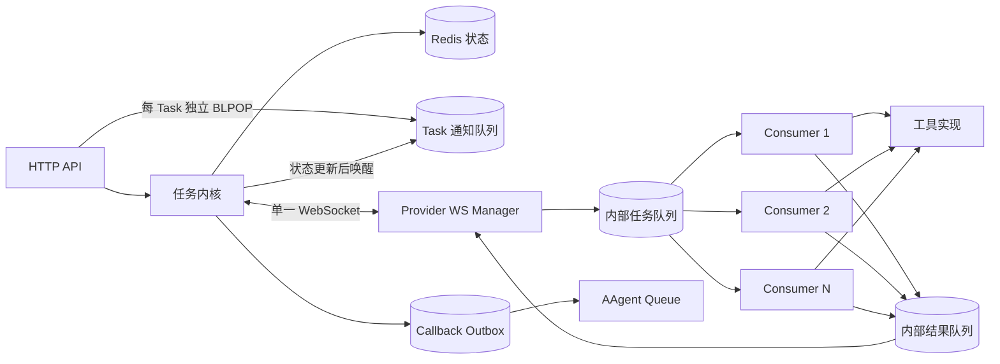
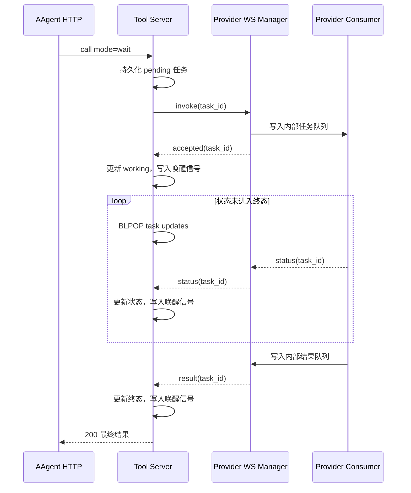

# 18 Tool Server 内核实现

## 1. 文档边界

本文描述 [17-Tool Server设计](17-Tool Server设计.md) 的内部实现，重点包括 Provider 连接所有权、执行并发、任务持久化、阻塞唤醒和 callback 可靠投递。外部职责、协议字段、任务状态和三种调用方式以设计文档为准。

## 2. 内核组件

Tool Server 是单实例调度内核。任意时刻只有一个实例持有 Provider WebSocket、工具注册表和任务调度权；系统不通过部署多个 Tool Server 实例分发任务。执行能力由 Provider 及其 Consumer 横向扩展，部署守护只负责在故障后恢复这个单实例，不引入并行调度实例。

Tool Server 内核负责注册表、连接路由、任务状态和回调投递，不启动工具执行 Worker。工具执行队列与 Consumer 全部位于 Provider 内部。

## 3. Provider 连接与消费

每个 Provider 由一个 WS Manager 独占 WebSocket。WS Manager 是连接的唯一读写者，负责将 `invoke` 写入内部任务队列，并将内部结果队列中的 `status` 和 `result` 发回 Tool Server。Consumer 不直接接触 WebSocket。

Provider 使用固定数量的 Consumer 控制并发，每个 Consumer 同时执行一个任务，因此最大执行并发等于 Consumer 数量。初始建议配置 1 个 Consumer，确认工具线程安全且资源允许后再增加。

内部任务队列必须有容量上限。WS Manager 成功入队后立即返回 `accepted`，队满则返回 `rejected`，不能等到工具执行完成才确认。Consumer 完成后将带 `task_id` 的结果写入内部结果队列，由 WS Manager 统一发送。

双方定期发送 `ping` / `pong`。连接断开后，Provider 的工具立即标记为不可调度：

- 未收到 `accepted` 的任务保持 `pending`，等待重新路由或超时；
- 已收到 `accepted` 的任务按租约和超时策略处理；
- 非幂等工具不能仅因连接重建而自动重复执行；
- 调整 Consumer 数量只改变工具吞吐，不改变 AAgent 的单 worker 时间线。

## 4. 任务持久化

第一阶段使用 Redis：

- Hash 保存工具 Schema 和 Provider 元数据；
- 带 TTL 的 Key 保存任务状态与结果；
- 每个 Task 固有一个带 TTL 的独立 List，保存状态变化唤醒信号；
- 独立 Outbox 保存尚未成功发布的 callback。

Tool Server 先持久化 `pending` 任务，再发送 `invoke`。收到 `accepted` 后将任务更新为 `working`。`accepted`、`rejected`、`status` 和 `result` 都按 `task_id` 幂等处理，终态写入使用条件更新，避免迟到状态覆盖完成或失败结果。

任务记录是唯一事实来源。通知 List、WebSocket 消息和 Outbox 都不是任务状态来源。

## 5. 阻塞等待内核

每个 Task 创建时都分配一个独立的短生命周期 Redis 通知 List，例如 `tool:task:{task_id}:updates`。这是任务模型的固定组成部分，而不是仅用于第一阶段的实现选择。Provider 上报状态后，Tool Server 先更新任务记录，再向该 List 写入唤醒信号。HTTP 请求通过 `BLPOP` 等待状态变化，被唤醒后重新读取任务记录。

Task 通知队列与 Provider 内部任务队列必须严格区分：前者按 Task 一对一隔离，只传递“状态可能已变化”的唤醒信号；后者由 Provider 持有，用于排队和执行多个工具任务。通知队列不保存状态，信号内容不参与状态判断，任务记录仍是唯一事实来源。

等待循环：

1. 读取任务记录，已进入终态则立即返回；
2. 按 HTTP 剩余等待时间执行 `BLPOP tool:task:{task_id}:updates`；
3. 被唤醒后重新读取任务记录，不依赖 List 消息内容；
4. 状态仍为 `pending` 或 `working` 时继续等待；
5. 时间耗尽后再读取一次任务记录，仍未结束则返回 `202 + task_id`。

Redis List 无需预创建，第一次写入信号时自然生成。状态更新和通知写入使用 Redis 事务或 Lua 脚本，顺序固定为先写状态、再写通知，避免丢失唤醒。通知使用 `LPUSH + LTRIM 0 0 + EXPIRE`，只保留最新一个信号，并与任务设置相同 TTL。

每个 Task 只允许一个阻塞等待者，其他调用方使用任务查询接口。这是独立通知队列消费语义的一部分：一条 List 信号只唤醒一个 `BLPOP` 等待者。FastAPI 使用异步 Redis 客户端执行 `BLPOP`，不能在事件循环中调用同步阻塞客户端。

Provider 不必为了阻塞机制定时上报状态，最终 `result` 本身会唤醒等待者。周期 `status` 只用于展示进度和刷新任务租约，频率应受限。

## 6. Callback 投递

任务进入或更新为 `callback.on` 指定的状态后，Tool Server 先在 Outbox 写入 callback，再由独立投递循环发送到 `callback.queue`。可回调状态为 `working`、`completed` 和 `failed`；`working` 用于转发 Provider 的状态更新。投递采用至少一次语义：成功后标记 Outbox 记录，失败则按退避策略重试；消费者按 `task_id` 去重。

调用方可以直接指定 Redis List key，Tool Server 不再要求 queue 白名单，也不把 queue 映射为固定 sink。Tool Server 只执行一次 `LPUSH` 形式的消息投递，不执行调用方提供的 Redis 命令；投递前仍需校验 key 格式、消息大小和服务端允许的 `event_type`。

回调 payload 的事实字段全部由服务端生成。`on` 和 `event_type` 必须随任务一起持久化，确保 Outbox 重试时使用完全相同的事件内容。

## 7. 原子性与清理

1. 返回 `task_id` 前必须完成任务持久化；
2. 状态条件更新、通知写入和 TTL 刷新应由 Redis 事务或 Lua 脚本完成；
3. 任务记录与通知 List 使用相同 TTL；
4. 大结果保存到外部存储，任务记录只保存引用；
5. 终态不可变，迟到的状态消息只记录日志，不覆盖任务；
6. callback Outbox 独立保留到成功投递或超过明确的保留期限；重试不能重新计算 `on` 或 `event_type`。

## 8. 实施顺序

1. 建立任务仓储和原子状态迁移；
2. 实现 Provider WS Manager 与连接注册表；
3. 实现 Provider 内部有界队列和 Consumer；
4. 实现每任务通知 List 与异步等待循环；
5. 实现 callback Outbox、重试和消费去重；
6. 增加断线、超时和重复消息测试。