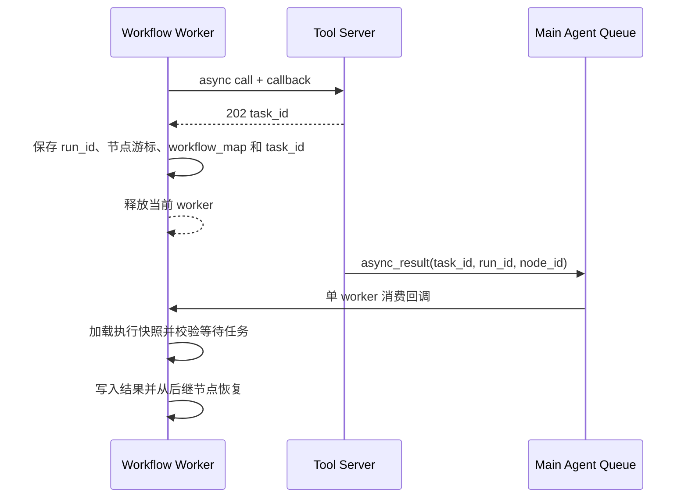

# 19 Workflow 本地与远程 Tool 节点拆分

## 1. 文档目标

本文定义 Workflow 中 Tool 节点的拆分方案。现有单一 `tool` 节点拆分为两种具有明确执行边界的节点：

- `local_tool`：调用 Agent 进程内注册的本地工具；
- `remote_tool`：通过 Tool Server 调用 Tool Provider 提供的远程工具。

编辑器显示名称分别为 `Local Tool` 和 `Remote Tool`。节点持久化类型继续遵循现有 snake_case 约定，不使用 `localTool`、`remoteTool` 作为存储值。

这次拆分的目标不是把所有工具迁移到 Tool Provider，而是让 Workflow 在建模时明确表达执行边界。文档只提出设计与实施顺序，不表示当前代码已经完成改造。

## 2. 设计动机

这次设计起于一个直接的问题：是否应把当前所有 Tool 都迁入 `tool_provider`，让 Agent 只通过 Tool Server 调用工具。

全部远程化在结构上看起来最统一，也能让 Agent 与具体工具实现彻底分离。但继续沿现有链路分析后，可以看到这种统一会把远程执行的固定成本强加给所有工具：

- 每次调用都需要网络通信、JSON 序列化和反序列化；
- Tool Server 需要创建和维护 Task，并处理超时、状态与结果；
- Provider 连接状态会成为原本进程内能力的新故障点；
- 长任务还需要 callback、幂等、持久化和恢复机制；
- 开发、部署和排障必须同时跨越 Agent、Tool Server 与 Provider。

这些成本对下载、ASR、外部 API 和独立部署服务是合理的，因为它们本来就有较重依赖、较长执行时间或独立扩缩容需求。但对 Documents、Workflow 内部状态访问、终端输出等 Agent 内生能力而言，这些成本没有换来对应收益。它们与 Agent 共享业务数据、生命周期和一致性边界，强制远程化只会把一次普通函数调用改造成分布式任务调用。

另一方面，如果保留单一 `tool` 节点，再由运行时判断一个工具应该本地执行还是转发到 Tool Server，表面上减少了节点类型，实际上会把复杂度藏进运行时：

- Workflow 无法从画布判断真实执行位置和故障边界；
- 同名工具、Provider 离线和目录变化会引入不稳定的隐式路由；
- 保存校验与运行时可能选择不同的工具来源；
- 用户无法根据延迟、可靠性和部署要求主动选择执行方式；
- 本地与远程两套目录、Schema 和错误语义仍然存在，只是失去了显式边界。

因此，我们采用第三条路径：统一 Tool 的抽象和节点交互模型，但不强制统一执行位置。Workflow 从节点层直接区分 `local_tool` 与 `remote_tool`，让调用者在建模时作出明确选择。

这里的“彻底解耦”指的是工具契约、发现方式和执行器之间具有清晰边界，可以分别演进和替换；它不等于所有调用都必须跨进程。Local/Remote 也不是工具能力等级或任务难度标签，而是运行时路由属性：

```text
Agent 内生、低延迟、共享一致性边界 -> local_tool
外部依赖、独立部署、可扩缩容或长耗时 -> remote_tool
```

这个拆分保护了本地工具的低成本路径，也让适合远程化的能力真正脱离 Agent 进程。更重要的是，它把系统原本已经存在的两种执行现实如实写进 Workflow 契约，而不是用一个看似统一的节点掩盖它们。

## 3. 当前实现事实

当前 Workflow 只有一种直接工具节点：

```json
{
  "id": "tool-1",
  "type": "tool",
  "name": "Tool 1",
  "arguments": {
    "tool": "query_document_by_id",
    "parameters": ["doc_id"]
  }
}
```

它的完整调用路径是：

```text
Workflow Editor /api/tools
  -> Redis Hash aagent:tools
  -> 编辑器固化 tool 和 parameters
  -> WebUI 保存时再次校验本地 Redis 注册表
  -> workflow_tool()
  -> tools.tool.execute_tool()
  -> 进程内 handler(**arguments)
```

当前实现具有以下约束：

1. `tool` 节点只认识 Agent 本地注册表，不能调用 Tool Server；
2. `workflow_tool()` 是同步函数，执行完成后立即沿 `control-out` 继续；
3. 整个 Workflow runner 是单次同步遍历，没有挂起、执行快照和回调恢复机制；
4. Tool Server 的目录格式使用 `inputSchema`，本地注册表使用 OpenAI Function 的 `function.parameters`，两者格式不同；
5. 节点契约目前分别存在于 Agent、WebUI 保存层、编辑器节点契约和编辑器序列化层，新增节点类型必须同步修改；
6. 独立的 `tool_call` 节点已删除（见 `docs/13` 5.5 节）：动态工具调用不再由画布节点执行，LLM 仅通过 `tool_calls` 输出端口交出 OpenAI 格式数组，编排由使用者自行处理；
7. Tool Server 的 `mode: "wait"` 可能返回 `202`，代表任务仍在执行，并不代表工具已经产生结果。

因此，这次拆分不能只在画布上增加两个按钮。节点目录、保存校验、运行时执行和超时语义必须同时分开。

## 4. 核心原则

### 4.1 节点类型决定执行边界

执行位置是 Workflow 的显式契约：

```text
local_tool  -> Local Tool Registry -> 进程内函数
remote_tool -> Tool Server API     -> Tool Server -> Tool Provider
```

运行时不能根据工具是否“恰好能在某个注册表找到”进行自动降级或跨边界查找：

- `local_tool` 找不到本地工具时直接失败，不能转发到 Tool Server；
- `remote_tool` 找不到在线远程工具时直接失败，不能调用同名本地函数；
- 本地与远程存在同名工具时，各自节点仍只调用自己的目录。

这条规则保证画布表达的行为与实际执行一致，也避免 Provider 断线时静默执行另一份实现。

### 4.2 统一节点形状，不统一执行路径

两类节点在画布上使用相同的参数端口模型：

```text
输入：control-in + Schema properties 对应的数据端口
输出：control-out + output
```

它们可以共享参数收集、端口渲染和结果传播逻辑，但不能共享最终执行器。共用 UI 不代表共用网络调用。

### 4.3 Workflow 不保存 Provider 身份

`remote_tool` 只保存稳定的工具名，不保存 `provider_id`：

- Provider 是部署和路由概念，不是 Workflow 业务契约；
- Tool Server 已负责根据工具名选择当前 Provider；
- Provider 重连或替换不应要求修改 Workflow。

### 4.4 注册与生命周期必须分开

Local Tool 和 Remote Tool 不应共享一套注册机制，因为它们的变化来源不同。

`local_tool` 的能力集合由当前 Agent 进程中的代码和注册过程决定：

```text
导入本地 Tool 模块
-> 装饰器注册 handler 和 Schema
-> Redis 发布本地工具目录
-> Agent 进程内按本地名称执行
```

Redis 中的本地工具数据供编辑器和保存层读取，并与 Agent 进程内的 handler 注册共同构成本地执行路径。本次节点拆分沿用当前代码的初始化、发布和注册表重建方式。

`remote_tool` 不在 Agent、Workflow Editor 或 WebUI 内建立 `Remote Registry`。它们直接依赖 Tool Server API：

```text
Tool Provider 上线/下线
-> Tool Server 内部 ProviderRegistry 更新
-> GET /api/tools 立即反映在线目录
-> POST /api/tools/{name}/calls 按当前在线状态调用
```

`ProviderRegistry` 是 Tool Server 内部实现细节。Tool Server API 是远程工具在线发现和调用的来源，但在线目录只为编辑器提供辅助候选，不限制 Workflow 可以填写的远程工具名和参数端口。Workflow Editor 可以代理该目录，也可以做带明确短 TTL 的容错缓存，但不能持久化一份可独立更新的远程注册表，否则会产生“候选显示可用、实际 Provider 已离线”的双重状态。

这一区分意味着：

- Local Tool 沿用 Agent 当前的注册与 Redis 目录发布方式；
- Remote Tool 的变化粒度是 Provider 连接，强调实时在线状态；
- Local Tool 的名称和参数端口由本地目录约束；
- Remote Tool 的名称和参数端口由用户声明，保存时不要求它出现在在线目录中；
- Remote Tool 只在执行时通过 Tool Server API 确认可用性并校验实际参数；
- Workflow 保存远程工具名和用户声明的端口，不保存一份远程注册状态。

### 4.5 Local Schema 与 Remote 端口声明

两类节点都保存 `parameters`，用于稳定渲染动态端口和过滤失效连接，但字段来源不同：

- `local_tool` 从 Local Tool Registry 的 Schema 生成 `parameters`，保存时必须与当前 Schema 一致；
- `remote_tool` 的 `parameters` 是 Workflow 作者声明的输入端口集合，用户可以自由新增、删除和命名；
- 远程在线目录中的 `inputSchema.properties` 可以一键填充或提示端口，但不能覆盖用户输入，也不能成为保存前置条件；
- 执行 `remote_tool` 时，运行时只收集节点声明的端口值，Tool Server 再按调用时的在线 Schema 校验实际 arguments；
- 远程 Schema 改变不会自动重写已保存的 Workflow，用户可以参考最新候选手动调整端口。

第一阶段不把完整远程 Schema 复制进 Workflow。`parameters` 表达画布输入契约，不宣称它是远程工具 Schema 的快照。

## 5. 节点数据契约

### 5.1 Local Tool

```json
{
  "id": "local-tool-1",
  "type": "local_tool",
  "name": "查询文档",
  "x": 320,
  "y": 200,
  "arguments": {
    "tool": "query_document_by_id",
    "parameters": ["doc_id"]
  }
}
```

允许的 `arguments` 字段：

| 字段 | 类型 | 含义 |
| --- | --- | --- |
| `tool` | string | 本地工具稳定名称 |
| `parameters` | string[] | 当前输入 Schema 的一级 properties，用于生成端口 |

运行语义保持现有 `tool` 节点行为：收集已到达的参数值，直接调用本地 handler，把结果传播到 `output`，然后进入下一控制节点。

文档 CRUD、固定上下文、Agent Queue 输出等系统内生能力应使用该节点。

### 5.2 Remote Tool

```json
{
  "id": "remote-tool-1",
  "type": "remote_tool",
  "name": "转写视频",
  "x": 580,
  "y": 200,
  "arguments": {
    "tool": "bilibili.gain_content_from_bvid",
    "parameters": ["bvid"],
    "timeout_ms": 30000
  }
}
```

允许的 `arguments` 字段：

| 字段 | 类型 | 含义 |
| --- | --- | --- |
| `tool` | string | 用户填写的远程工具名；在线目录只提供候选 |
| `parameters` | string[] | 用户声明的输入端口名称，不要求与保存时的在线 Schema 一致 |
| `timeout_ms` | integer | 本次阻塞等待上限，受客户端和 Tool Server 上限共同限制 |

第一阶段不允许在节点中配置以下字段：

- `provider_id`：由 Tool Server 路由；
- `mode`：第一阶段固定使用 `wait`；
- `callback`：当前 Workflow 尚不能从持久化执行点恢复；
- `idempotency_key`：应由运行时根据 Workflow 执行身份生成，不能由用户写死。

### 5.3 端口契约

两类节点的端口结构相同：

| 方向 | 端口 | 类型 | 含义 |
| --- | --- | --- | --- |
| 输入 | `control-in` | `control` | 触发调用 |
| 输入 | `<parameter>` | `content` | 节点声明的参数输入 |
| 输出 | `control-out` | `control` | 调用成功后继续 |
| 输出 | `output` | `content` | 工具结果 |

本次拆分保持当前限制：所有工具参数端口仍按 `content` 处理。JSON Schema 中的 number、boolean、array 和 object 暂不映射成新的 Workflow 数据类型；执行前仍由工具 Schema 做最终校验。后续若扩展 Workflow 类型系统，应独立设计，不能夹带在本次节点拆分中。

Local Tool 切换目录项，或用户编辑 Remote Tool 参数端口时，只清理已被删除参数的数据连接，必须保留：

- `control-in` 入站连接；
- `control-out` 出站连接；
- `output` 数据出站连接。

## 6. 工具目录拆分

### 6.1 编辑器对外目录

Workflow Editor 应提供两个明确的资源接口：

```text
GET /api/tools/local
GET /api/tools/remote
```

编辑器后端负责把两种源格式归一化为相同的候选目录结构：

```json
{
  "items": [
    {
      "name": "query_document_by_id",
      "description": "通过文档 id 查询文档",
      "inputSchema": {
        "type": "object",
        "properties": {
          "doc_id": {"type": "string"}
        },
        "required": ["doc_id"]
      },
      "outputSchema": null,
      "execution": "local"
    }
  ]
}
```

本地接口读取启动时生成的 `AGENT_TOOLS_KEY` 只读目录投影，把 `function.parameters` 转换为 `inputSchema`。远程接口由 Workflow Editor 后端实时代理 Tool Server 的 `GET /api/tools`，不要让浏览器直接访问 Docker 内部地址，也不要让前端持有 Tool Server 凭据。

两个目录在 UI 和 API 上必须保持分离。可以复用同一个归一化数据结构，但不能合并后再靠工具名猜测来源。Local Tool 目录用于受约束选择；Remote Tool 目录只是 Tool Server 在线目录的候选代理，编辑器必须允许自由填写目录之外的工具名，并允许用户独立维护参数端口。

### 6.2 保存侧校验

WebUI 保存 Workflow 时按不同强度校验：

```text
local_tool  -> Agent 本地 Redis 注册表与当前 Schema
remote_tool -> 节点字段和用户声明的端口结构
```

`local_tool` 校验内容包括：

1. 工具当前存在于本地目录；
2. `parameters` 与当前输入 Schema 的一级 properties 完全一致；
3. 节点只包含对应类型允许的 arguments；
4. 连接端口在 Schema 变化后仍然有效。

`remote_tool` 保存时只校验：

1. `tool` 是非空字符串；
2. `parameters` 是不重复的非空字符串数组，并且端口名满足 Workflow 端口命名规则；
3. `timeout_ms` 是受限正整数；
4. 节点只包含对应类型允许的 arguments；
5. 所有参数连接均指向当前用户声明的端口。

保存 `remote_tool` 时不要求 Tool Server 可用，不要求工具当前在线，也不要求 `parameters` 与候选目录中的 Schema 一致。目录不可用时只失去自动补全和一键填充能力，不影响编辑或保存。工具不存在、Provider 离线或实际参数不符合远程 Schema，都在执行调用时由 Tool Server 返回明确错误。

## 7. 运行时执行语义

### 7.1 Local Tool 执行器

`workflow_local_tool()` 复用当前本地执行路径：

```text
收集参数
-> local registry execute_tool()
-> 传播 output
-> next successor
```

它不创建 Tool Server Task，不写远程任务状态，也不承担分布式调用成本。

### 7.2 Remote Tool 执行器第一阶段

`workflow_remote_tool()` 通过独立的 Tool Server Client 调用：

```http
POST /api/tools/{tool_name}/calls
Content-Type: application/json

{
  "arguments": {},
  "mode": "wait",
  "timeout_ms": 30000,
  "idempotency_key": "<runtime-generated>"
}
```

响应处理必须区分 HTTP 状态和 Task 状态：

| HTTP / Task | Workflow 行为 |
| --- | --- |
| `200 + completed` | 传播 `result`，继续控制流 |
| `200 + failed` | 节点失败，不继续控制流 |
| `202 + pending/working` | 节点进入“尚未完成”错误，不得把 Task 对象当作工具结果 |
| `404/503` | 远程工具不可用，节点失败 |
| 网络错误 | 节点失败；是否重试由未来执行策略决定 |

当前 runner 没有挂起与恢复能力，所以第一阶段的 `remote_tool` 只是“有上限的同步等待远程任务”。当 Tool Server 返回 `202` 时，运行时必须保留并报告 `task_id`，但不能继续后继节点，也不能在 Agent 单 worker 中无限轮询。

这个限制意味着第一阶段只适合能在 `TOOL_MAX_WAIT_MS` 内稳定完成的远程工具。B 站下载和 ASR 等长任务在 Workflow 中正式启用前，应先完成第 7.3 节的挂起恢复机制。

### 7.3 后续异步挂起与恢复

真正支持长耗时 `remote_tool` 需要新增 Workflow Run，而不是给当前同步循环增加长轮询：



恢复机制至少需要：

- 稳定的 `workflow_run_id`；
- 当前节点和下一节点游标；
- 可持久化的运行时数据输入值；
- `task_id -> workflow_run_id + node_id` 关联；
- callback 至少一次投递下的去重；
- Worker 重启后的恢复策略；
- 终态失败、超时和人工取消语义。

在这些能力完成前，`remote_tool` 不提供 `mode: async` 配置。

### 7.4 幂等键

远程调用的幂等键不能只使用节点 ID，因为同一 Workflow 节点可能在不同运行或 foreach 中执行多次。建议由运行时生成：

```text
workflow_run_id : node_id : invocation_index
```

第一阶段如果尚无 `workflow_run_id`，可以生成每次调用唯一键以避免客户端网络重试创建重复任务，但它不能提供跨 Worker 重启的严格幂等。该限制需要记录在实现日志中。

## 8. `tool_call` 与 LLM 工具挂载边界

直接节点拆分不能自动解决动态 Tool Call 的来源问题。OpenAI 格式的 `tool_call` 通常只包含函数名和参数：

```json
{
  "id": "call-1",
  "function": {
    "name": "some_tool",
    "arguments": "{}"
  }
}
```

其中没有可靠的 `local` / `remote` 来源字段。当前 `tool_call` 节点又会直接执行本地工具。因此本次设计采用以下边界：

1. 第一阶段只拆分“直接调用一个固定工具”的 `tool` 节点；
2. 独立 `tool_call` 节点已移除，动态工具调用改由使用者基于 LLM 的 `tool_calls` 输出自行编排，“Local Tool Call / Remote Tool Call”的节点级标记不再需要；
3. LLM 节点第一阶段仍只挂载本地工具，不能把远程目录直接混入现有 `tools: string[]`；
4. 远程动态 Tool Call 另行设计 `remote_tool_call`，或者将 LLM 挂载项升级为带 execution 的结构化引用；
5. 在动态调用协议确定前，不能按“本地找不到就调用远程”的方式自动路由。

未来建议把 LLM 工具引用升级为：

```json
{
  "tools": [
    {"execution": "local", "name": "query_document_by_id"},
    {"execution": "remote", "name": "web.search"}
  ]
}
```

但模型返回的函数名如何无歧义映射回该引用，仍需定义全局唯一命名或调用别名。这个问题不应由本次节点改名隐式决定。

## 9. 旧 `tool` 节点迁移

现有所有 `tool` 节点都只可能来自本地注册表，因此迁移规则是确定的：

```text
type: tool -> type: local_tool
```

迁移策略：

1. 独立编辑器导入或打开旧 Workflow 时，把 `tool` 规范化为 `local_tool`；
2. 保存新快照时只写 `local_tool`，不再写 `tool`；
3. WebUI 上传旧 JSON 时执行同样的确定性迁移；
4. Agent validator 可在一个短过渡版本中接受 `tool` 并在解析前归一化；
5. 迁移窗口结束后，运行时拒绝旧 `tool`，避免永久维护第三种节点类型；
6. 不根据工具名把旧节点迁移为 `remote_tool`。需要远程执行的节点由用户显式替换。

迁移只改变节点类型，不改变节点 ID、参数端口或连接，因此现有控制连接和数据连接应完整保留。

## 10. 错误与结果格式

当前本地工具通常返回字符串，而远程工具结果可以是任意 JSON。为了保持现有 `content` 输出端口，第一阶段统一按以下规则输出：

- string 原样输出；
- number、boolean、array 和 object 使用 JSON 序列化；
- JSON null 转换为明确的 `null` 文本，不与“端口没有值”混淆；
- 工具失败通过节点异常表达，不把错误字符串伪装成成功结果。

需要注意，当前 `read_workflow_input()` 使用 `slot[2] is not None` 判断值是否到达，运行时 JSON null 会被视为没有输入。正式实现时应同步修正值到达标记，或者在 Tool 输出边界先规范化为字符串；不能让本地和远程节点产生不同的 null 行为。

建议错误至少包含：

```json
{
  "node_id": "remote-tool-1",
  "tool": "bilibili.gain_content_from_bvid",
  "execution": "remote",
  "task_id": "optional",
  "message": "remote tool did not complete within synchronous wait"
}
```

当前 Workflow 没有节点失败事件和运行记录，这部分应与异步挂起能力一起补齐。

## 11. 涉及模块

实施时至少需要同步修改以下位置：

| 模块 | 修改内容 |
| --- | --- |
| `agent/workflow_contract.py` | 注册两种节点类型、arguments 和数据端口 |
| `agent/workflow_validator.py` | 校验两种节点字段、本地参数契约、远程自定义端口与超时 |
| `agent/workflow_nodes.py` | 拆分本地和远程 handler |
| `agent/workflow_parser.py` | 保持两种类型并编译相同端口形状 |
| `agent/` 新 Tool Server Client | 直接调用 Tool Server API，封装调用、任务状态和错误映射 |
| `webui_py/workflows.py` | 保存格式、连接类型、本地目录校验和远程结构校验 |
| `workflow_editor/main.py` | 暴露本地与远程两个归一化目录 API |
| `workflow_editor/static/workflow/domain/node-contract.js` | 节点类型、创建逻辑和端口 |
| `workflow_editor/static/workflow/domain/serialization.js` | arguments 白名单、规范化和旧节点迁移 |
| `workflow_editor/static/workflow/inspector/integrations.js` | Local Tool 受约束选择；Remote Tool 自由输入并提供目录候选和端口编辑 |
| `workflow_editor/static/workflow_edit.html` | 两个节点入口和两个 Inspector 模板 |
| `docker-compose.yml` | Agent、编辑器和 WebUI 的 Tool Server 地址配置 |

由于节点契约当前存在多份手工副本，本次实施后应增加契约一致性测试。是否进一步建立单一 JSON Schema 或代码生成机制，可以作为后续重构，不阻塞第一阶段拆分。

## 12. 测试要求

### 12.1 契约与迁移

- `local_tool` 和 `remote_tool` 均能通过保存、校验和解析；
- 旧 `tool` 导入后稳定转换为 `local_tool`；
- 新快照不再产生 `type: "tool"`；
- 未知 arguments 被拒绝；
- `remote_tool.timeout_ms` 缺失时使用明确默认值，非法值被拒绝。
- `remote_tool.tool` 可以保存不在当前在线目录中的非空名称；
- `remote_tool.parameters` 可以由用户自由声明，重复、空值和非法端口名被拒绝。

### 12.2 目录隔离

- Local Tool 下拉框只显示本地目录；
- Remote Tool 提供 Tool Server 在线目录候选，但允许输入候选之外的名称；
- 选择 Remote Tool 候选时可以建议或填充参数端口，之后用户仍可独立增删和改名；
- 同名工具不会跨目录执行；
- Tool Server 不可用不影响任何 Workflow 的编辑和保存，只影响远程候选加载和运行时调用；
- 本地注册表不可用不应把本地节点误判为远程节点。

### 12.3 连接稳定性

- Local Tool 切换目录项或 Remote Tool 删除自定义参数后，只删除失效参数连接；
- 控制入站、控制出站和结果出站连接保持不变；
- 本地节点转换为远程节点时，只有同名参数端口可以保留数据连接；
- 保存侧和运行时分别根据 Local Schema 或 Remote Tool 用户声明计算出相同端口集合。

### 12.4 运行时

- Local Tool 不访问 Tool Server；
- Remote Tool 不访问本地 handler；
- 远程 `completed` 正确传播结果；
- 远程 `failed` 阻止控制流继续；
- HTTP `202` 不会作为成功结果传播；
- Provider 离线和网络错误产生可识别的节点错误；
- JSON 结果按照约定转换为 content；
- 重复客户端请求不会意外执行非幂等工具两次。

## 13. 建议实施顺序

1. 增加两种归一化工具目录 API，不修改节点；其中远程目录只作为候选数据源；
2. 在四份节点契约中加入 `local_tool` 和 `remote_tool`，同时加入旧 `tool -> local_tool` 导入迁移；
3. 完成编辑器双节点和双 Inspector：Local Tool 目录选择，Remote Tool 自由工具名、候选补全和自定义参数端口；
4. 完成 WebUI 本地目录强校验与远程节点结构校验；
5. 把现有 `workflow_tool()` 原样迁移为 `workflow_local_tool()`；
6. 增加 Tool Server Client 和同步等待版 `workflow_remote_tool()`；
7. 增加 `200 completed`、`failed`、`202`、断线和 Schema 变化测试；
8. 更新已有 Workflow 数据并结束旧 `tool` 兼容窗口；
9. 单独设计 Workflow Run 持久化、异步挂起与恢复；
10. 最后处理 LLM 远程工具挂载和动态 `remote_tool_call`。

## 14. 结论

这次拆分确立的是执行边界，而不是工具能力等级：

- `local_tool` 表示 Agent 自身拥有、低开销、进程内执行的能力；
- `remote_tool` 表示由 Tool Server 调度、可独立部署和扩展的能力；
- 两者共享画布和端口模型，但目录用途、保存校验和执行器保持分离；
- 远程调用第一阶段只支持有上限的同步等待；
- 长任务必须建立 Workflow 挂起与恢复后才能安全接入；
- 动态 `tool_call` 的来源标识另行设计，不使用隐式查找掩盖边界。

这样可以保留 Documents 等系统工具的低调用成本，同时让搜索、下载、ASR、QQ API 等外部能力真正从 Agent 进程中解耦。