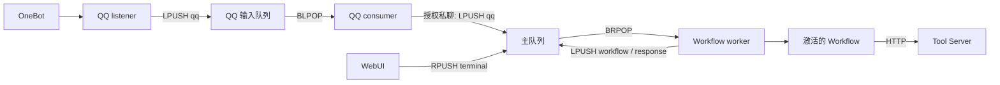

# 20 Event 协议与流转

本文只描述当前 **Workflow + Tool Server** 架构中的 Event。主队列 Event 负责把外部输入送入 Workflow，并记录 Workflow 的最终输出：

```text
外部输入 -> qq / terminal -> workflow -> response
```

Workflow 的 Tool 节点直接调用本地执行器或 Tool Server，不通过主 Event 分发器。

## 1. Event 信封

```json
{
  "event_type": "workflow",
  "payload": {}
}
```

- `event_type` 决定主 worker 调用哪个 handler；
- `payload` 保存该类型的数据；
- Event 出队后，主 worker 会复制 Event、追加 UTC `created_at`，再写入 MongoDB；
- MongoDB 自动生成 `_id`；
- `terminal` 生产者还会添加顶层 `time`，主 worker 不读取该字段；
- 主队列当前只接受 `qq`、`terminal`、`workflow`、`response`。

未知 `event_type` 会先写入历史，然后因没有 handler 而处理失败。

## 2. 队列与顺序

### 2.1 QQ 输入队列

| 项目 | 当前值 |
|------|--------|
| Redis List | `QQ_QUEUE_NAME`，默认 `qq:events` |
| 生产者 | `qqbot/listener.py` |
| 消费者 | `qqbot_consumer/queue_consumer.py` |
| 入队 / 出队 | `LPUSH` / `BLPOP` |
| 顺序 | LIFO，后到的 Event 先处理 |
| 历史集合 | `QQ_HISTORY_COLLECTION`，默认 `qq_event_history` |

QQ consumer 是输入适配器。它保存 QQ Event，只把目标用户的私聊消息转发到主队列；群消息、输入状态和其他用户的消息不会进入 Workflow。

### 2.2 主队列

| 项目 | 当前值 |
|------|--------|
| Redis List | `MAIN_AGENT_QUEUE_NAME`，默认 `main_agent_queue` |
| 消费者 | `agent/task_worker.py` |
| 普通入队 / 出队 | `LPUSH` / `BRPOP` |
| 普通顺序 | FIFO |
| WebUI 终端入队 | `RPUSH`，位于消费端，当前处理结束后优先出队 |
| 历史集合 | `MONGO_HISTORY_COLLECTION`，默认 `event_history` |



## 3. 当前 Event 类型

| `event_type` | 生产者 | 消费者 | 作用 |
|--------------|--------|--------|------|
| `qq` | QQ listener，经 QQ consumer 筛选 | 主 worker | 把授权 QQ 私聊转换为 `workflow` |
| `terminal` | WebUI `POST /api/terminal` | 主 worker | 把终端输入转换为 `workflow` |
| `workflow` | 主 worker 的输入 handler | 主 worker | 执行当前激活的 Workflow |
| `response` | `workflow` handler | 主 worker | 将最终输出写入事件历史 |

WebUI 会用 `raw` 包装无法解析为 JSON 对象的队列内容。`raw` 只是展示类型，不是主 worker 协议。

## 4. Event 格式

### 4.1 `qq`

消息 Event：

```json
{
  "event_type": "qq",
  "payload": {
    "post_type": "message",
    "user_id": 3363336986,
    "group_id": null,
    "raw_message": "执行任务",
    "message": [
      {"type": "text", "data": {"text": "执行任务"}}
    ]
  }
}
```

输入状态 Event：

```json
{
  "event_type": "qq",
  "payload": {
    "post_type": "inputing",
    "user_id": 3363336986
  }
}
```

`inputing` 是当前上游使用的拼写。只有同时满足以下条件的 Event 会进入主队列：

- `post_type == "message"`；
- `group_id` 为空；
- `user_id == QQ_TARGET_USER_ID`。

主 worker 将 `raw_message` 转换为：

```json
{
  "event_type": "workflow",
  "payload": {
    "content": "执行任务",
    "source": "qq"
  }
}
```

### 4.2 `terminal`

```json
{
  "event_type": "terminal",
  "time": "2026-09-18T12:00:00.000Z",
  "payload": {
    "message": "执行任务",
    "files": []
  }
}
```

- `message` 去除首尾空白后必须非空，最大 4000 个字符；
- `files` 当前必须为空；
- 主 worker 将其转换为 `workflow`，其中 `content = message`、`source = "terminal"`。

### 4.3 `workflow`

```json
{
  "event_type": "workflow",
  "payload": {
    "content": "执行任务",
    "source": "terminal"
  }
}
```

`source` 当前为 `qq` 或 `terminal`。主 worker 的执行过程：

1. 从 MongoDB settings 集合读取 `_id = "agent"` 的 `workflow_id`；
2. 读取、校验并解析该 Workflow；
3. 找到 `input` 节点；
4. 按 Workflow 输入端口的 `name` 从 Event payload 读取同名字段；
5. 同步执行 `run_workflow_map()`；
6. 把最终输出转换为 `response` 并普通入队。

入口 Workflow 若要接收标准输入，应声明 `content` 和 `source` 输入端口。payload 中不存在的字段会以 `None` 传播，而运行时会把 `None` 判断为“没有值”。

### 4.4 `response`

```json
{
  "event_type": "response",
  "payload": {
    "content": "Workflow 输出"
  }
}
```

`response` handler 不做业务处理。该 Event 用于写入 `event_history`，并显示在 WebUI Event 时间线和 `/api/terminal/history` 中。

## 5. Tool Server 边界

### 5.1 本地 Tool

`local_tool` 调用 Agent 进程内的 `execute_tool()`，结果立即传播到 Workflow 后继节点。

### 5.2 远程同步 Tool

`remote_sync_tool` 向 Tool Server 发出 `mode = "wait"` 的 HTTP 请求。任务在等待窗口内完成时，结果传播到 Workflow；否则节点失败，任务可能仍在 Tool Server 中继续执行。

### 5.3 远程异步 Tool

`remote_async_tool` 发出 `mode = "async"` 的 HTTP 请求，并把返回的 `task_id` 传播到 Workflow。节点可选配置 Redis callback：

```json
{
  "type": "redis",
  "queue": "专用回调队列",
  "event_type": "async_result",
  "on": ["completed", "failed"]
}
```

Tool Server 的回调信封为：

```json
{
  "event_type": "async_result",
  "payload": {
    "task_id": "01J...",
    "tool": "qq.send_group_msg",
    "status": "completed",
    "result": {"message_id": 123},
    "error": null,
    "progress": null,
    "message": null
  }
}
```

callback 是 Tool Server 的可选能力，不是主 Agent 的当前 Event 类型：

- 未配置 callback 时不会投递 Redis Event；
- `event_type` 必须被 `TOOL_CALLBACK_EVENT_TYPES` 允许，默认仅 `async_result`；
- Tool Server 使用 `LPUSH` 投递；
- 主 worker 没有 `async_result` handler，因此 callback 必须使用有对应消费者的专用队列，不能写入 `main_agent_queue`。

## 6. 完整运行路径

### 6.1 QQ 私聊

```text
OneBot
  -> QQ listener 封装 qq
  -> LPUSH qq:events
  -> QQ consumer BLPOP
  -> 写入 qq_event_history
  -> 校验目标用户私聊
  -> LPUSH main_agent_queue: qq
  -> 主 worker BRPOP
  -> 写入 event_history
  -> LPUSH workflow {content, source: "qq"}
  -> 执行激活的 Workflow
  -> LPUSH response
  -> 写入 event_history
```

### 6.2 WebUI 终端

```text
POST /api/terminal
  -> RPUSH main_agent_queue: terminal
  -> 主 worker BRPOP
  -> 写入 event_history
  -> LPUSH workflow {content, source: "terminal"}
  -> 执行激活的 Workflow
  -> LPUSH response
  -> 写入 event_history
```

`terminal` 本身具有插队优先级，但它产生的 `workflow` 使用普通 `LPUSH`，不会继承该优先级。

## 7. 历史与 WebUI

主 worker 对每个 Event 的处理顺序：

1. worker 状态设置为 `processing`；
2. Event 写入 MongoDB 历史；
3. 根据 `event_type` 调用 handler；
4. 无论成功或失败，worker 状态恢复为 `idle`。

WebUI `/api/events` 合并三种来源：

| 状态 | 来源 |
|------|------|
| `done` | MongoDB 中已处理的 Event |
| `running` | worker status Redis Key 中的当前 Event |
| `pending` | 主 Redis List 中尚未处理的 Event |

## 8. 修改检查表

新增或修改 Event 时，至少同步检查：

1. 生产者构造的 `event_type` 和 payload；
2. `agent/task_worker.py` 的 `handle_map`；
3. 入队和出队方向是否形成预期顺序；
4. 是否需要进入 MongoDB 历史和 WebUI 时间线；
5. Tool Server callback 是否有专用消费者；
6. 本文的类型表、格式和流转路径。