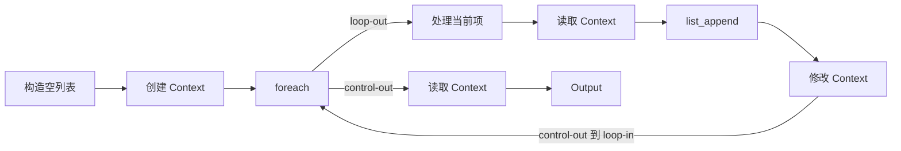

# 21 Workflow Context 节点设计

## 1. 目标

当前 Workflow 使用 pipeline 模型：数据沿连接从上游节点写入下游节点，控制流决定节点执行顺序。`foreach` 可以通过 `loop-out` 和 `loop-in` 重复执行循环体，但循环体没有独立的可变状态空间，因此无法完成以下操作：

- 把当前迭代结果累积为一个新列表；
- 将本轮计算结果传给下一轮；
- 在控制流的不同位置读取和覆盖同一个中间值。

本方案将 Context 分为两类：

- Workflow 内 Context：只在一个 Workflow 执行实例内有效，执行结束后统一删除；
- 全局 Context：可跨 Workflow 执行实例长期访问，授权与生命周期规则后续单独设计。

首期只实现 Workflow 内 Context。它是 Redis 中一份带类型的临时可变值，Workflow 通过不透明的 Context ID 引用它。首期新增三个节点：

- `context_create`：使用初始值创建 Context；
- `context_read`：根据 Context ID 读取当前值；
- `context_write`：根据 Context ID 覆盖当前值。

Context 不改变现有 pipeline 执行模型，也不要求 `foreach` 理解累积、映射或变量传递。循环体使用普通数据节点完成计算，再通过 Context 节点显式读写状态。

## 2. 设计原则

1. `value_type` 是节点面板配置，不是数据端口输入；
2. `value_type` 决定节点值端口的静态类型，编辑器保存时即可校验连线；
3. Context ID 是不透明字符串，使用现有 `content` 数据连接类型；
4. 创建 Context 时必须提供同类型初始值，不提供隐式默认值；
5. 修改操作只做完整覆盖，不在首期提供 append、merge、increment 等复合操作；
6. 每个 Workflow 执行实例独立拥有自己的 Context，不与父 Workflow 或子 Workflow 共享；
7. Workflow 执行结束时，无论成功或失败，都删除该执行实例创建的全部 Context；
8. TTL 只用于进程崩溃等无法执行结束清理时的兜底回收；
9. Context 读写失败直接终止当前 Workflow，不静默返回空值；
10. 首期按串行 Workflow 语义设计，不保证多个并行分支的读改写原子性。

支持的 `value_type`：

```text
content
message
list-content
list-message
```

不新增 `x-workflow-content` 数据类型。Context ID 虽然具有专门语义，但其数据表示仍是字符串；编辑器通过端口名称和标题表达 `Context ID`，底层连接类型保持 `content`。

## 3. 节点契约

### 3.1 创建 Context

节点类型：`context_create`

```json
{
  "id": "context-create-1",
  "type": "context_create",
  "name": "创建 Context",
  "x": 320,
  "y": 200,
  "arguments": {
    "value_type": "list-content"
  }
}
```

面板提供 `value_type` 下拉选择。选择变化后，`initial-value` 端口立即切换为对应类型，并清理与新类型不兼容的数据连接；控制连接不受影响。

| 方向 | 端口 ID | 类型 | 说明 |
|------|---------|------|------|
| 输入 | `control-in` | `control` | 触发创建 |
| 输入 | `initial-value` | `value_type` | 必填的初始值 |
| 输出 | `control-out` | `control` | 创建成功后继续 |
| 输出 | `context-id` | `content` | 新建 Context 的不透明 ID |

执行步骤：

1. 读取并校验 `initial-value`；
2. 生成随机 Context ID；
3. 将类型、值和元数据写入 Redis；
4. 将 Context ID 登记到当前 Workflow 执行实例的清理集合；
5. 设置兜底 TTL；
6. 传播 `context-id`，再进入 `control-out`。

初始值必须通过数据连接传入。空列表应由 `construct_list` 显式创建，而不是由 `context_create` 根据类型猜测默认值。

### 3.2 读取 Context

节点类型：`context_read`

```json
{
  "id": "context-read-1",
  "type": "context_read",
  "name": "读取 Context",
  "x": 580,
  "y": 200,
  "arguments": {
    "value_type": "list-content"
  }
}
```

| 方向 | 端口 ID | 类型 | 说明 |
|------|---------|------|------|
| 输入 | `control-in` | `control` | 触发读取 |
| 输入 | `context-id` | `content` | Context ID |
| 输出 | `control-out` | `control` | 读取成功后继续 |
| 输出 | `value-out` | `value_type` | Context 当前值 |

执行步骤：

1. 根据 `context-id` 读取 Redis 数据；
2. 校验 Context 存在且保存的类型等于节点 `value_type`；
3. 校验保存值符合对应的数据结构；
4. 刷新兜底 TTL，防止仍在执行的长 Workflow 被提前回收；
5. 传播 `value-out`，再进入 `control-out`。

### 3.3 修改 Context

节点类型：`context_write`

```json
{
  "id": "context-write-1",
  "type": "context_write",
  "name": "修改 Context",
  "x": 840,
  "y": 200,
  "arguments": {
    "value_type": "list-content"
  }
}
```

| 方向 | 端口 ID | 类型 | 说明 |
|------|---------|------|------|
| 输入 | `control-in` | `control` | 触发写入 |
| 输入 | `context-id` | `content` | Context ID |
| 输入 | `value-in` | `value_type` | 必填的新值 |
| 输出 | `control-out` | `control` | 写入成功后继续 |
| 输出 | `context-id` | `content` | 原样传播 Context ID |
| 输出 | `value-out` | `value_type` | 已写入的值 |

执行步骤：

1. 根据 `context-id` 查找 Context；
2. 校验保存的类型等于节点 `value_type`；
3. 校验 `value-in` 符合对应的数据结构；
4. 完整覆盖旧值并更新时间；
5. 刷新兜底 TTL，防止仍在执行的长 Workflow 被提前回收；
6. 传播 `context-id` 和 `value-out`，再进入 `control-out`。

输出 ID 和写入值可减少后续节点为了继续使用同一 Context 而重复布线。

## 4. Redis 存储

### 4.1 Key 与 ID

对外 ID 使用不可预测的随机值，例如 UUID：

```text
ctx_9a490d1170204cb89ecf30e59893e08b
```

Redis Key 使用固定命名空间：

```text
workflow-context:{context_id}
```

Workflow 只能使用 `context_create` 生成的 ID，不能自行指定 Redis Key。随机 ID 用于避免不同 Workflow 调用相互覆盖；固定前缀便于监控和清理。

### 4.2 数据结构

使用 Redis Hash 保存：

| 字段 | 内容 |
|------|------|
| `version` | 存储格式版本，首版为 `1` |
| `value_type` | `content`、`message`、`list-content` 或 `list-message` |
| `value` | JSON 序列化后的值 |
| `invocation_id` | 创建 Context 的 Workflow 调用标识 |
| `created_at` | UTC 创建时间 |
| `updated_at` | UTC 最近写入时间 |

示例：

```text
HSET workflow-context:ctx_9a490d1170204cb89ecf30e59893e08b \
  version 1 \
  value_type list-content \
  value '["a","b"]' \
  invocation_id 66ed... \
  created_at 2026-09-19T08:00:00Z \
  updated_at 2026-09-19T08:00:00Z
EXPIRE workflow-context:ctx_9a490d1170204cb89ecf30e59893e08b 86400
```

Repository 层负责 Key 构造、序列化、类型校验、删除和 TTL，不允许节点处理器直接拼接 Redis 命令。

## 5. 生命周期与空间控制

### 5.1 Workflow 执行实例作用域

每次 Workflow 执行都建立独立的 `invocation_id` 和本次创建的 Context ID 集合。`context_create` 成功后将新 ID 加入当前执行实例的集合。读取和写入只允许访问 `invocation_id` 与当前执行实例一致的 Context。

每次 Workflow 执行必须使用 `try/finally` 包裹。无论执行成功或节点失败，`finally` 都删除该执行实例集合中的全部 Context。清理失败应记录错误日志，但不能覆盖 Workflow 原本的执行结果或异常。

父 Workflow 与子 Workflow 的 Context 作用域完全隔离：

- 调用子 Workflow 时，子 Workflow 建立新的 `invocation_id` 和清理集合；
- 子 Workflow 不能读取或修改父 Workflow 创建的 Context；
- 父 Workflow 不能读取或修改子 Workflow 创建的 Context；
- 子 Workflow 返回或失败时，在自己的 `finally` 中清理自己创建的全部 Context；
- 子 Workflow 的清理完成后，父 Workflow 继续执行，父 Workflow 的 Context 不受影响。

因此 Context ID 不能作为父子 Workflow 间的数据契约传递。即使通过普通 `content` 端口传递了 ID，接收方也会因 `invocation_id` 不匹配而得到“Workflow Context 不存在”。

Workflow 内 Context 也不能作为可复用的 Workflow 输出。当前执行实例结束后，对应 Context 已被删除。

### 5.2 兜底 TTL

结束清理无法覆盖进程崩溃、容器被强制终止等情况，因此 Redis Key 仍使用滑动 TTL：

- 创建成功后设置 TTL；
- 每次成功读取后刷新 TTL；
- 每次成功写入后刷新 TTL；
- 未能执行结束清理时，最后一次成功访问后超过 TTL，由 Redis 自动删除 Context。

默认配置：

```text
WORKFLOW_CONTEXT_TTL_SECONDS=86400
```

默认兜底 TTL 为最后一次成功访问后的 24 小时。TTL 是异常回收策略，不是 Workflow 内 Context 的正常生命周期；正常情况下 Context 会在所属 Workflow 执行结束时立即删除。TTL 不放入节点面板，需要调整时通过 Agent 环境变量统一配置。

24 小时默认值兼顾以下需求：

- 普通循环和较长 Workflow 执行期间不会因短 TTL 中断；
- 进程异常退出后遗留的 Context 最终会自动回收；
- TTL 不会被误当作跨 Workflow 执行持久化承诺。

读写操作续期只为保护仍在执行的长 Workflow，不表示 Context 可以在执行结束后继续访问。

### 5.3 全局 Context（后续）

全局 Context 用于跨 Workflow 执行长期保留和访问状态，不随单次 Workflow 执行结束而删除。它至少需要单独明确以下规则：

- 创建、读取、修改和删除权限；
- 所有者或命名空间；
- 永久保存、固定 TTL 或滑动 TTL 策略；
- Context ID 跨调用传递和泄露后的安全边界；
- 与 Workflow 内 Context 的节点类型、端口或显式作用域区分。

首期不实现全局 Context，也不让现有三个节点通过参数切换为全局作用域。后续应独立设计，避免改变 Workflow 内 Context 的生命周期承诺。

### 5.4 Value 大小限制

TTL 只能限制保存时间，不能限制单条数据占用。Repository 层应在写入前检查 JSON 序列化后的字节数：

```text
WORKFLOW_CONTEXT_MAX_VALUE_BYTES=1048576
```

默认单个 Context Value 上限为 1 MiB。超过上限时节点失败，不截断数据。该限制同时用于创建和修改操作。

Redis 实例级 `maxmemory` 只能作为最后保护，不能替代结束清理和兜底 TTL。若 Redis 使用会淘汰 Key 的策略，仍在执行中的 Context 也可能被删除，因此部署时应监控 Context Key 数量、总内存和淘汰计数。

## 6. 类型校验

编辑器根据节点 `value_type` 生成动态端口，连接规则如下：

| `value_type` | 值端口允许的连接类型 |
|--------------|----------------------|
| `content` | `content` |
| `message` | `message` |
| `list-content` | `list-content` |
| `list-message` | `list-message` |

运行时仍必须进行第二次校验：

- `content`：值必须是字符串；
- `message`：值必须是合法 Message 对象；
- `list-content`：值必须是字符串列表；
- `list-message`：值必须是合法 Message 对象列表。

`context_read` 和 `context_write` 的面板类型必须与 Redis 中的 `value_type` 完全一致。类型不一致时直接失败，不做转换。

当用户修改面板中的 `value_type` 时，只清理该节点不兼容的数据连接，必须保留所有控制连接和 `context-id` 的 `content` 连接。

## 7. foreach 使用方式

### 7.1 将列表映射为另一个列表



数据连接：

```text
construct_list.list-out -> context_create.initial-value
context_create.context-id -> 循环内 context_read.context-id
context_create.context-id -> 循环内 context_write.context-id
context_create.context-id -> 循环后 context_read.context-id
foreach.item-out -> 循环体处理节点
循环体结果 -> list_append.item-in
循环内 context_read.value-out -> list_append.list-in
list_append.list-out -> context_write.value-in
循环后 context_read.value-out -> Output
```

Context ID 可以连接到多个读取和修改节点，因此不需要在每轮控制流中重新生成或转发 ID。

### 7.2 将本轮结果传给下一轮

创建一个单值 Context，循环体每轮先读后写：

```text
context_read.value-out
-> 使用上一轮值参与当前轮计算
-> context_write.value-in
-> foreach.loop-in
```

第一轮读取创建节点提供的初始值，之后每轮读取上一轮覆盖后的值。这一模式可以表达串行 carry 和 reduce。

## 8. 一致性与并发边界

单个 `context_create`、`context_read` 或 `context_write` 操作应通过 Redis pipeline 或事务完成数据操作和 TTL 刷新，避免操作成功但 TTL 未设置或未续期。每次 Workflow 执行的批量清理独立于节点操作，在该次执行的 `finally` 中完成。

首期不保证以下复合过程的原子性：

```text
context_read -> 普通节点计算 -> context_write
```

当前 `foreach` 循环体串行执行，同一个循环内不会出现两轮同时覆盖，因此满足当前需求。如果未来允许并行分支修改同一个 Context，可能发生丢失更新：

```text
分支 A 读取旧值
分支 B 读取旧值
分支 A 写入新值
分支 B 覆盖分支 A 的结果
```

届时应根据真实需求引入版本号 CAS、`WATCH/MULTI/EXEC`，或新增原子语义明确的 `context_append`、`context_increment` 节点。首期不提前加入锁和重试机制。

## 9. 错误语义

以下情况均使当前节点失败并终止 Workflow：

| 场景 | 错误 |
|------|------|
| `context-id` 缺失或不是字符串 | Context ID 输入无效 |
| Context 不存在、已被清理、已经过期或属于其他 Workflow 执行实例 | Workflow Context 不存在 |
| 节点 `value_type` 与保存类型不同 | Workflow Context 类型不匹配 |
| 初始值或新值缺失 | Context Value 输入缺失 |
| Value 不符合声明类型 | Workflow Context Value 无效 |
| 序列化后超过大小上限 | Workflow Context Value 过大 |
| Redis 读写失败 | Context 存储操作失败 |

不存在、已清理、已过期和作用域不匹配使用同一种错误语义，避免向节点暴露其他 Workflow 执行实例中 Context 的存在性。不得返回 `None`、空字符串或空列表来掩盖错误。

Workflow 结束清理不属于节点执行。清理失败只记录 Context ID 和存储错误，不改变原本的 Workflow 成功结果，也不覆盖原本的 Workflow 异常；遗留 Key 由兜底 TTL 回收。

## 10. 安全与作用域

Context ID 不应包含 Redis Key、Workflow 名称或业务数据。随机 ID 只降低猜测概率，不替代作用域校验。

Repository 应保存创建 Context 的 `invocation_id`。每次 Workflow 执行建立自己的调用标识和 Context 清理集合，并将它们提供给本次执行中的三个节点处理器。读取和写入只允许当前执行实例访问自己创建的 Context。

父 Workflow、子 Workflow 和后续 Workflow 调用即使持有 Context ID，也不能访问该 Context。跨执行共享由未来的全局 Context 设计处理，不能通过放宽 `invocation_id` 校验实现。

日志可以记录 Context ID、类型、操作和 Value 字节数，但不得记录完整 Value，避免把消息或文档内容重复写入日志。

## 11. 实施范围

### 11.1 Agent

- `agent/workflow_contract.py`
  - 注册三种节点类型和 `value_type` 参数；
  - 根据 `value_type` 生成动态数据端口；
  - 校验 Context ID 和 Value 连接类型。
- `agent/workflow_validator.py`
  - 校验 `value_type`；
  - 校验节点参数和动态端口连接。
- `agent/workflow_nodes.py`
  - 实现 `workflow_context_create`、`workflow_context_read`、`workflow_context_write`；
  - 注册节点处理器。
- 新增 `agent/workflow_context_repository.py`
  - 封装 Redis 操作、序列化、类型校验、批量删除、TTL 和大小限制。
- `run_workflow_map`
  - 每次调用建立独立的 `invocation_id` 和 Context 清理集合；
  - 在本次执行的 `finally` 中删除本次创建的全部 Context；
  - 调用子 Workflow 时不传递父 Workflow 的 Context 作用域，由子 Workflow 自行建立和清理。

### 11.2 保存 API

- `manager_webui/workflows.py`
  - 注册三种节点参数；
  - 同步动态端口和连接类型校验；
  - 保存时拒绝无效 `value_type`。

### 11.3 Workflow Editor

- 节点库增加 `Create Context`、`Read Context`、`Write Context`；
- Inspector 增加 `value_type` 下拉框；
- 节点契约根据类型生成动态端口；
- 序列化层保存 `arguments.value_type`；
- 修改类型时只移除不兼容的数据连接；
- 为三个节点增加清晰但统一的视觉标识。

### 11.4 测试

至少覆盖：

1. 四种类型均可创建、读取和覆盖；
2. 创建节点拒绝缺失初始值；
3. 读取和修改拒绝不存在的 Context；
4. 节点类型与 Context 保存类型不一致时失败；
5. Value 结构错误和大小超限时失败；
6. 创建、读取和写入均正确设置或刷新兜底 TTL；
7. Workflow 成功和失败结束时均清理本次创建的全部 Context；
8. 父 Workflow 与子 Workflow 使用不同的 `invocation_id` 和清理集合；
9. 子 Workflow 结束时只清理自己的 Context，不影响父 Workflow 的 Context；
10. 父子 Workflow 互相拒绝读取或修改对方创建的 Context；
11. `foreach` 可以累积生成新列表；
12. `foreach` 可以读取上一轮写入的值；
13. 编辑器和后端对动态端口使用相同连接规则；
14. 修改 `value_type` 时保留控制连接和 Context ID 连接。

## 12. 首期不实现

- `context_delete`；
- append、merge、increment 等原子修改节点；
- 并行读改写事务；
- 用户自定义 Redis Key；
- 节点级 TTL 配置；
- 永不过期 Context；
- 自动类型转换；
- Context Value 历史版本；
- 全局 Context 及其跨 Workflow 调用授权、生命周期和删除机制。

## 13. 结论

Workflow Context 为现有 pipeline 增加显式、带类型的可变状态引用。`value_type` 在节点面板配置并决定动态端口；`context_create` 强制接收同类型初始值；`context_read` 和 `context_write` 通过 Context ID 访问 Redis 中的值。

首期三个节点只操作 Workflow 内 Context。每次 Workflow 执行实例建立独立的调用标识和 Context 清理集合，并在自身执行结束时通过 `finally` 统一删除；父 Workflow 与子 Workflow 各自建立和清理作用域，互不共享。滑动 TTL 仅作为进程异常终止时的兜底回收。全局 Context 作为后续独立能力记录，不通过现有节点参数提前兼容。首期保持串行和完整覆盖语义，不引入并发事务及复合状态操作。