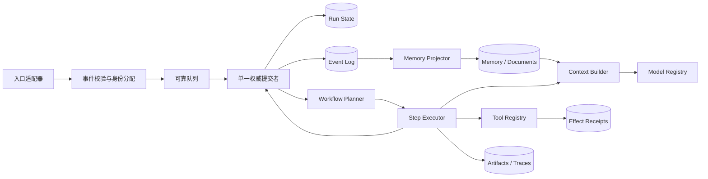

# AAgent 设计缺陷与优化方向

> 日期:2026-09-14  
> 定位:本文讨论 Agent 运行时的结构性问题与演进顺序,不重复枚举全部代码 bug。具体代码证据以[全项目问题报告](审查日志/2026-09-14-全项目-问题报告.md)为准,架构决策项由[架构问题汇总](审查日志/架构问题汇总.md)持续跟踪。

## 0. 结论

AAgent 的方向是成立的:外部入口事件化、单一决策中心、线性提交、Workflow 声明式编排,这些选择适合构建一个持续存在的个人 Agent。

当前主要问题不是“能力不够多”,而是**运行时内核尚未闭合**。系统把 Redis 队列、MongoDB 历史、Python 调用栈和 Workflow 可变图同时当作状态的一部分,却没有定义一次任务从接收、执行、产生副作用到完成或失败的完整生命周期。由此产生四个根本后果:

1. 只能保证“单 worker 顺序取消息”,不能保证任务恰好提交一次;
2. 进程退出后只能看到输入历史,不能恢复执行现场;
3. 能看到最终结果时尚可,失败时缺少稳定、可关联的诊断记录;
4. 模型、工具、上下文和 Workflow 的配置虽然可编辑,运行时却未形成统一契约。

因此,近期优先级应是:

```text
可靠执行内核 > 上下文治理 > 工具与模型契约 > 评测体系 > 高级推理能力
```

MCTS、Multi-Agent、Draft-Review 和复杂 RAG 都应建立在这个内核之上。否则新增的每条推理分支只会放大不可恢复、不可归因和副作用重复的问题。

---

## 1. 当前系统的准确模型

当前主链路实际是:

```text
外部事件
  -> Redis List
  -> 单 worker BRPOP
  -> 入口事件写 MongoDB
  -> 同步读取并解析当前 Workflow
  -> 在 Python 内存中循环执行节点
  -> 最终 response 再次入队
  -> response 被消费后写 MongoDB
```

这套实现具备**单消费者串行性**,但还不具备完整的**可持久化状态机语义**。尤其是 Workflow 的节点位置、端口值、循环状态、工具执行状态和当前错误都只存在于 `run_workflow_map()` 的调用栈与可变对象中。

因此,以下说法需要收紧:

- “MongoDB 是权威 Agent 状态”目前只对已消费的事件成立,不覆盖运行中的 Workflow 状态;
- “线性执行已实现”目前只表示单进程内没有并发 LLM 调用,不表示有 fencing、幂等提交或崩溃恢复;
- “事件历史同时承担状态”只适合不可变事实记录,不应直接替代任务状态、运行快照和上下文投影。

建议把目标表述改为:

> AAgent 采用单一权威提交者。所有决策与副作用结果按版本线性提交;读取、检索和无副作用计算可以并行,但不能绕过提交协议修改主线。

这比“永远只有一个进程”更精确,也为将来的高可用、异步工具和候选分支保留空间。

---

## 2. 八类结构性缺陷

### 2.1 任务身份缺失

事件只有 `event_type` 和不稳定的 `payload`,没有统一的:

- `event_id`:事件唯一身份;
- `run_id`:一次 Agent 任务或 Workflow 运行身份;
- `correlation_id`:同一交互链身份;
- `causation_id`:当前事件由哪个事件产生;
- `attempt`:当前重试次数;
- `schema_version`:事件契约版本。

没有这些字段,系统无法可靠回答“这个响应属于哪条输入”“这个工具结果对应哪次运行”“重复消息是否已处理”“失败后应该从哪里重试”。当前全局历史只能依靠时间邻近性推测因果,当终端插队、外部消息积压或内部事件回环时,这种推测会失真。

**优化方向**:定义统一事件信封,业务字段只放在 `payload` 中。

```json
{
  "schema_version": 1,
  "event_id": "uuid",
  "event_type": "workflow.requested",
  "run_id": "uuid",
  "correlation_id": "uuid",
  "causation_id": "uuid-or-null",
  "created_at": "RFC3339",
  "source": {"type": "terminal", "id": "global"},
  "attempt": 0,
  "payload": {}
}
```

### 2.2 队列不是可靠提交协议

Redis List 能表达顺序,但 `BRPOP` 会在消费瞬间移除消息。worker 若在落库后、工具执行中或最终响应发布前退出,该任务不会自动重现。当前也没有 processing 队列、ack、visibility timeout、dead-letter queue 或重放策略。

此外,LPUSH/RPUSH 被同时用于 FIFO、内部优先级和终端插队,业务语义依赖调用方记住方向。已有代码已经出现主队列、QQ 队列和 WebUI 队列方向不一致的问题。

**优化方向**:

- 短期保留 Redis 时,使用 Redis Streams consumer group,显式 `XACK`,并回收超时 pending 消息;
- 若继续用 List,至少采用 ready -> processing 的原子转移、完成后 ack、超时回收与 DLQ;
- 队列 API 改为 `enqueue_external()`、`enqueue_continuation()` 等语义方法,禁止业务代码直接选择左右端;
- 优先级应是事件字段或独立队列,不应隐藏在 LPUSH/RPUSH 中。

### 2.3 Workflow 执行状态不可恢复

`run_workflow_map()` 在一个同步 `while` 中跑完整张图。`current_id`、`data_inputs`、`_foreach_items` 和 `_workflow_call_stack` 都是进程内状态。任何中途崩溃都会丢失进度;若简单重跑,已完成的有副作用工具可能重复执行。

控制流环也没有统一步数、时间、模型调用或工具调用预算,错误图可能无限循环并持续产生费用。

**优化方向**:把 Workflow 从“递归函数调用”升级为“可持久化的小步状态机”。每执行一个节点就产生一个确定的状态迁移:

```text
load run(version=N)
  -> execute one node
  -> persist node result + next node + version=N+1
  -> enqueue continuation(run_id, version=N+1)
```

每个运行实例至少保存:

| 字段 | 作用 |
| --- | --- |
| `run_id` / `workflow_id` / `workflow_version` | 固定本次执行定义,避免运行中被编辑影响 |
| `status` | queued/running/waiting/succeeded/failed/cancelled |
| `current_node_id` | 可定位、可恢复 |
| `inputs` / `outputs` | 本次运行边界数据 |
| `node_states` | 节点输入、输出、尝试次数与错误 |
| `step_count` / `budgets` | 防止无限环和费用失控 |
| `version` | 乐观锁与重复 continuation 防护 |

确定性构造节点可以批量连续执行;LLM、工具、子 Workflow 和等待节点是天然 checkpoint。这样既不会把每个字符串拼接都做成昂贵事务,又能覆盖真正的失败边界。

### 2.4 副作用没有幂等边界

工具执行目前只有 `execute_tool(id, tool, args)`,其中 `id` 没有被用作幂等键。发送 QQ 消息、改写文档或未来调用外部写 API 时,超时并不表示操作未完成。盲目重试可能重复发送或重复写入;完全不重试又会丢任务。

**优化方向**:

- 为每次节点尝试生成稳定的 `operation_id = run_id + node_id + logical_iteration`;
- 工具声明 `effect`: `pure`、`read`、`idempotent_write`、`non_idempotent_write`;
- 写工具需要明确超时后的结果未知语义，并由调用方决定是否允许重试;
- 工具结果先持久化,再推进 Workflow;
- 对未知结果使用 `indeterminate` 状态,交由查询、补偿或人工确认,不能直接当失败重试;
- 分支探索、MCTS 和 Draft 阶段默认禁止执行不可逆工具。

### 2.5 历史、运行状态和记忆混为一层

当前 `event_history` 同时被期待承担审计、上下文、任务状态、工具追踪和 WebUI 展示。统一写入口有价值,但统一集合不等于统一数据模型。

原始事件流适合回答“发生过什么”;Workflow 运行表适合回答“现在执行到哪里”;Document/Memory 适合回答“哪些信息值得以后召回”;LLM trace 适合回答“本次模型为何得到这些输入与输出”。四者查询模式、保留周期和隐私要求不同。

**优化方向**:逻辑上拆成四个投影,允许物理上初期仍共用 MongoDB。

| 投影 | 内容 | 是否进入默认上下文 |
| --- | --- | --- |
| Event Log | 不可变事实与因果关系 | 否 |
| Run State | 当前运行快照和节点状态 | 仅任务摘要 |
| Memory/Documents | 提炼后的事实、偏好、计划、来源 | 按召回策略 |
| Trace/Artifacts | prompt、token、延迟、大结果句柄 | 否,按需查看 |

原始工具大结果和完整 messages 不应无上限复制进每个事件;应存为 artifact,事件只保留摘要、哈希、大小和引用。

### 2.6 上下文构建缺少显式策略

旧 `active` 路径只是最近 N 条事件加字符串模板;当前 Workflow LLM 路径则只读取连入节点的 messages。两者代表两套上下文哲学,且文档、设置和运行时代码已经分叉。

单一全局认知不意味着每次调用必须看到全部历史。真正需要统一的是信息空间和写入权威,不是 prompt 无限增长。上下文应是可复现的编译产物:

$$
Context = Policy(CurrentInput, RunState, Memory, RecentEvents, ToolReceipts, Budget)
$$

**优化方向**:建立独立 `ContextBuilder`,输出上下文及 manifest。manifest 记录候选来源、选择理由、裁剪原因、token 估算和版本。最低限度应固定以下层次:

1. 不可裁剪:系统规则、当前输入、当前任务状态、安全约束;
2. 高优先级:直接因果链、未完成工具结果、用户明确约束;
3. 召回层:相关 documents/memories,必须保留来源;
4. 近期层:有限的最近事件;
5. 压缩层:较老内容的版本化摘要。

检索失败应降级但可见;摘要不是事实源,必须能追溯原始事件。敏感字段在进入模型前应经过统一脱敏策略。

### 2.7 模型和工具不是稳定运行时资源

模型配置在管理面存在,但 Workflow 运行时仍读取进程环境变量;工具通过 import 副作用注册并清空 Redis 注册表。结果是“可配置界面”与“真正执行资源”脱节。

**优化方向**:

- `ModelRegistry`:按不可变 model configuration version 解析 provider、模型名、能力、超时和密钥引用;
- `ToolRegistry`:工具定义包含 schema version、effect、timeout、retry policy、权限和 handler version;
- Workflow 保存时固定引用版本或明确使用浮动 alias;
- Workflow 启动时生成 execution plan,一次性解析资源并做能力检查;
- API Key 只通过 secret reference 获取,不进入 Workflow、事件或前端响应;
- LLM 与工具统一返回结构化结果,不要用特殊值 `402` 或 `"Error:..."` 字符串混入正常输出。

建议统一结果代数:

```text
Result = Success(value, metadata)
       | RetryableError(code, message, retry_after)
       | PermanentError(code, message)
       | IndeterminateError(code, message, receipt)
```

### 2.8 缺少可验证的质量闭环

现有测试主要覆盖 Workflow 解析和少量执行路径,尚未覆盖崩溃恢复、重复投递、工具超时、上下文裁剪、模型配置生效和端到端响应关联。没有统一指标时,高级能力只能靠主观体验判断。

**优化方向**:建立三层验证。

| 层次 | 重点 |
| --- | --- |
| 契约测试 | 事件 schema、节点端口、模型响应、工具结果 |
| 故障注入测试 | 节点前后崩溃、重复消息、Mongo/Redis 短暂失败、工具超时 |
| Agent 评测 | 任务完成率、事实正确率、工具选择、费用、延迟、恢复成功率 |

Prompt、Workflow、model config、tool schema 和 ContextBuilder 都必须有版本,每次 run 记录版本组合,否则评测结果无法归因。

---

## 3. 建议的目标架构



关键点不是增加服务数量,而是明确职责:

- **事件层**只负责身份、因果和可靠投递;
- **提交者**串行决定主线状态版本;
- **Workflow Executor**按小步执行并 checkpoint;
- **ContextBuilder**决定一次模型实际看到什么;
- **Registry**把编辑器配置解析成可执行、版本化资源;
- **Receipt**保护外部副作用;
- **Memory Projector**从事实流异步生成可召回信息,但无权修改主线事实。

初期这些组件可以都在 `agent` 进程中,不需要立即微服务化。模块边界先于部署边界。

---

## 4. 分阶段演进路线

### P0:先让失败可见且有归属

目标:任何输入最终都能查询到 succeeded 或 failed,不存在“消息消失”。

1. 定义统一事件信封与运行 ID;
2. 所有异常生成结构化 `run.failed`,包含阶段、workflow、node、错误码和可公开摘要;
3. 修复当前模型配置失效、`None` 槽位、RPC 回发和未知事件类型等致命链路;
4. 增加 Workflow 最大步数、LLM 调用数、工具调用数和总时长限制;
5. WebUI 按 `run_id` 展示输入、节点、工具、响应或失败。

**退出标准**:

- 100% 已接收输入具有终态或明确 waiting 状态;
- 错误日志可从 `run_id` 定位到节点;
- 任意控制流环不会无限执行;
- 编辑器选择的模型与运行 trace 中的实际模型一致。

### P1:补齐可靠消费与幂等

目标:worker 在任意 checkpoint 前后退出,任务都不丢失且副作用不重复。

1. 队列迁移到 Streams 或等价 ack 模型;
2. 增加 pending 回收、有限重试、指数退避和 DLQ;
3. 建立 operation receipt 与工具 effect 分类;
4. settings、tool registry、model registry 改为显式初始化和版本化读取;
5. 增加重复投递与崩溃故障注入测试。

**退出标准**:

- checkpoint 后强杀 worker,重启可继续或安全重放;
- 同一 `event_id` 重复投递不产生重复响应;
- 同一 `operation_id` 不产生重复外部写操作;
- 超过重试上限的任务进入可查看、可重放的 DLQ。

### P2:Workflow 小步状态机

目标:长任务可暂停、恢复、取消和观察。

1. 引入 `workflow_runs` 与 `node_runs`;
2. Workflow 定义版本化,运行实例固定版本;
3. LLM、工具、子 Workflow、人工审批成为 checkpoint 节点;
4. 支持 cancel、resume、retry-from-node,但重试必须经过副作用检查;
5. 将节点契约提取为单一机器可读 schema,供 Python 与前端生成或校验。

**退出标准**:

- 可展示每个节点的 queued/running/succeeded/failed 状态;
- 重启不丢 foreach 迭代位置;
- 编辑中的 Workflow 不改变已开始运行;
- 保存面与执行面使用同一契约测试集。

### P3:上下文与记忆治理

目标:每次模型输入可解释、可复现、受预算控制。

1. 建立 ContextBuilder 与 context manifest;
2. 拆分 event、run、artifact、memory 四类投影;
3. 引入 token 预算、去重、来源、敏感信息过滤和摘要版本;
4. 建立 retrieval benchmark,评估关键事实召回率与噪声率;
5. 工具大结果改为 artifact 引用 + 可控摘要。

**退出标准**:

- 给定 run 与版本可重建同一组模型 messages;
- 每段召回信息可追溯来源;
- prompt token 不随历史总量线性增长;
- 关键约束召回率、无关信息率和平均成本有持续统计。

### P4:再引入高级推理能力

满足 P0-P3 后,再逐步增加 Skill-Tool、异步任务、Draft-Review、MCTS 和受控多 Agent。所有候选计算遵循:

- 候选分支只读主线快照;
- 分支输出是 proposal,不是事实;
- 不可逆副作用只能由主线提交者授权;
- 合并记录来源、证据、冲突和采用理由;
- 每项能力先在固定 benchmark 上证明质量收益大于成本和延迟。

---

## 5. 必须建立的运行指标

### 可靠性

- 输入到终态覆盖率;
- 队列等待时间、运行时间和端到端时间分位数;
- 重试率、DLQ 率、崩溃恢复成功率;
- 重复事件抑制数、重复副作用数;
- stuck run 数量与最长停滞时间。

### 模型与上下文

- 每 run 的 prompt/completion token、调用次数和费用;
- 各模型错误率、超时率、限流率;
- context 各来源 token 占比;
- 关键事实召回率、无关召回率、摘要命中率;
- tool call 参数校验失败率。

### Workflow

- 节点类型成功率与 P50/P95 延迟;
- 每 run 步数、循环次数和最大深度;
- 失败节点分布;
- Workflow 版本间任务完成率与成本变化。

日志、指标和 trace 都以 `run_id`、`event_id`、`node_run_id` 关联。不得记录 API Key;完整 prompt 和工具结果应配置保留周期与访问权限。

---

## 6. 当前不建议做的事

1. **不建议立即拆微服务**。当前问题是语义边界不清,拆进程只会增加分布式故障面。先在单进程内模块化。
2. **不建议用“增加更多事件类型”代替运行状态模型**。事件描述事实,运行快照描述当前状态,两者需要投影关系。
3. **不建议默认重试所有工具**。非幂等副作用遇到超时可能是结果未知,不是简单失败。
4. **不建议把全部历史或全部 document 塞入 prompt**。单一认知不等于无差别上下文;必须有预算和来源。
5. **不建议先做并发 LLM 或多个主 Agent worker**。在版本提交与 fencing 完成前,并发会破坏主线一致性。
6. **不建议把自然语言错误字符串当协议**。错误必须有稳定 code、分类和结构化 metadata。
7. **不建议在可靠性基线前做 GA/MCTS 自动优化**。没有版本、评测和可复现 run 时,优化结果无法归因。

---

## 7. 推荐的第一个实现切片

第一个切片不需要重写整个系统,可以限定在“一次 terminal -> workflow -> response”链路:

1. 新增事件信封构造与校验函数;
2. terminal 入队时生成 `event_id/run_id/correlation_id`;
3. `workflow()` 全程保留这些身份并发布 `run.started/run.succeeded/run.failed`;
4. `run_workflow_map()` 抛错时附加当前 node id 和 step count;
5. 增加 `max_steps`,禁止无限控制流环;
6. WebUI 用 `run_id` 聚合显示终态;
7. 编写成功、节点异常、超步数和重复输入四个测试。

这个切片会先建立后续所有改造需要的“任务身份 + 生命周期 + 错误边界”。完成后再替换可靠队列和持久化节点状态,迁移风险会明显降低。

---

## 8. 最终判断

AAgent 不需要放弃“一个决策中心、一条权威主线”的设计。需要修正的是其工程表达:

```text
当前:
单进程 + 单队列 + 全局历史 + 内存 Workflow

目标:
单一权威提交者 + 因果事件 + 可恢复运行状态
+ 幂等副作用 + 可解释上下文 + 版本化资源
```

前者依赖进程恰好不出错;后者才是一套可以承载长任务、异步工具、候选分支和持续记忆的 Agent 运行时。先完成这个转变,后续的高级推理能力才会成为可评估的增益,而不是新的不确定性来源。