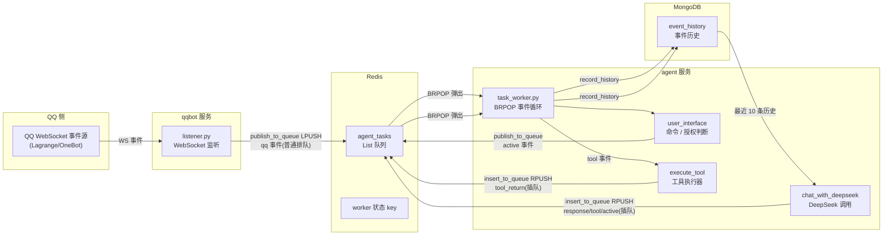
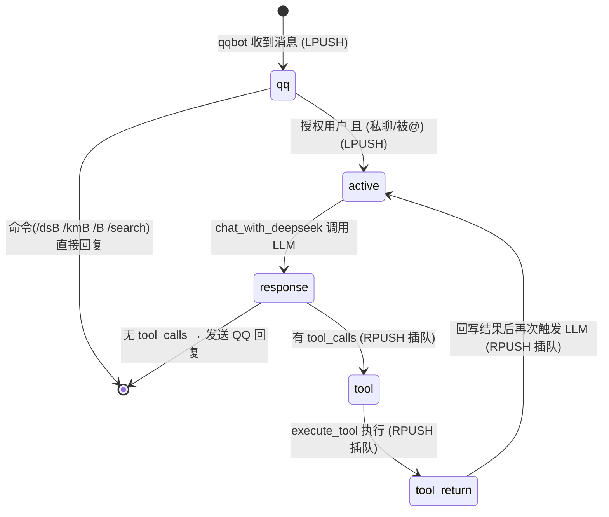

# AAgent 架构文档

> 本文档单独描述系统架构、事件驱动设计与调度机制；业务逻辑、配置与已知问题见《业务逻辑文档.md》。

## 1. 架构总览

AAgent 是一个基于 **事件驱动架构（EDA）** + **Redis 任务队列** 的 QQ 机器人 + LLM Agent 系统：

- `qqbot` 监听 QQ WebSocket 事件，封装为 `qq` 事件投递到 Redis 队列；
- `agent` 作为中央 worker 消费队列事件，调用 DeepSeek 大模型与工具（余额查询 / Tavily 搜索）；
- LLM 工具调用通过**事件回环**（`response → tool → tool_return → active`）在同一轮对话内循环推进，直到生成最终回复；
- 所有事件持久化到 MongoDB 形成历史上下文，供 LLM 回忆。



## 2. 服务拓扑与职责

| 服务 | 职责 | 构建路径 | 关键文件 |
|------|------|----------|----------|
| `qqbot` | 连接 QQ WebSocket，接收事件并发布任务到 Redis | `./qqbot` | `listener.py`, `queue_client.py` |
| `agent` | 消费 Redis 任务，调用 LLM/工具，回复 QQ 消息 | `./agent` | `task_worker.py`, `llm.py`, `tool.py`, `qqapi.py` |
| `webui` | 队列 / worker 状态 / 历史记录监控面板 | `./webui` | `main.go`, `static/` |
| `redis` | 任务队列与事件缓冲（List + 状态 Key） | `redis:7-alpine` | `data/redis/` |
| `mongodb` | 事件历史持久化 | `mongo:8` | `data/mongo/` |

所有服务接入自定义桥接网络 `rainbow_net`，通过服务名互相访问。

## 3. 核心机制：事件驱动与"同步调度"

### 3.1 设计思路（内部命名：同步调度）

本系统无意中参考了 **CPU 的取指-执行循环（Fetch-Decode-Execute Cycle）** 设计：

| CPU 概念 | 本系统对应实现 |
|----------|----------------|
| 指令缓冲（Instruction Buffer） | Redis 队列 `agent_tasks` |
| 取指-执行循环 | `task_worker.py` 的 `BRPOP` + `handle_task()` 主循环 |
| 子程序调用（call） | `tool` 事件（调用工具函数） |
| 子程序返回（return） | `tool_return` 事件（携带工具结果回写队列） |
| 时钟脉冲 | 队列中的事件——**事件即时钟**，事件到达即触发下一步 |
| 程序计数器（PC） | 队列顺序（由入队方向决定下一步执行谁） |
| 中断（interrupt） | 新 QQ 消息（通过排队机制软化解，不打断当前工具链） |

我们将其命名为 **"同步调度"**：系统按确定性顺序逐步推进一轮对话，每一步由上一步产出的事件驱动。

### 3.2 专业术语对照

"同步调度"不是一个标准术语，在分布式微服务中由以下经典模式组合而成：

| 层面 | 专业术语 | 说明 |
|------|----------|------|
| 总体架构 | **事件驱动架构（EDA）** | 系统行为由事件（消息）触发，组件间通过消息解耦 |
| 基础设施 | **任务队列 / 消息队列模式（Task Queue）** | Redis List + BRPOP 实现异步消费 |
| 调度方式 | **队列驱动的状态机（Queue-Driven State Machine）** | 事件类型即状态，`active` 事件为状态转移触发器 |
| 编排视角 | **编排（Orchestration）** / **编排型 Saga** | agent worker 作为中央调度者，决定每步执行什么 |
| 工具链推进 | **Agentic Loop / ReAct 循环** | LLM 工具调用循环：思考 → 调用工具 → 观察结果 → 再思考 |
| 未来演进方向 | **Durable Execution（持久执行）** | 若增加重试、补偿、进度持久化，即 Temporal/Cadence 式工作流 |

### 3.3 事件状态机



- `response`、`tool_return` 仅记录历史，不主动触发回复；
- `active` 是真正触发 LLM 调用并发送 QQ 回复的入口；
- 整条工具链（`response → tool → tool_return → active`）通过插队保证不被新消息打断，循环直到 LLM 不再请求工具为止。

## 4. 队列机制（两种入队方式）

Redis 任务队列基于 List 实现，消费端固定使用 `BRPOP`（从队尾阻塞弹出），**入队方向决定事件优先级**：

| 方法 | 底层命令 | 行为 | 用途 |
|------|----------|------|------|
| `publish_to_queue()` | `LPUSH` | 从队头压入，排在队尾（FIFO 普通排队） | 外部 QQ 消息、`active` 触发等常规任务 |
| `insert_to_queue()` | `RPUSH` | 从队尾压入，紧贴消费端，**会被立即弹出（最高优先级插队）** | 工具链 / LLM 内部连续性事件 |

设计意图：

- `publish_to_queue()` 是**正常排队**，`insert_to_queue()` 是**最高优先级插队**；
- LLM 工具调用链属于一轮对话内部的连续性事件，必须优先于后续新到的 QQ 消息被执行，因此使用 `insert_to_queue()` 插队；
- 外部 QQ 消息进入时使用 `publish_to_queue()` 排队，避免持续插队导致普通任务饿死。

## 5. 事件类型与流转

| 事件类型 | 产生方 | 入队方式 | 消费行为 |
|----------|--------|----------|----------|
| `qq` | qqbot listener | `publish_to_queue` | 记录历史 → `user_interface()` 判断命令/授权 |
| `active` | `user_interface()` / `chat_with_deepseek()` | 前者 `publish_to_queue`，后者 `insert_to_queue` | 记录历史 → `chat_with_deepseek()` → 发送回复 |
| `response` | `chat_with_deepseek()` | `insert_to_queue` | 仅记录历史 |
| `tool` | `chat_with_deepseek()` | `insert_to_queue` | 记录历史 → `execute_tool()` → 生成 `tool_return` 插队 |
| `tool_return` | `handle_task()` | `insert_to_queue` | 仅记录历史（供 LLM 上下文） |

典型流转（授权用户 @ 机器人）：

```
[QQ 消息] → qqbot 解析 → LPUSH agent_tasks
              ↓
agent BRPOP 弹出 qq 事件 → user_interface 判断授权 → LPUSH active 事件
              ↓
agent BRPOP 弹出 active 事件 → chat_with_deepseek 调用 DeepSeek
              ↓
生成 [response, tool1, tool2, active]，反转后 RPUSH 插队
              ↓
依次弹出：response(记录) → tool1(执行) → tool_return1(记录)
        → tool2(执行) → tool_return2(记录) → active(再次调用 LLM)
              ↓
第二次 LLM 调用获得带工具结果的回复 → 发送 QQ 消息
```

## 6. 数据存储

### 6.1 Redis

- `agent_tasks`：任务队列（List），`publish_to_queue`（LPUSH）与 `insert_to_queue`（RPUSH）双端写入，`BRPOP` 消费；
- `aagent:worker:status`：worker 运行状态（state / event / started_at / updated_at），供 webui 展示。

### 6.2 MongoDB

集合：`agent.event_history`（默认），每条事件附加 `created_at`（UTC）。

已建立索引：

| 索引 | 键 | 说明 |
|------|-----|------|
| `created_at_desc` | `created_at` 倒序 | 历史查询主排序 |
| `event_type_created_at` | `(event_type, created_at)` 倒序 | 按类型过滤历史 |
| `tool_call_id_payload` | `payload.id`（稀疏） | 工具调用 ID 检索 |

## 7. 配置

配置集中存放在根目录 `.env`（模板见 `.env.example`），详见《业务逻辑文档.md》第 5 节。

关键地址变量：

- `QQ_WS_URI` / `QQ_WS_TOKEN`：QQ WebSocket 事件源；
- `QQ_API_BASE_URL` / `QQ_API_TOKEN`：QQ HTTP API（发消息等）；
- `DEEPSEEK_BASE_URL` / `DEEPSEEK_API_KEY` / `DEEPSEEK_MODEL`：大模型；
- `REDIS_HOST` / `REDIS_PORT` / `AGENT_QUEUE_NAME`：队列；
- `MONGO_*`：历史存储。

## 8. 目录结构

```
D:\AAgent
├── .env                  # 环境变量（含敏感信息，勿提交）
├── .env.example          # 环境变量模板
├── .gitignore
├── docker-compose.yml    # Docker Compose 编排
├── README.md
├── LICENSE
├── 业务逻辑文档.md        # 业务逻辑 / 配置 / 已知问题
├── 架构文档.md            # 本文档：架构 / 调度机制 / 事件流转
├── agent/                # Agent 服务代码
│   ├── Dockerfile
│   ├── requirements.txt
│   ├── task_worker.py    # 任务消费与分发入口（事件循环）
│   ├── llm.py            # 大模型对话逻辑（工具链事件生成）
│   ├── tool.py           # 工具定义与执行
│   ├── qqapi.py          # QQ HTTP API 封装
│   ├── queue_client.py   # Redis 队列操作（LPUSH/RPUSH/BRPOP）
│   ├── history_repository.py # MongoDB 历史记录
│   ├── script.py         # Tavily 测试脚本
│   ├── 2.py              # 博查 API 测试脚本
│   └── 3.py              # 智谱 GLM 测试脚本
├── qqbot/                # QQ 机器人服务代码
│   ├── Dockerfile
│   ├── requirements.txt
│   ├── listener.py       # WebSocket 监听入口
│   └── queue_client.py   # Redis 队列操作
├── webui/                # Web 监控面板
│   ├── Dockerfile
│   ├── go.mod
│   ├── main.go           # Go HTTP 服务（/api/*）
│   └── static/           # 前端页面
└── data/                 # 运行时数据（已加入 .gitignore）
    ├── mongo/            # MongoDB 数据文件
    └── redis/            # Redis 持久化文件
```
