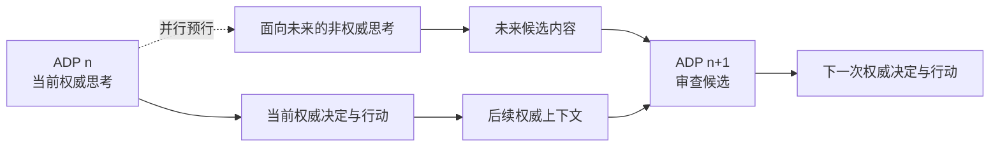

# 09 同步架构下的加速设计

> 本文专门讨论一个问题：在不打破“单 worker 同步推进 + 海量上下文按需召回”架构的前提下，如何降低 Agent 的端到端延迟并提高吞吐。
>
> 本文描述的是设计方向，不代表相关能力已经实现。当前实现状态仍以[路线图与创新](05-路线图与创新.md)和源码为准。

## 1. 问题定义

AAgent 的核心约束不是“所有计算都只能占用一个线程”，而是：

1. 同一时刻只能有一个权威决策推进主线；
2. 下一次 LLM 决策必须基于已提交的最新主线版本；
3. 外部事件、工具结果和模型响应必须经过统一队列与历史记录管线；
4. 海量历史不能被粗暴地全部塞进 prompt，而要经过 callback 召回、筛选、排序、投影和裁剪；
5. 任何缓存、索引或预计算结果都不是新的事实来源，MongoDB 中已提交的历史仍是权威依据。

因此，加速目标不是把主 Agent 改成多线程并发思考，而是减少一次权威决策在关键路径上的等待：

$$
T_{total} = T_{queue} + T_{callback} + T_{prompt} + T_{llm} + T_{tool} + T_{commit}
$$

其中：

- $T_{queue}$：事件进入队列后等待单 worker 的时间；
- $T_{callback}$：检索、去重、重排和上下文组装时间；
- $T_{prompt}$：prompt 传输与输入 token 预填充时间；
- $T_{llm}$：模型生成时间；
- $T_{tool}$：同步工具执行与网络等待时间；
- $T_{commit}$：事件记录、版本校验和后续事件入队时间。

同步架构的加速，本质上是压缩这些分项，而不是通过增加权威时间线来掩盖它们。

## 2. 不可突破的不变量

任何加速方案都必须通过以下检查：

| 不变量 | 判断问题 |
|--------|----------|
| 单一决策中心 | 是否出现两个主 LLM 同时决定下一步行动？ |
| 主线顺序提交 | 是否可能基于旧上下文覆盖新版本结果？ |
| 统一事件入口 | 是否绕过 Redis 和 `record_history()` 直接修改 Agent 状态？ |
| 候选不等于事实 | 预取、摘要、缓存或小模型输出是否未经确认就进入权威结论？ |
| 副作用唯一 | 并行探索是否可能重复发送消息、写文件或调用不可逆 API？ |
| callback 可降级 | 索引、缓存或预计算失败时，是否仍能从权威历史恢复并继续执行？ |

只要某个方案违反其中一项，它加速的就不再是当前架构，而是在引入另一套一致性模型。

## 3. 总体思路：并行与预行

### 3.1 核心概念：权威决策点（Authoritative Decision Point, ADP）

本文将主 Agent 基于当前权威上下文进行正式思考、确认当前事实并决定下一步行动的时间点，称为**权威决策点**（Authoritative Decision Point，简称 **ADP**）。

> **纲领：权威的意义在于，它会产生结论，并会执行带来现实影响的行动。**

如果非权威思考由于权限管理失败而对现实造成了影响，本文将这种影响称为**副作用**。副作用的产生不是非权威思考的责任，而是权限管理未能守住权威边界的结果。

ADP 是候选思考与权威思考之间的权限边界：

- ADP 之前产生的一切思考都只是候选，不自动代表 Agent 的认知、判断或决定；
- 候选思考不能自行调用具有副作用的工具，不能修改主线，不能对外宣称结论已经成立；
- 到达 ADP 时，主 Agent 才基于当时的权威上下文审查此前产生的候选内容；
- 只有被 ADP 明确采纳的内容，才对当前思考有效，并有资格影响后续行动；
- 未被采纳、已经过时或与当前上下文冲突的候选内容，可以被忽略或废弃。

换言之，**计算可以提前发生，权威只能在 ADP 上产生。**

### 3.2 并行：隔离非权威思考

第一种加速思路是并行。在正式决策开始前，可以隔离出一部分上下文进行思考，也可以使用其他方式产生非权威思考。

这里的关键不是“同时运行多少份思考”，而是严格分割权限：并行思考只能读取被授予的上下文，只能产出候选内容，不能擅自行动。它不是第二个 Agent，也不是另一条可以自行推进的上下文主线。

```text
权威上下文 ──隔离部分上下文──→ 非权威并行思考 ──→ 候选内容
     │                                             │
     └──────────────→ ADP 审查与采纳 ←─────────────┘
                              ↓
                         权威决定与行动
```

隔离既是上下文隔离，也是权限隔离。即使非权威思考得出了看似完整的结论，在 ADP 采纳之前也不能产生外部副作用。

### 3.3 预行：利用思考空档

第二种加速思路是预行。Agent 的权威思考并不是一直在进行：两次事件之间、等待外部输入时，以及当前没有正式决策任务时，都会存在空档。

这些空档可以用于提前思考未来可能需要的问题，生成候选分析或准备材料。预行不是提前作出决定，而是把原本只能在下一次正式思考中完成的一部分非权威计算，移动到空档期。

预行结果仍然受 ADP 约束。未来真正进入权威思考时，环境、目标和上下文可能已经变化，因此此前预行产生的内容必须重新接受审查，不能因为“已经想过”就直接生效。

### 3.4 叠加：在当前权威思考期间为未来预行

并行与预行叠加后，可以得到第三种形态：**在当前权威思考进行时，同时为未来的权威思考产生非权威候选。**

当前 ADP 只负责当前问题。与当前权威思考并行产生的未来候选，不得反过来干扰当前决策，也不得越过当前主线提前行动。它们等待未来某个 ADP 到来后，再由那一时刻的权威上下文进行审查。



因此，时间关系可以概括为：

> 在任意 ADP 上，只有该时点以前已经发生、并在该时点经过审查采纳的内容才作数。当前思考期间为未来产生的内容，只能等待未来的 ADP 获得权威性。

这使系统能够持续利用并行能力和时间空档，同时仍然保持一条同步、可审计、不会被候选思考擅自推进的权威主线。

## 4. 结论

同步与高性能并不矛盾。AAgent 真正必须保持同步的是**权威决策与提交顺序**，不是每一项辅助计算。合理的加速边界可以概括为：

> 非权威思考可以并行，也可以预行，还可以在当前权威思考期间为未来预行；但它只能产生候选内容。只有权威决策点（ADP）能够审查和采纳这些内容，并据此形成权威决定与行动。

因此，加速不是增加多条可以自行行动的 Agent 主线，而是让更多非权威思考提前发生，并把它们严格约束在 ADP 之外。这样可以利用并行计算与思考空档，又不牺牲同步架构、全局上下文和单一决策中心。

## 关联文档

- 核心不变量：[00-设计哲学](00-设计哲学.md)
- 当前执行拓扑：[01-系统架构](01-系统架构.md)
- 队列与线性推进：[02-事件与队列](02-事件与队列.md)
- 规划能力与实现状态：[05-路线图与创新](05-路线图与创新.md)
- 事件和上下文格式：[06-格式规范](06-格式规范.md)
- callback 信息模型：[07-事件双重身份与信息回调](07-事件双重身份与信息回调.md)