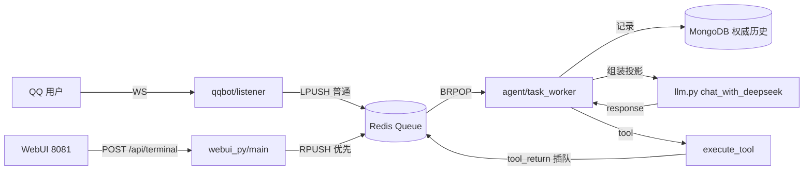

# 2026-08-02 全项目全面审计报告

> 日期:2026-08-02。
> 类型:审计报告。
> 性质:历史快照(快照型审计记录,非实时问题清单)。
> 范围:对 `d:\AAgent` 全项目(`agent/`、`qqbot/`、`webui_py/`、`docker-compose*.yml`、Dockerfile、`requirements.txt`、`.env.example`、`README.md`、`docs/`)做一次独立、新鲜的代码审计,核对其与[审查核验汇总](2026-08-02-审查核验汇总.md)(当前唯一权威问题清单)的一致性,并补充此前未记录的新发现。
> 待办:遗留问题以[审查核验汇总](2026-08-02-审查核验汇总.md)第 3 节为准,修复后从该清单删除并在其第 2 节补修复证据。

---

## 0. 审计结论总览

| 维度 | 结论 |
|------|------|
| 总体质量 | **良好**。架构清晰、文档纪律好,未发现致命崩溃级 bug |
| 正确性 | 工具链顺序、队列插队语义、消息投影格式均核实无误;`deepseekBalance` URL 已由用户确认正常工作 |
| 权威清单一致性 | 第 3 节既有 P0-P3 条目**逐项核对仍成立**,无过时项 |
| 新增发现 | 4 项(见第 3 节,标注【新】):QQ 回复不自动回推、inputing 事件 DB 噪音、response.context 冗余、余额返回类型不一致 |
| 工作区状态 | `git status` 干净,无未提交改动;无残留测试脚本(`script.py`/`2.py`/`3.py` 已清) |

---

## 1. 架构核对(源码为准)

### 1.1 事件流

### 1.2 关键机制核实

| 机制 | 代码位置 | 核对结论 |
|------|----------|----------|
| LPUSH=普通排队,RPUSH=优先插队,BRPOP 尾部消费 | `queue_client.py`(`publish_to_queue`/`insert_to_queue`) | ✅ 一致 |
| 多 tool_calls 顺序 | `task_worker.py` response 分支 `insert_to_queue(*events[::-1])` | ✅ 完整追踪入队/弹出序列,执行顺序正确 |
| 工具链插队循环 | response→tool→tool_return→active(空 payload 触发下一轮) | ✅ 一致 |
| 消息投影(不用 tool 角色) | `task_worker.py` active 分支 | ✅ 与 `docs/06` 一致 |
| WebUI 三阶段快照 | `webui_py/main.py`(`worker_stage`/`pending_stage`/`history_stage`) | ✅ 输出结构正确 |
| 历史按 `_id` 倒序 | `history_repository.py` / `webui_py/main.py` | ✅ 一致 |

---

## 2. 做得好的地方

1. **消息格式设计成熟**:`tool_return` 投影为 `user` 文本、`response` 不回传 `tool_calls`,规避 OpenAI 兼容 API 的消息对匹配 400 风险(`docs/06`);
2. **单 worker 串行模型清晰**:MongoDB 是唯一权威上下文,外部事件只能进队列,规避并发写上下文;
3. **前端工程质量高**:DOM 行复用 + 锚点恢复、指纹去重、Worker 卡死检测(10 分钟)、搜索/类型筛选、`aria` 可访问性;
4. **文档纪律好**:`2026-08-02-审查核验汇总.md` 作为唯一权威清单,旧报告按快照保留,README 指向正确。

---

## 3. 问题清单(按严重度)

> 标注【已记录】= 已在审查核验汇总第 3 节,本次逐项核对仍成立;标注【新】= 本次审计新增,此前文档未记录。

### P0 正确性

| # | 问题 | 位置 | 说明 |
|---|------|------|------|
| 1 【已记录】 | `/` 命令无鉴权 | `task_worker.py::user_interface` | 命令分支先于 `QQ_TARGET_USER_ID` 校验,任何人对 `/dsB` `/kmB` `/search` 可触发,消耗余额/搜索配额 |
| 2 【已记录】 | 出队后失败不重试 | `task_worker.py::main` | LLM/工具/QQ 发送异常后事件直接丢弃 |

### P1 健壮性与安全

| # | 问题 | 位置 | 说明 |
|---|------|------|------|
| 3 【已记录】 | 外部 HTTP 异常处理不统一 | `qqapi.py` / `tool.py` | 余额函数无 try/except;QQ API 裸 `raise_for_status` |
| 4 【已记录】 | processing 状态无心跳 | `task_worker.py::main` | 只有 `started_at`;长任务卡死仅靠前端 10 分钟猜测 |
| 5 【已记录】 | Redis 客户端反复创建 | 两个 `queue_client.py` | 每次调用新建连接,应模块级复用 |
| 6 【已记录】 | 未使用 Key 阻塞启动 | `tool.py` | `ZAI_API_KEY`、`BOCHA_*` 模块级强读,未启用也必填 |
| 7 【已记录】 | Redis 无密码 + MongoDB root | compose + `.env` | 公网部署风险;`.env` 现用 `MONGO_USER=root` |
| 8 【已记录】 | FastAPI 422 破坏错误契约 | `webui_py/main.py` | `extra="forbid"` 触发 422 返回 `{"detail":...}`,前端 `api.js` 读 `body.error` 拿不到 |
| 9 【新】 | **LLM 回复不自动回推 QQ** | `task_worker.py` | response 内容只写历史;QQ 用户能否收到回复**完全取决于 LLM 是否主动调用 `send_group_msg`/`send_private_msg` 工具**。若模型漏调、或走 `llm.py` 的"余额不足"分支直接返回文本,用户永远看不到回复(仅 WebUI 可见)。需明确确认为设计取舍 |

### P2 精简与维护

| # | 问题 | 位置 | 说明 |
|---|------|------|------|
| 10 【已记录】 | `qqapi.py` 4 个未使用函数 + 重复模板 | `qqapi.py` | `send_private_img`/`get_group_list`/`get_group_member_info`/`get_group_msg_history` 全库零调用 |
| 11 【已记录】 | `qqbot` 的 `pop_from_queue` 未使用且方向错误 | `qqbot/queue_client.py` | `blpop` 与 `lpush` 不配对,从未被调用 |
| 12 【已记录】 | schema 与执行器分开维护 + 长 if-elif | `tool.py` / `task_worker.py` | 建议工具注册表/分发表/命令路由表 |
| 13 【已记录】 | webui 模块级 `int(env(...))` 导入期崩溃、`worker_stage` 5 元组、`Z` vs `+00:00` 不一致、`MAX_TERMINAL_RUNES` 命名 | `webui_py/main.py` | |
| 14 【已记录】 | `llm.py::send_messages` 每次 `print(resp.json())` 刷屏 | `llm.py` | 含长上下文+工具结果,应改 `logging` |
| 15 【新】 | **`inputing` 事件永久写入 MongoDB 噪音** | `qqbot/listener.py` + `task_worker.py` | 每次"对方正在输入"notice 都被 `record_history` 落库,但投影从不使用,属永久垃圾数据 |
| 16 【新】 | **response 的 `context` 字段冗余膨胀** | `task_worker.py` | 每轮把完整投影消息(含 system prompt)写入 MongoDB,长期数据量大,仅调试用 |
| 17 【新】 | 余额返回类型不一致 | `tool.py` | `deepseekBalance` 返回 float、`kimiBalance` 返回 str;Kimi 若返回"分"单位直接当"rmb"显示有误导 |

### P3 WebUI

| # | 问题 | 位置 |
|---|------|------|
| 18 【已记录】 | 无 favicon | `static/index.html` / `terminal.html` |
| 19 【已记录】 | 搜索无 debounce | `static/app.js`:`searchInput` input 直接全量渲染 |
| 20 【已记录】 | done 行 ID 低概率冲突 | `webui_py/main.py`:`done-{fingerprint}-{created_at}` |

---

## 4. 已核实无误项

- ✅ `deepseekBalance` 的 `DEEPSEEK_BASE_URL + /v1/user/balance` —— **用户已确认正常工作(2026-08-02),勿改**;
- ✅ `tool.py` `send_private_msg` schema `required` 已修对(`["user_id","message"]`);
- ✅ `active` 分支 `payload["content"] or ""` 已修复;
- ✅ 多 tool_calls 执行顺序正确(完整追踪队列序列);
- ✅ 队列插队语义与 `submit_terminal` 的"已优先入队"文案一致(RPUSH 尾部,BRPOP 先消费);
- ✅ 工作区干净、无残留测试脚本、无硬编码密钥残留。

---

## 5. 建议处理顺序

沿用权威清单第 5 节(P0 → P1 → P2 → P3),本次额外建议优先级:

1. **P0-1 命令鉴权**(最先做):`user_interface` 命令分支复用 `str(user_id) == TARGET_USER_ID` 校验,几行即可堵住配额滥用;
2. **P1-9 确认 QQ 回推语义**:决定"纯工具驱动回复"还是"response 自动回推";若前者,建议在 `docs/06` 明确写明,避免误以为有自动回复;
3. **P2-15 inputing 噪音**:`listener.py` 不再投递或 `task_worker.py` 记录时过滤,成本极低;
4. **P1-5 Redis 连接复用**:两个 `queue_client.py` 改模块级单例,并同步补 `REDIS_PASSWORD`(webui_py 已支持,agent/qqbot/compose 三处同步改)。

---

## 6. 关联文档

- 审查日志入口:[README](../README.md);
- 权威问题清单:[2026-08-02 审查核验汇总](2026-08-02-审查核验汇总.md);
- 历史快照:[2026-08-01 优化报告](2026-08-01-优化报告.md)、[2026-08-02 webui_py 审查报告](2026-08-02-webui_py-审查报告.md);
- 接口契约:[前端API格式](../../webUI/前端API格式.md);
- 核心设计:[设计哲学](../../00-设计哲学.md)、[格式规范](../../06-格式规范.md)、[系统架构](../../01-系统架构.md)。
